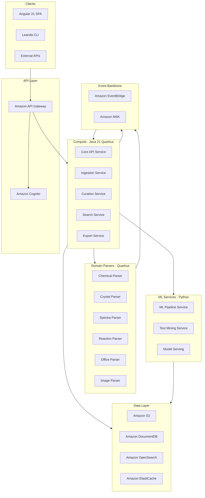
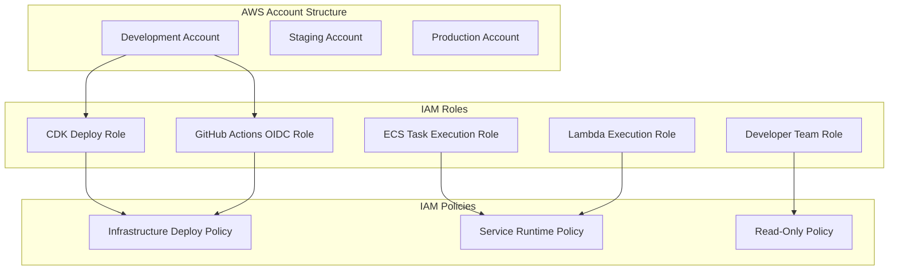

# Leanda NG - Greenfield Rewrite Plan

## Overview

Replace all 112 .NET projects with Java 21/Quarkus microservices, keeping Python 3.12+ for ML services. Infrastructure provisioned via AWS CDK with project name **"Leanda NG"** and initial **Development** environment.

## Current State Summary

| Component | Current | Target |
|-----------|---------|--------|
| Core Services | .NET Core 3.1 (112 projects) | Java 21 / Quarkus 3.x |
| File Parsers | Java 8 / Spring Boot 2.0 RC1 | Java 21 / Quarkus 3.x |
| ML Services | Python (legacy) | Python 3.12+ / FastAPI |
| Frontend | Angular 9 | Angular 21 |
| IaC | Docker Compose | AWS CDK (TypeScript) |
| Messaging | RabbitMQ / MassTransit | Amazon MSK (Kafka) / EventBridge |
| Database | MongoDB 3.6 / EventStore 4.x | Amazon DocumentDB / DynamoDB Streams |

---

## Architecture Diagram



---

## AWS IAM Setup Instructions

### IAM Architecture Overview



### Prerequisites

```bash
# Install AWS CLI v2
brew install awscli

# Configure AWS credentials (for initial bootstrap only)
aws configure --profile leanda-ng-admin
# Enter: AWS Access Key ID, Secret Access Key, Region (us-east-1), Output (json)
```

### Step 1: Create IAM OIDC Provider for GitHub Actions

This is a one-time setup per AWS account to enable GitHub Actions to assume IAM roles without storing long-lived credentials.

```bash
# Create OIDC provider for GitHub Actions (one-time setup)
aws iam create-open-id-connect-provider \
  --url https://token.actions.githubusercontent.com \
  --client-id-list sts.amazonaws.com \
  --thumbprint-list 6938fd4d98bab03faadb97b34396831e3780aea1 \
  --profile leanda-ng-admin
```

**Note**: Replace `ACCOUNT_ID` in the commands below with your actual AWS account ID.

### Step 2: Create CDK Bootstrap Role

Create `leanda-ng/infrastructure/iam/cdk-bootstrap-policy.json`:

```json
{
  "Version": "2012-10-17",
  "Statement": [
    {
      "Effect": "Allow",
      "Action": [
        "cloudformation:*",
        "s3:*",
        "iam:*",
        "ecr:*",
        "ssm:*",
        "sts:AssumeRole"
      ],
      "Resource": "*",
      "Condition": {
        "StringEquals": {
          "aws:RequestedRegion": "us-east-1"
        }
      }
    }
  ]
}
```

Create the CDK deploy role:

```bash
# Create the CDK deploy role
aws iam create-role \
  --role-name leanda-ng-cdk-deploy-role \
  --assume-role-policy-document '{
    "Version": "2012-10-17",
    "Statement": [{
      "Effect": "Allow",
      "Principal": {
        "Federated": "arn:aws:iam::ACCOUNT_ID:oidc-provider/token.actions.githubusercontent.com"
      },
      "Action": "sts:AssumeRoleWithWebIdentity",
      "Condition": {
        "StringEquals": {
          "token.actions.githubusercontent.com:aud": "sts.amazonaws.com"
        },
        "StringLike": {
          "token.actions.githubusercontent.com:sub": "repo:ArqiSoft/leanda-ng:*"
        }
      }
    }]
  }' \
  --profile leanda-ng-admin

# Attach the policy
aws iam put-role-policy \
  --role-name leanda-ng-cdk-deploy-role \
  --policy-name CDKDeployPolicy \
  --policy-document file://leanda-ng/infrastructure/iam/cdk-bootstrap-policy.json \
  --profile leanda-ng-admin
```

**Important**: Replace `ACCOUNT_ID` with your AWS account ID and `ArqiSoft/leanda-ng` with your actual GitHub repository path.

### Step 3: Create Service Execution Roles via CDK

Create `leanda-ng/infrastructure/lib/stacks/iam-stack.ts`:

```typescript
import * as cdk from 'aws-cdk-lib';
import * as iam from 'aws-cdk-lib/aws-iam';
import { Construct } from 'constructs';

export interface IamStackProps extends cdk.StackProps {
  projectName: string;
  environment: string;
}

export class IamStack extends cdk.Stack {
  public readonly ecsTaskRole: iam.Role;
  public readonly ecsExecutionRole: iam.Role;
  public readonly lambdaExecutionRole: iam.Role;

  constructor(scope: Construct, id: string, props: IamStackProps) {
    super(scope, id, props);

    const { projectName, environment } = props;

    // ECS Task Execution Role (for pulling images, logging)
    this.ecsExecutionRole = new iam.Role(this, 'EcsExecutionRole', {
      roleName: `${projectName}-ecs-execution-${environment}`,
      assumedBy: new iam.ServicePrincipal('ecs-tasks.amazonaws.com'),
      managedPolicies: [
        iam.ManagedPolicy.fromAwsManagedPolicyName(
          'service-role/AmazonECSTaskExecutionRolePolicy'
        ),
      ],
    });

    // ECS Task Role (for application runtime)
    this.ecsTaskRole = new iam.Role(this, 'EcsTaskRole', {
      roleName: `${projectName}-ecs-task-${environment}`,
      assumedBy: new iam.ServicePrincipal('ecs-tasks.amazonaws.com'),
    });

    // Add permissions for services to access AWS resources
    this.ecsTaskRole.addToPolicy(new iam.PolicyStatement({
      sid: 'S3Access',
      effect: iam.Effect.ALLOW,
      actions: [
        's3:GetObject',
        's3:PutObject',
        's3:DeleteObject',
        's3:ListBucket',
      ],
      resources: [
        `arn:aws:s3:::${projectName}-*-${environment}`,
        `arn:aws:s3:::${projectName}-*-${environment}/*`,
      ],
    }));

    this.ecsTaskRole.addToPolicy(new iam.PolicyStatement({
      sid: 'SecretsManagerAccess',
      effect: iam.Effect.ALLOW,
      actions: [
        'secretsmanager:GetSecretValue',
      ],
      resources: [
        `arn:aws:secretsmanager:${this.region}:${this.account}:secret:${projectName}/${environment}/*`,
      ],
    }));

    this.ecsTaskRole.addToPolicy(new iam.PolicyStatement({
      sid: 'DocumentDBAccess',
      effect: iam.Effect.ALLOW,
      actions: [
        'rds-db:connect',
      ],
      resources: [
        `arn:aws:rds-db:${this.region}:${this.account}:dbuser:*/${projectName}_*`,
      ],
    }));

    // Lambda Execution Role
    this.lambdaExecutionRole = new iam.Role(this, 'LambdaExecutionRole', {
      roleName: `${projectName}-lambda-execution-${environment}`,
      assumedBy: new iam.ServicePrincipal('lambda.amazonaws.com'),
      managedPolicies: [
        iam.ManagedPolicy.fromAwsManagedPolicyName(
          'service-role/AWSLambdaVPCAccessExecutionRole'
        ),
      ],
    });

    // Add EventBridge permissions for Lambda
    this.lambdaExecutionRole.addToPolicy(new iam.PolicyStatement({
      sid: 'EventBridgePublish',
      effect: iam.Effect.ALLOW,
      actions: [
        'events:PutEvents',
      ],
      resources: [
        `arn:aws:events:${this.region}:${this.account}:event-bus/${projectName}-${environment}`,
      ],
    }));

    // Output role ARNs
    new cdk.CfnOutput(this, 'EcsTaskRoleArn', {
      value: this.ecsTaskRole.roleArn,
      exportName: `${projectName}-ecs-task-role-arn-${environment}`,
    });

    new cdk.CfnOutput(this, 'EcsExecutionRoleArn', {
      value: this.ecsExecutionRole.roleArn,
      exportName: `${projectName}-ecs-execution-role-arn-${environment}`,
    });

    new cdk.CfnOutput(this, 'LambdaExecutionRoleArn', {
      value: this.lambdaExecutionRole.roleArn,
      exportName: `${projectName}-lambda-execution-role-arn-${environment}`,
    });
  }
}
```

### Step 4: Create Developer Team Role

Create a role for developers to access AWS resources via console or CLI:

```bash
# Create developer role for console/CLI access
aws iam create-role \
  --role-name leanda-ng-developer-role \
  --assume-role-policy-document '{
    "Version": "2012-10-17",
    "Statement": [{
      "Effect": "Allow",
      "Principal": {
        "AWS": "arn:aws:iam::ACCOUNT_ID:root"
      },
      "Action": "sts:AssumeRole",
      "Condition": {
        "Bool": {
          "aws:MultiFactorAuthPresent": "true"
        }
      }
    }]
  }' \
  --profile leanda-ng-admin

# Attach read-only and specific write permissions
aws iam attach-role-policy \
  --role-name leanda-ng-developer-role \
  --policy-arn arn:aws:iam::aws:policy/ReadOnlyAccess \
  --profile leanda-ng-admin
```

Create `leanda-ng/infrastructure/iam/developer-policy.json` for additional permissions:

```json
{
  "Version": "2012-10-17",
  "Statement": [
    {
      "Sid": "CloudWatchLogsAccess",
      "Effect": "Allow",
      "Action": [
        "logs:DescribeLogGroups",
        "logs:DescribeLogStreams",
        "logs:GetLogEvents",
        "logs:FilterLogEvents"
      ],
      "Resource": "arn:aws:logs:*:*:log-group:/aws/ecs/leanda-ng-*"
    },
    {
      "Sid": "ECSAccess",
      "Effect": "Allow",
      "Action": [
        "ecs:DescribeClusters",
        "ecs:DescribeServices",
        "ecs:DescribeTasks",
        "ecs:ListTasks"
      ],
      "Resource": "*"
    },
    {
      "Sid": "SSMParameterAccess",
      "Effect": "Allow",
      "Action": [
        "ssm:GetParameter",
        "ssm:GetParameters",
        "ssm:DescribeParameters"
      ],
      "Resource": "arn:aws:ssm:*:*:parameter/leanda-ng/*"
    }
  ]
}
```

Attach the custom policy:

```bash
aws iam put-role-policy \
  --role-name leanda-ng-developer-role \
  --policy-name DeveloperCustomPolicy \
  --policy-document file://leanda-ng/infrastructure/iam/developer-policy.json \
  --profile leanda-ng-admin
```

### Step 5: Configure GitHub Actions Secrets

Add the following secrets to your GitHub repository (Settings → Secrets and variables → Actions):

| Secret Name | Description | Example Value |
|-------------|-------------|---------------|
| `AWS_ACCOUNT_ID` | AWS Account ID for deployment | `123456789012` |
| `AWS_DEPLOY_ROLE_ARN` | ARN of `leanda-ng-cdk-deploy-role` | `arn:aws:iam::123456789012:role/leanda-ng-cdk-deploy-role` |
| `AWS_REGION` | AWS region for deployment | `us-east-1` |

### Step 6: GitHub Actions Workflow with OIDC

Create `.github/workflows/deploy-infrastructure.yml`:

```yaml
name: Deploy Infrastructure

on:
  push:
    branches: [main]
    paths:
      - 'leanda-ng/infrastructure/**'
  workflow_dispatch:
    inputs:
      environment:
        description: 'Environment to deploy'
        required: true
        default: 'development'
        type: choice
        options:
          - development
          - staging
          - production

permissions:
  id-token: write
  contents: read

jobs:
  deploy:
    runs-on: ubuntu-latest
    environment: ${{ inputs.environment || 'development' }}
    
    steps:
      - uses: actions/checkout@v4

      - name: Configure AWS Credentials
        uses: aws-actions/configure-aws-credentials@v4
        with:
          role-to-assume: ${{ secrets.AWS_DEPLOY_ROLE_ARN }}
          aws-region: ${{ secrets.AWS_REGION }}

      - name: Setup Node.js
        uses: actions/setup-node@v4
        with:
          node-version: '20'
          cache: 'npm'
          cache-dependency-path: leanda-ng/infrastructure/package-lock.json

      - name: Install dependencies
        working-directory: leanda-ng/infrastructure
        run: npm ci

      - name: CDK Diff
        working-directory: leanda-ng/infrastructure
        run: npx cdk diff --all
        env:
          ENVIRONMENT: ${{ inputs.environment || 'development' }}

      - name: CDK Deploy
        working-directory: leanda-ng/infrastructure
        run: npx cdk deploy --all --require-approval never
        env:
          ENVIRONMENT: ${{ inputs.environment || 'development' }}
```

### IAM Best Practices Checklist

- [ ] Use OIDC for GitHub Actions (no long-lived credentials)
- [ ] Apply least-privilege principle to all roles
- [ ] Enable MFA for human access
- [ ] Use resource-based conditions (account, region, resource tags)
- [ ] Rotate any programmatic credentials regularly
- [ ] Enable CloudTrail for IAM audit logging
- [ ] Use AWS Organizations SCPs for guardrails (if applicable)
- [ ] Tag all IAM resources with `Project: leanda-ng` and `Environment: development`

### Updated Project Structure

```
leanda-ng/
├── infrastructure/
│   ├── lib/
│   │   ├── stacks/
│   │   │   ├── iam-stack.ts          # NEW: IAM roles and policies
│   │   │   ├── networking-stack.ts
│   │   │   ├── database-stack.ts
│   │   │   └── ...
│   ├── iam/                          # NEW: Manual IAM policy files
│   │   ├── cdk-bootstrap-policy.json
│   │   └── developer-policy.json
│   ├── bin/
│   ├── cdk.json
│   └── package.json
├── .github/
│   └── workflows/
│       └── deploy-infrastructure.yml # NEW: CI/CD with OIDC (CI/CD postponed until full migration)
├── services/                 # Java/Quarkus microservices
│   ├── core-api/
│   ├── ingestion-service/
│   ├── curation-service/
│   ├── search-service/
│   └── domain-parsers/
│       ├── chemical-parser/
│       ├── crystal-parser/
│       ├── spectra-parser/
│       └── ...
├── ml-services/              # Python ML services
│   ├── ml-pipeline/
│   └── text-mining/
├── frontend/                 # Angular 21 app
└── docs/
    └── adr/                  # Architecture Decision Records
```

---

## Phase 0: Foundation Setup (Weeks 1-4)

### 0.1 Project Structure

Create new `leanda-ng/` directory structure as shown above.

### 0.2 AWS CDK Infrastructure

Key CDK configuration for Development environment:

```typescript
// infrastructure/bin/leanda-ng.ts
import * as cdk from 'aws-cdk-lib';
import { IamStack } from './lib/stacks/iam-stack';
import { NetworkingStack } from './lib/stacks/networking-stack';
// ... other imports

const app = new cdk.App();

const projectName = 'leanda-ng';
const environment = process.env.ENVIRONMENT || 'development';

// IAM stack must be deployed first
const iamStack = new IamStack(app, `${projectName}-iam-${environment}`, {
  env: { account: process.env.CDK_DEFAULT_ACCOUNT, region: 'us-east-1' },
  projectName,
  environment,
});

new NetworkingStack(app, `${projectName}-networking-${environment}`, {
  env: { account: process.env.CDK_DEFAULT_ACCOUNT, region: 'us-east-1' },
  projectName,
  environment,
});
```

### 0.3 Core Infrastructure Components

| Component | AWS Service | Development Sizing |
|-----------|-------------|-------------------|
| VPC | Amazon VPC | 2 AZs, private subnets |
| Auth | Amazon Cognito | User Pool + ORCID integration |
| API | API Gateway | REST API with usage plans |
| Compute | ECS Fargate | 0.25 vCPU / 512MB per service |
| Database | DocumentDB | db.t3.medium (single instance) |
| Search | OpenSearch Serverless | Development collection |
| Cache | ElastiCache Redis | cache.t3.micro |
| Storage | S3 | Standard tier with lifecycle |
| Events | EventBridge + MSK Serverless | Default quotas |

---

## Phase 1: Core Services Rewrite (Weeks 5-12)

### 1.1 .NET to Quarkus Service Mapping

| .NET Service | New Quarkus Service | Priority |
|--------------|---------------------|----------|
| `Sds.Osdr.WebApi` | `core-api` | P0 |
| `Sds.Osdr.Domain.BackEnd` | `domain-backend` | P0 |
| `Sds.Osdr.Domain.FrontEnd` | `domain-frontend` | P0 |
| `Sds.Osdr.Persistence` | `persistence-service` | P0 |
| `Sds.Osdr.Generic` | `generic-domain` | P1 |
| `Sds.Osdr.Chemicals` | `chemical-domain` | P1 |
| `Sds.Osdr.Crystals` | `crystal-domain` | P1 |
| `Sds.Osdr.MachineLearning` | `ml-orchestrator` | P1 |
| `Leanda.Categories` | `categories-service` | P2 |
| `Sds.Indexing` | `indexing-service` | P2 |

### 1.2 Quarkus Service Template

Each service follows this structure:

```
services/core-api/
├── src/main/java/io/leanda/ng/
│   ├── api/                  # REST endpoints
│   ├── domain/               # Domain entities
│   ├── application/          # Use cases / services
│   ├── infrastructure/       # Adapters (DB, messaging)
│   └── config/               # Configuration
├── src/test/java/            # Tests
├── pom.xml
├── Dockerfile.jvm
└── Dockerfile.native
```

### 1.3 Key Technology Choices

- **Java Version**: 21 LTS (virtual threads, pattern matching)
- **Quarkus Version**: 3.17+ (latest stable)
- **Messaging**: SmallRye Reactive Messaging with Kafka
- **Persistence**: Quarkus Panache with MongoDB/DocumentDB
- **Validation**: Hibernate Validator
- **OpenAPI**: Quarkus OpenAPI Generator
- **Testing**: JUnit 5, REST Assured, Testcontainers

---

## Phase 2: Domain Parsers Migration (Weeks 13-18)

Migrate existing Java 8 parsers to Java 21/Quarkus:

| Current Service | Lines of Code | Complexity |
|-----------------|---------------|------------|
| `chemical-file-parser-service` | ~1,500 | Medium |
| `chemical-properties-service` | ~2,000 | Medium |
| `crystal-file-parser-service` | ~1,800 | Medium |
| `spectra-file-parser-service` | ~1,200 | Low |
| `reaction-file-parser-service` | ~1,000 | Low |
| `imaging-service` | ~2,500 | High |
| `office-file-processor-service` | ~1,500 | Medium |

### Key Migrations

- `javax.*` → `jakarta.*` namespace
- Spring Boot → Quarkus extensions
- Custom `jtransit-light` → SmallRye Reactive Messaging
- MongoDB driver 3.x → 5.x with Panache

---

## Phase 3: ML Services Modernization (Weeks 19-22)

Keep Python, modernize to:

- **Python**: 3.12+
- **Framework**: FastAPI + Pydantic v2
- **ML**: PyTorch 2.x, scikit-learn
- **Integration**: AWS SageMaker for training/inference
- **Deployment**: Lambda containers or ECS Fargate

---

## Phase 4: Frontend Rewrite (Weeks 23-28)

- Angular 9 → Angular 21 (new project, not migration)
- Replace `@aspnet/signalr` → `@microsoft/signalr`
- Replace Protractor → Playwright
- Deploy to S3 + CloudFront via CDK

---

## Phase 5: Testing & Deployment (Weeks 29-32)

### Testing Strategy

| Test Type | Tool | Coverage Target |
|-----------|------|-----------------|
| Unit | JUnit 5 / pytest | 80% |
| Integration | Testcontainers | Critical paths |
| E2E | Playwright | Happy paths |
| Load | k6 | API endpoints |
| Security | Snyk, OWASP ZAP | Zero critical |

### CDK Environments

```typescript
// Multi-environment setup
const environments = ['development', 'staging', 'production'];

environments.forEach(env => {
  new LeandaNGStack(app, `leanda-ng-${env}`, {
    environment: env,
    // Environment-specific config
  });
});
```

---

## Deliverables

1. **`leanda-ng/infrastructure/`** - Complete AWS CDK stacks
2. **`leanda-ng/services/`** - All Java/Quarkus microservices
3. **`leanda-ng/ml-services/`** - Modernized Python ML services
4. **`leanda-ng/frontend/`** - Angular 21 application
5. **`docs/adr/`** - Architecture Decision Records
6. **GitHub Actions** - CI/CD pipelines (CI/CD postponed until full migration is complete)

---

## Timeline Summary

```
Weeks 1-4:   Phase 0 - Foundation (CDK, project structure, IAM setup)
Weeks 5-12:  Phase 1 - Core services rewrite (.NET → Quarkus)
Weeks 13-18: Phase 2 - Domain parsers migration (Java 8 → 21)
Weeks 19-22: Phase 3 - ML services modernization
Weeks 23-28: Phase 4 - Frontend rewrite (Angular 21)
Weeks 29-32: Phase 5 - Testing & deployment
```

**Total: ~8 months (32 weeks)**

---

## First Steps (What We Build Now)

1. Create `leanda-ng/` project structure
2. Set up AWS IAM roles and policies (OIDC provider, CDK deploy role, service roles)
3. Initialize AWS CDK project with Development environment
4. Create IAM stack in CDK
5. Create networking stack (VPC, subnets, security groups)
6. Create first Quarkus service scaffold (`core-api`)
7. Set up GitHub Actions workflow with OIDC authentication (CI/CD postponed until full migration)
