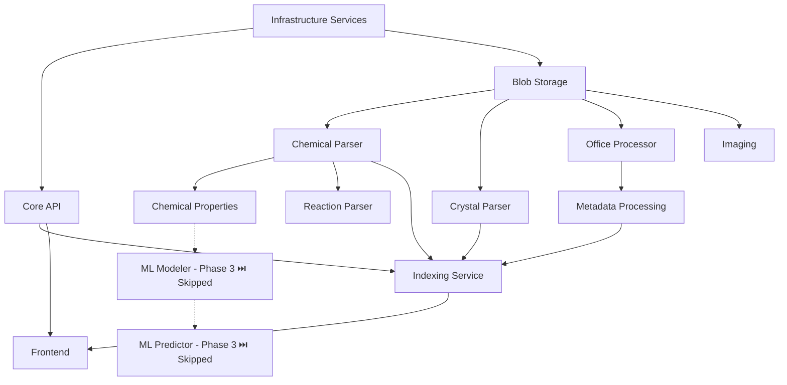

# Leanda NG Agent Coordination

**Last Updated**: 2025-01-22 (100% Feature Parity Implementation - Backend APIs Complete, Testing in Progress)  
**Project Status**: Phase 1 Complete ✅ | Phase 2 Complete ✅ | Phase 3 Skipped ⏭️ | Phase 4 Core Infrastructure Complete ✅ | Phase 5-10: 100% Feature Parity in Progress 🟢 (Backend APIs ✅, Frontend Tests 🟢, Integration Tests 🟢, E2E Tests 🟢)  
**Structure**: Consolidated (services/, shared/, docker/, frontend/, infrastructure/)

---

## Quick Status

| Phase | Status | Agents | Completion |
|-------|--------|--------|------------|
| **Phase 1: Core Services** | ✅ Complete | 5 agents | 100% |
| **Phase 2: Domain Parsers** | ✅ Complete | 10 agents | 100% |
| **Phase 3: ML Services** | ⏭️ Skipped | 0 agents | N/A (will be re-implemented differently) |
| **Phase 4: Production** | 🟢 Core Complete | 7 agents | 86% (6/7 complete, 1 modernization planned) |
| **Phase 5-10: Feature Parity** | 🟢 In Progress | 4 agents | ~40% (Backend APIs ✅, Frontend Tests 🟢, Integration Tests 🟢, E2E Tests 🟢) |
| **Continuous: Team Lead** | 🟢 Active | 1 agent | Ongoing |
| **Continuous: Cloud QA** | 🟢 Active | 1 agent | Ongoing |
| **Continuous: QA-Test-Impl** | 🟢 Active | 1 agent | Ongoing |
| **Continuous: UI/UX** | 🟢 Active | 1 agent | Ongoing |
| **Continuous: UI-Engineer** | 🟢 Active | 1 agent | Testing and backend integration |
| **Continuous: Backend-API-Impl** | 🟢 Active | 1 agent | Backend API implementation |
| **Continuous: Frontend-Test-Unit** | 🟢 Active | 1 agent | Frontend unit testing |
| **Continuous: Frontend-Test-E2E** | 🟢 Active | 1 agent | Frontend E2E testing |

**Legend**: ⏳ Not Started | 🟢 In Progress | 🟡 Blocked | ✅ Complete

**Testing restructure (2026-01)**: Start with **Agent QA-Cloud** to create strategy docs and CI mapping; then QA-Test-Impl and Frontend-Test-E2E run in parallel. See § Testing Strategy Alignment below.

**Essential services (minimal distro)**: core-api, blob-storage, office-processor, **indexing**, **imaging**. Indexing is required to find files (search); imaging generates thumbnails for uploaded files displayed in the browser. All coordination, agent prompts, and testing docs treat these five as the essential set for upload, process, find, and display workflows.

---

## Current Agent Status

### Phase 1 Agents (Complete ✅)

| Agent | Scope | Status | Services |
|-------|-------|--------|----------|
| Agent 1 | Core API & REST | ✅ Complete | core-api |
| Agent 2 | Domain Services & Events | ✅ Complete | Event handlers |
| Agent 3 | Persistence & Data | ✅ Complete | Models, repositories |
| Agent 4 | Testing Infrastructure | ✅ Complete | Test framework |
| Agent 5 | Docker & Infrastructure | ✅ Complete | docker-compose.yml |

### Phase 2 Agents (Complete ✅)

| Agent | Scope | Status | Services |
|-------|-------|--------|----------|
| Agent 1 | Java Parsers Group A | ✅ Complete | chemical-parser, chemical-properties, reaction-parser |
| Agent 2 | Java Parsers Group B | ✅ Complete | crystal-parser, spectra-parser, imaging |
| Agent 3 | Blob Storage + Office | ✅ Complete | blob-storage, office-processor |
| Agent 4 | Metadata + Indexing | ✅ Complete | metadata-processing, indexing |
| Agent 5 | ML Services | ⏭️ Skipped | feature-vectors, modeler, predictor (moved to Phase 3, which is skipped) |
| Agent 6 | Frontend | ✅ Complete | Angular 21 application |
| Agent 7 | Testing Infrastructure | ✅ Complete | Test utilities |
| Agent 8 | Docker + Integration | ✅ Complete | docker-compose.yml |
| Agent 9 | Phase 1-2 Integration | ✅ Complete | Event contracts, WebSocket |
| Agent 10 | Verification & QA | ✅ Complete | Contract verification, test coverage audit |

### Phase 3 Agents (Skipped ⏭️)

| Agent | Scope | Status | Services |
|-------|-------|--------|----------|
| Agent ML-1 | Feature Vectors | ⏭️ Skipped | Will be re-implemented differently |
| Agent ML-2 | ML Modeler | ⏭️ Skipped | Will be re-implemented differently |
| Agent ML-3 | ML Predictor | ⏭️ Skipped | Will be re-implemented differently |

**Note**: Phase 3 ML Services are being skipped. The logic will be re-implemented in a different way in the future.

### Continuous Agents (Active 🟢)

| Agent | Scope | Status | Services |
|-------|-------|--------|----------|
| Agent Lead | Team Lead | 🟢 Active | Technology oversight, best practices, timeline management |
| Agent QA-Cloud | Senior Cloud QA | 🟢 Active | Continuous testing strategies, quality assurance |
| Agent QA-Test-Impl | Integration Test Implementation | 🟢 Active | Test gap resolution, contract compliance, workflow tests |
| Agent UI-UX | Senior UI/UX Engineer | 🟢 Active | Frontend design, UX patterns, accessibility, component design |
| Agent UI-Engineer | UI Engineer | 🟢 Active | Frontend implementation complete, testing and backend integration in progress |
| Agent Backend-API-Impl | Backend API Implementation | 🟢 Active | Nodes, Entities, Categories, Search APIs with 100% test coverage |
| Agent Frontend-Test-Unit | Frontend Unit Testing | 🟢 Active | Unit tests for all frontend components and services (100% coverage target) |
| Agent Frontend-Test-E2E | Frontend E2E Testing | 🟢 Active | E2E tests for all critical user workflows |

### Phase 4 Agents (Core Infrastructure: Complete ✅ | Modernization: 2 Planned)

| Agent | Scope | Status | Services |
|-------|-------|--------|----------|
| Agent PROD-0 | Cloud Architect | ✅ Complete | Architecture design, Well-Architected Framework |
| Agent PROD-1 | AWS CDK Deployment | ✅ Complete | infrastructure/ |
| Agent PROD-2 | CI/CD Pipelines | ✅ Complete (postponed until full migration) | .github/workflows/ |
| Agent PROD-3 | Monitoring & Alerting | ✅ Complete | Observability |
| Agent PROD-4 | Cloud Security | ✅ Complete | Security architecture, IAM, compliance |
| Agent PROD-5 | FinOps Architect | ✅ Complete | Cost optimization, billing, cost management |
| Agent PROD-6 | Saga Pattern Modernization | ✅ Complete | Saga orchestration, Step Functions, Kafka Streams (greenfield distro, no legacy) |
| Agent PROD-7 | Compliance & SOC 2 Type II | 📋 Planned | SOC 2 Type II compliance framework, audit readiness |

---

## Project Structure (Consolidated)

All paths use the new consolidated structure:

```
mono-repo/
├── services/              # All microservices (11 services)
│   ├── core-api/         # Phase 1 ✅
│   ├── blob-storage/     # Phase 2 ✅
│   ├── office-processor/  # Phase 2 ✅
│   ├── chemical-parser/   # Phase 2 ✅
│   ├── chemical-properties/ # Phase 2 ✅
│   ├── reaction-parser/   # Phase 2 ✅
│   ├── crystal-parser/    # Phase 2 ✅
│   ├── spectra-parser/    # Phase 2 ✅
│   ├── imaging/          # Phase 2 ✅
│   ├── metadata-processing/ # Phase 2 ✅
│   └── indexing/         # Phase 2 ✅
├── ml-services/         # Python ML services (Phase 3 ⏳)
├── shared/                # Shared models, contracts, specs
├── frontend/              # Angular 21 application ✅
├── infrastructure/        # AWS CDK stacks (Phase 4 📋)
├── docker/                # docker-compose.yml ✅
├── tests/                 # Integration and E2E tests ✅
└── docs/                  # Documentation
```

---

## Active Agent Tracking

### Currently Active Agents

1. **Agent Lead: Team Lead** (Continuous)
   - Status: 🟢 Active - Continuously monitoring technology trends and managing timelines
   - See: `docs/agents/AGENT_PROMPTS.md` (Agent Lead)
   - **Purpose**: Continuously monitor latest stable technologies, enforce best practices, and track project timelines

2. **Agent QA-Cloud: Senior Cloud QA** (Continuous)
   - Status: 🟢 Active - Continuously providing testing strategies
   - See: `docs/agents/AGENT_PROMPTS.md` (Agent QA-Cloud)
   - **Purpose**: Continuously provide testing strategies and quality assurance guidance

3. **Agent UI-UX: Senior UI/UX Engineer** (Continuous)
   - Status: 🟢 Active - Continuously overseeing frontend design and UX
   - See: `docs/agents/AGENT_PROMPTS.md` (Agent UI-UX)
   - **Purpose**: Continuously provide UI/UX guidance, design patterns, and frontend best practices

### Next Agents to Start

1. **Agent PROD-6: Saga Pattern Modernization** (Phase 4)
   - Dependencies: ✅ Phase 1-2 complete, ✅ PROD-0 (Cloud Architect) complete, ✅ PROD-1 (CDK Deployment) complete
   - Status: Ready to start
   - See: `docs/agents/AGENT_PROMPTS.md` (Agent PROD-6)
   - **Priority**: Medium - All Phase 4 infrastructure agents complete

### Completed: MongoDB Removal → DynamoDB + S3/MinIO (Greenfield) ✅

**Status**: ✅ Complete (2026-02-02)

- **core-api**: Uses DynamoDB for metadata/workflow state ✅
- **blob-storage**: Uses S3/MinIO for blob storage (GridFS removed) ✅
- **imaging**: MongoDB dependency removed ✅
- **metadata-processing**: MongoDB removed (stubbed; service not in minimal distro) ✅
- **docker-compose.minimal.yml**: MongoDB service and env vars removed ✅
- **tests**: MongoDB test utilities and Testcontainers removed ✅

**Scope**: Greenfield; no data migration. DynamoDB for metadata and workflow state; S3/MinIO for blobs only.
**See**: `docs/agents/AGENT_PROMPTS.md` (MongoDB Removal → DynamoDB), `docs/adr/0012-dynamodb-for-metadata.md`

---

### Agent PROD-0: Cloud Architect - Architecture Design & Review

**Status**: ✅ Complete  
**Scope**: Cloud architecture design, AWS Well-Architected Framework review, ADRs  
**Current Task**: Architecture design complete  
**Dependencies**: ✅ Phase 2 complete (all services implemented)

**Results**:
- ✅ Comprehensive cloud architecture document created (`docs/cloud-architecture.md`)
- ✅ AWS Well-Architected Framework review completed (all 5 pillars)
- ✅ 6 Architecture Decision Records (ADRs) created:
  - ADR-0001: Use ECS Fargate for Compute
  - ADR-0002: Use MSK Serverless for Messaging
  - ADR-0003: Use DocumentDB for Metadata
  - ADR-0004: Multi-AZ Deployment Strategy
  - ADR-0005: Multi-Layer Caching Strategy
  - ADR-0006: Disaster Recovery Strategy
- ✅ Architecture diagrams created (`docs/architecture-diagrams.md`)
- ✅ Scalability and performance architecture designed
- ✅ Disaster recovery architecture designed
- ✅ Service selection rationale documented

**Key Deliverables**:
- `docs/cloud-architecture.md` - Comprehensive architecture design
- `docs/architecture-diagrams.md` - Visual architecture diagrams (Mermaid)
- `docs/adr/` - Architecture Decision Records directory with 6 ADRs

**Architecture Highlights**:
- **Compute**: ECS Fargate with auto-scaling (2-20 tasks per service)
- **Messaging**: MSK Serverless for Kafka (auto-scaling, multi-AZ)
- **Database**: DocumentDB with multi-AZ, automated backups
- **Caching**: Three-layer strategy (CloudFront, ElastiCache Redis, Application)
- **Disaster Recovery**: Multi-region backup strategy (RTO: 4h, RPO: 1h)
- **Security**: VPC isolation, IAM least privilege, encryption at rest/in-transit
- **Observability**: CloudWatch, X-Ray, structured logging

**Next Steps for Other Agents**:
- PROD-1: Implement CDK stacks with architecture enhancements
- PROD-2: CI/CD postponed until full migration is complete
- PROD-3: Set up monitoring and alerting per architecture
- PROD-4: Implement security architecture (coordinate with PROD-0)
- PROD-5: Implement cost optimization strategies (coordinate with PROD-0)

**Responsibilities**:
1. **Architecture Design**
   - Design cloud architecture following AWS Well-Architected Framework
   - Document service selection rationale and trade-offs
   - Create architecture diagrams and documentation

2. **AWS Well-Architected Framework Review**
   - Operational Excellence: CI/CD, runbooks, monitoring
   - Security: IAM, encryption, network security
   - Reliability: Multi-AZ, disaster recovery, fault tolerance
   - Performance Efficiency: Caching, database optimization, CDN
   - Cost Optimization: Right-sizing, resource tagging, cost allocation

3. **Architecture Decision Records (ADRs)**
   - Document major architectural decisions
   - Include context, decision, consequences, alternatives
   - Store in `docs/adr/` directory

4. **Scalability and Performance Design**
   - Design auto-scaling strategies
   - Design caching layers
   - Design database optimization strategies
   - Design CDN and edge computing strategies

5. **Disaster Recovery Design**
   - Design backup and restore procedures
   - Design multi-region failover architecture
   - Define RTO/RPO targets and procedures

6. **Coordination**
   - Provide architecture guidance to PROD-1 (CDK deployment)
   - Coordinate with PROD-4 on security architecture
   - Coordinate with PROD-5 on cost optimization strategies

**Key Files**:
- Architecture: `docs/cloud-architecture.md`
- Diagrams: `docs/architecture-diagrams.md`
- ADRs: `docs/adr/0001-*.md` through `docs/adr/0006-*.md`
- Infrastructure: `infrastructure/lib/stacks/`

**Next**: Architecture design complete. Ready for PROD-1 to implement CDK stacks.

---

### Agent PROD-2: CI/CD Pipelines - GitHub Actions Setup

**Status**: ✅ Complete  
**Scope**: GitHub Actions workflows, automated testing, automated deployment, OIDC setup  
**Current Task**: CI/CD pipelines implemented; **CI/CD is postponed until full migration is complete**.  
**Dependencies**: ✅ Phase 2 complete (all services implemented)

**Results**:
- ✅ GitHub Actions workflows created for all components:
  - Java services workflow (build and test all 11 services)
  - Frontend workflow (lint, test, build, E2E)
  - Infrastructure workflow (CDK validation and synth)
  - Staging deployment workflow
  - Production deployment workflow
- ✅ OIDC configuration documented for AWS authentication
- ✅ Secrets management guide created
- ✅ Comprehensive deployment guide created
- ✅ All workflows configured with proper triggers and conditions
- ✅ Matrix builds for parallel service testing
- ✅ Artifact uploads for test results and build outputs

**Key Deliverables**:
- `.github/workflows/java-services.yml` - Java services build and test
- `.github/workflows/frontend.yml` - Frontend build, test, and E2E
- `.github/workflows/infrastructure.yml` - CDK validation
- `.github/workflows/deploy-staging.yml` - Staging deployment
- `.github/workflows/deploy-production.yml` - Production deployment
- `docs/deployment/oidc-setup.md` - OIDC authentication setup guide
- `docs/deployment/deployment-guide.md` - Comprehensive deployment guide
- `docs/deployment/secrets-management.md` - Secrets management guide

**Workflow Features**:
- **Java Services**: Matrix build for 11 services, unit and integration tests, test result artifacts
- **Frontend**: Lint, unit tests with coverage, production build, Playwright E2E tests
- **Infrastructure**: CDK TypeScript build, synth, and diff validation
- **Staging Deployment**: Automatic on `develop` branch, manual service selection
- **Production Deployment**: Automatic on `main` branch, confirmation required for manual dispatch
- **OIDC Authentication**: Secure AWS authentication without long-lived credentials
- **Secrets Management**: GitHub secrets for CI/CD, AWS Secrets Manager for runtime

**Next Steps for Other Agents**:
- PROD-1: Can now use these workflows for CDK deployment automation
- PROD-3: Can integrate monitoring and alerting into deployment workflows
- All agents: Can use workflows for automated testing and validation

**Responsibilities**:
1. **GitHub Actions Workflows**
   - Create build and test workflows for Java services
   - Create build and test workflows for frontend
   - Create validation workflow for infrastructure (CDK)
   - Create deployment workflows for staging and production

2. **OIDC Configuration**
   - Document OIDC setup for AWS authentication
   - Configure IAM roles for GitHub Actions
   - Set up trust policies for staging and production

3. **Secrets Management**
   - Document GitHub secrets configuration
   - Document AWS Secrets Manager usage
   - Document AWS Systems Manager Parameter Store usage

4. **Deployment Documentation**
   - Create comprehensive deployment guide
   - Document manual deployment procedures
   - Document rollback procedures
   - Document troubleshooting steps

**Key Files**:
- Workflows: `.github/workflows/*.yml`
- OIDC Setup: `docs/deployment/oidc-setup.md`
- Deployment Guide: `docs/deployment/deployment-guide.md`
- Secrets Management: `docs/deployment/secrets-management.md`

**Next**: CI/CD workflows exist; **CI/CD is postponed until full migration is complete**. Ready for PROD-1 to use workflows for CDK deployment when resumed.

---

### Agent PROD-1: AWS CDK Deployment - Infrastructure as Code

**Status**: ✅ Complete  
**Scope**: AWS CDK stacks for all infrastructure components  
**Current Task**: All CDK stacks implemented and configured  
**Dependencies**: ✅ PROD-0 (Cloud Architect) complete

**Results**:
- ✅ 9 CDK stacks implemented and configured:
  - **KMS Stack** (`kms-stack.ts`) - Customer-managed encryption keys for S3, DocumentDB, Secrets Manager, CloudWatch Logs, EBS
  - **IAM Stack** (`iam-stack.ts`) - IAM roles and policies with least privilege for all services
  - **Networking Stack** (`networking-stack.ts`) - VPC, subnets, security groups, VPC Flow Logs, VPC endpoints
  - **Database Stack** (`database-stack.ts`) - DocumentDB cluster (encrypted), ElastiCache Redis, S3 buckets (KMS-encrypted)
  - **Messaging Stack** (`messaging-stack.ts`) - EventBridge custom event bus, MSK Serverless cluster
  - **Compute Stack** (`compute-stack.ts`) - ECS Fargate cluster, ECR repository with image scanning
  - **Observability Stack** (`observability-stack.ts`) - CloudWatch dashboards and log groups
  - **Security Stack** (`security-stack.ts`) - GuardDuty, Macie, Security Hub, AWS Config with compliance rules
  - **FinOps Stack** (`finops-stack.ts`) - AWS Budgets, cost allocation tags, S3 lifecycle policies
- ✅ Main CDK app configured (`bin/leanda-ng.ts`)
  - All stacks properly instantiated with dependencies
  - Multi-environment support (dev, staging, production)
  - Cost allocation tagging applied to all stacks
- ✅ Cost allocation tagging utility (`lib/utils/tagging.ts`)
  - Mandatory tags: Project, Environment, Service, CostCenter, Owner
  - Applied to all CDK stacks automatically

**Key Deliverables**:
- `infrastructure/bin/leanda-ng.ts` - Main CDK app
- `infrastructure/lib/stacks/` - All 9 CDK stacks
- `infrastructure/lib/utils/tagging.ts` - Cost allocation tagging utility
- `infrastructure/README.md` - Infrastructure documentation

**Infrastructure Highlights**:
- **Security**: KMS encryption for all data at rest, VPC isolation, least-privilege IAM
- **Scalability**: ECS Fargate with auto-scaling, MSK Serverless for messaging
- **Reliability**: Multi-AZ deployment, automated backups, VPC Flow Logs
- **Cost Optimization**: Comprehensive tagging, S3 lifecycle policies, AWS Budgets
- **Observability**: CloudWatch dashboards, log groups, Container Insights

**Next Steps for Other Agents**:
- PROD-3: Can now integrate monitoring and alerting into existing ObservabilityStack
- All agents: Infrastructure ready for deployment and testing

**Responsibilities**:
1. **CDK Stack Implementation**
   - Implement all infrastructure stacks per architecture design
   - Configure stack dependencies and outputs
   - Apply cost allocation tags to all resources

2. **Multi-Environment Support**
   - Support dev, staging, and production environments
   - Environment-specific configurations (retention, removal policies)
   - Environment variables for configuration

3. **Security Configuration**
   - KMS encryption for all data at rest
   - VPC isolation and security groups
   - IAM roles with least privilege
   - VPC Flow Logs for network monitoring

4. **Integration with CI/CD**
   - CDK synth and validation in CI/CD pipeline
   - Deployment workflows ready for use

**Key Files**:
- Main App: `infrastructure/bin/leanda-ng.ts`
- Stacks: `infrastructure/lib/stacks/*.ts`
- Tagging: `infrastructure/lib/utils/tagging.ts`
- README: `infrastructure/README.md`

**Next**: All CDK stacks complete. Ready for PROD-3 to expand monitoring and alerting.

---

### Agent PROD-3: Monitoring & Alerting - Observability

**Status**: ✅ Complete  
**Scope**: CloudWatch monitoring, X-Ray tracing, alerting rules, dashboards  
**Current Task**: Monitoring and alerting implementation complete  
**Dependencies**: ✅ PROD-0 (Cloud Architect) complete, ✅ PROD-1 (CDK Deployment) complete

**Results**:
- ✅ ObservabilityStack expanded (`infrastructure/lib/stacks/observability-stack.ts`)
  - CloudWatch dashboard configured
  - Log groups for services with retention policies
  - Environment-specific retention (1 year for prod, 1 week for dev)
- ✅ CloudWatch alarms implemented:
  - ECS service health alarms (CPU, memory, error rates) for all 11 services
  - Database alarms (DocumentDB CPU, connections, Redis memory, evictions)
  - MSK consumer lag alarms
  - EventBridge dead letter queue alarms
  - S3 bucket size and request error alarms
- ✅ X-Ray integration configured:
  - X-Ray sampling rules (100% for errors, 10% for success)
  - X-Ray service group for service map
- ✅ Custom metrics dashboards created:
  - Main dashboard with service health overview
  - Service-specific dashboards for all 11 services
  - Business metrics dashboard (placeholder for custom metrics)
  - Performance dashboard (placeholder for latency metrics)
- ✅ Alerting rules implemented:
  - SNS topics for P1 (Critical), P2 (Warning), P3 (Info) alerts
  - Email subscriptions configured
  - Alarm actions linked to SNS topics
- ✅ Service-Level Objectives (SLOs) defined:
  - SLO definitions document created (`docs/monitoring/slo-definitions.md`)
  - Error budget tracking defined
  - SLO violation alert thresholds configured
- ✅ Monitoring documentation created:
  - Alerting runbook (`docs/monitoring/alerting-runbook.md`)
  - Monitoring guide (`docs/monitoring/monitoring-guide.md`)
  - SLO definitions (`docs/monitoring/slo-definitions.md`)

**Key Deliverables**:
- Enhanced `infrastructure/lib/stacks/observability-stack.ts` with alarms, X-Ray, dashboards, and alerting
- CloudWatch alarm definitions for all critical metrics
- X-Ray sampling rules and service group configuration
- Custom metrics dashboards (main, service-specific, business, performance)
- SNS topics for alert routing (P1, P2, P3)
- Comprehensive monitoring documentation

**Monitoring Features**:
- **Alarms**: 30+ CloudWatch alarms covering ECS, databases, messaging, and storage
- **Dashboards**: 15+ CloudWatch dashboards (main + 11 service-specific + business + performance)
- **X-Ray**: Distributed tracing with intelligent sampling
- **Alerting**: 3-tier severity system (P1/P2/P3) with SNS routing
- **SLOs**: Defined for all 11 services with error budget tracking

**Next Steps for Other Agents**:
- All agents: Services can now publish custom CloudWatch metrics
- PROD-1: X-Ray daemon sidecar can be added to ECS task definitions (coordinate with PROD-3)
- All agents: Use monitoring dashboards for service health visibility

**Key Deliverables** (To Complete):
- Enhanced `infrastructure/lib/stacks/observability-stack.ts` with alarms and X-Ray
- CloudWatch alarm definitions
- X-Ray configuration
- Custom metrics dashboards
- Alerting runbook

**Next Steps for Other Agents**:
- All agents: Can use monitoring dashboards once complete
- PROD-1: Coordinate on X-Ray daemon deployment in ECS

**Responsibilities**:
1. **CloudWatch Monitoring**
   - Create CloudWatch alarms for all critical metrics
   - Configure alarm thresholds and actions
   - Set up composite alarms for complex conditions

2. **X-Ray Distributed Tracing**
   - Enable X-Ray for ECS tasks
   - Configure X-Ray daemon
   - Add X-Ray SDK to services
   - Create service maps

3. **Custom Metrics and Dashboards**
   - Create service-specific dashboards
   - Add business metrics
   - Create cost monitoring dashboards
   - Performance dashboards

4. **Alerting Configuration**
   - Set up SNS topics for alerts
   - Configure alert routing (PagerDuty, Slack, email)
   - Define alert severity levels
   - Create alert suppression rules

5. **SLO Definition**
   - Define SLOs for each service
   - Configure error budget tracking
   - Set up SLO violation alerts

**Key Files**:
- Observability Stack: `infrastructure/lib/stacks/observability-stack.ts`
- Monitoring Documentation: `docs/monitoring/`
  - `alerting-runbook.md` - Alert response procedures
  - `monitoring-guide.md` - How to use dashboards and metrics
  - `slo-definitions.md` - Service-Level Objectives definitions
- Main CDK App: `infrastructure/bin/leanda-ng.ts` (updated with stack dependencies)

**Next**: Monitoring and alerting complete. Ready for services to publish custom metrics and integrate X-Ray SDK.

---

### Agent PROD-5: FinOps Architect - Cost Optimization & Cost Management

**Status**: ✅ Complete  
**Scope**: Cost optimization strategies, AWS Budgets, cost allocation tags, FinOps documentation  
**Current Task**: Cost optimization implementation complete  
**Dependencies**: ✅ PROD-0 (Cloud Architect) complete

**Results**:
- ✅ FinOps CDK stack created (`infrastructure/lib/stacks/finops-stack.ts`)
  - AWS Budgets configured (dev: $1,000, staging: $5,000, prod: $10,000)
  - Budget alerts at 50%, 80%, 100%, and forecasted thresholds
  - SNS topics for budget and cost anomaly alerts
- ✅ Cost allocation tagging utility created (`infrastructure/lib/utils/tagging.ts`)
  - Mandatory tags: Project, Environment, Service, CostCenter, Owner
  - Applied to all CDK stacks
- ✅ S3 lifecycle policies enhanced
  - Intelligent-Tiering for automatic cost optimization
  - Glacier transition after 90 days
  - Deep Archive transition after 180 days
  - Automatic cleanup of incomplete multipart uploads
- ✅ Cost optimization ADR created (`docs/adr/0007-cost-optimization-strategy.md`)
- ✅ FinOps playbook created (`docs/finops/README.md`)
- ✅ Cost baseline document created (`docs/finops/cost-baseline.md`)
- ✅ Infrastructure README updated with cost optimization information

**Key Deliverables**:
- `infrastructure/lib/stacks/finops-stack.ts` - FinOps CDK stack
- `infrastructure/lib/utils/tagging.ts` - Cost allocation tagging utility
- `docs/adr/0007-cost-optimization-strategy.md` - Cost optimization ADR
- `docs/finops/README.md` - FinOps playbook and procedures
- `docs/finops/cost-baseline.md` - Cost baseline and optimization recommendations
- `infrastructure/README.md` - Updated with cost optimization section

**Cost Optimization Strategies**:
- **Cost Allocation**: Comprehensive tagging strategy for cost visibility
- **AWS Budgets**: Budget tracking and alerts per environment
- **S3 Optimization**: Intelligent-Tiering and lifecycle policies
- **Right-Sizing**: Procedures for ECS, DocumentDB, ElastiCache
- **Reserved Capacity**: Strategy for predictable workloads
- **Cost Monitoring**: Cost Explorer, budgets, anomaly detection

**Next Steps for Other Agents**:
- PROD-1: Ensure cost allocation tags are applied to all resources
- PROD-3: Coordinate on cost monitoring dashboards
- All agents: Follow cost optimization procedures in FinOps playbook

**Responsibilities**:
1. **Cost Allocation and Tagging**
   - Design comprehensive tagging strategy
   - Implement tags in all CDK stacks
   - Enable cost allocation reports

2. **AWS Budgets and Cost Monitoring**
   - Configure AWS Budgets per environment
   - Set up budget alerts and notifications
   - Enable cost anomaly detection (manual setup required)
   - Create cost monitoring dashboards

3. **Cost Optimization Strategies**
   - Design right-sizing strategies
   - Implement S3 lifecycle policies
   - Design Reserved Instance/Savings Plans strategy
   - Create cost optimization procedures

4. **Cost Review and Reporting**
   - Monthly cost review procedures
   - Quarterly cost review procedures
   - Cost allocation reports
   - Cost optimization recommendations

5. **Documentation**
   - Create FinOps playbook
   - Create cost optimization ADRs
   - Create cost baseline documents
   - Update infrastructure documentation

**Key Files**:
- FinOps Stack: `infrastructure/lib/stacks/finops-stack.ts`
- Tagging Utility: `infrastructure/lib/utils/tagging.ts`
- Cost Optimization ADR: `docs/adr/0007-cost-optimization-strategy.md`
- FinOps Playbook: `docs/finops/README.md`
- Cost Baseline: `docs/finops/cost-baseline.md`
- Infrastructure README: `infrastructure/README.md`

**Next**: Cost optimization implementation complete. Manual setup required for Cost Anomaly Detection and billing alarms.

---

### Agent PROD-6: Saga Pattern Modernization

**Status**: ✅ Complete  
**Scope**: Saga orchestration for the greenfield Leanda NG distro (no legacy system or data). Event-driven orchestration, optional Step Functions and Kafka Streams.  
**Current Task**: Complete. ADR 0008, AsyncAPI saga contracts, shared workflow state models, core-api event-driven orchestrator (FileProcessingOrchestrator, WorkflowStateRepository, CompensationHandler), Step Functions CDK stack and Lambda handlers, Kafka Streams processor skeleton, saga orchestration guide.  
**Dependencies**: ✅ Phase 1-2 complete (core-api, parsers, event infrastructure), ⏳ PROD-0 (Cloud Architect) for architecture guidance, ⏳ PROD-1 (CDK Deployment) for Step Functions infrastructure

**Responsibilities**:
1. **Design Saga Contracts**
   - Create AsyncAPI contracts for saga events (file-processing, record-processing, ml-training)
   - Design workflow state models
   - Define compensation actions
   - Create correlation ID strategy

2. **Implement Event-Driven Orchestrator (Phase 1)**
   - Create `FileProcessingOrchestrator` in core-api
   - Implement state tracking in DocumentDB
   - Handle correlation ID propagation
   - Implement compensation logic

3. **Implement AWS Step Functions Workflows (Phase 2 - Optional)**
   - Create CDK stack for Step Functions
   - Define state machines for complex workflows
   - Create Lambda functions for workflow steps
   - Integrate with Kafka via EventBridge

4. **Implement Kafka Streams (Phase 3 - Optional)**
   - Create Kafka Streams processor for high-volume workflows
   - Use KTable for saga state management
   - Implement exactly-once semantics

**Key Files**:
- Event contracts: `shared/contracts/events/`
- Orchestrator: `services/core-api/src/main/java/io/leanda/coreapi/orchestration/`
- Step Functions: `infrastructure/lib/stacks/saga-orchestration-stack.ts`
- Lambda handlers: `infrastructure/lib/lambdas/saga-handlers/`
- ADRs: `docs/adr/`

**Dependencies**:
- ✅ Phase 1-2 complete (core-api, parsers, event infrastructure)
- ⏳ PROD-0 (Cloud Architect) - for architecture guidance (can work in parallel)
- ⏳ PROD-1 (CDK Deployment) - for Step Functions infrastructure (can work in parallel)
- ✅ Kafka integration complete (MSK Serverless, SmallRye Reactive Messaging)

**Success Criteria**:
- [x] Saga contracts designed (AsyncAPI: file-processing-saga, record-processing-saga, ml-training-saga)
- [x] Event-driven orchestrator implemented (core-api FileProcessingOrchestrator, WorkflowStateRepository, CompensationHandler)
- [x] AWS Step Functions workflows implemented (CDK SagaOrchestrationStack, FileProcessingWorkflow, MlTrainingWorkflow)
- [x] Kafka integration with Step Functions via EventBridge (rule for FileProcessingStarted)
- [x] Unit tests for orchestrator and compensation (FileProcessingOrchestratorTest, CompensationHandlerTest, FileCreatedHandlerTest)
- [x] ADR created for saga orchestration strategy (docs/adr/0008-saga-orchestration-strategy.md)
- [x] Documentation created (docs/saga-orchestration-guide.md, core-api README)

**Next**: Optional: expand Lambda handlers with Kafka/ECS integration; run integration tests.

---

### Agent PROD-7: Compliance & SOC 2 Type II Architect - SOC 2 Type II Compliance Framework

**Status**: 📋 Planned  
**Scope**: SOC 2 Type II compliance framework design, control implementation, and audit readiness  
**Current Task**: Not started  
**Dependencies**: ✅ PROD-0 (Cloud Architect) complete, ✅ PROD-1 (CDK Deployment) complete, ✅ PROD-3 (Monitoring & Alerting) complete, ✅ PROD-4 (Cloud Security) complete, ✅ PROD-5 (FinOps) complete

**Responsibilities**:
1. **Design SOC 2 Type II Compliance Framework**
   - Document all 5 Trust Service Criteria (TSC)
   - Map existing controls to SOC 2 requirements
   - Identify control gaps
   - Design missing controls

2. **Implement Missing Controls**
   - Security Controls (CC6) - Verify and document existing PROD-4 controls
   - Availability Controls (CC7) - Extend PROD-3 monitoring
   - Processing Integrity Controls (CC8) - New implementation
   - Confidentiality Controls (CC6.7) - Extend PROD-4 work
   - Privacy Controls (P1-P9) - Map GDPR controls to SOC 2 Privacy criteria

3. **Control Evidence and Monitoring**
   - Design control evidence collection procedures
   - Implement automated evidence collection
   - Create continuous monitoring dashboards
   - Document control testing schedules

4. **Audit Preparation**
   - Create audit readiness checklist
   - Document audit procedures
   - Prepare control documentation
   - Create evidence packages

5. **CDK Infrastructure Updates**
   - Create SOC 2 compliance stack (if needed)
   - Extend ObservabilityStack with SOC 2 metrics
   - Extend SecurityStack with SOC 2 controls

6. **Documentation and ADRs**
   - Create SOC 2 compliance documentation
   - Create control matrix
   - Create evidence requirements document
   - Create audit preparation guide
   - Create ADR for SOC 2 strategy

**Key Files**:
- Coordination: `docs/agents/COORDINATION.md`
- SOC 2 Compliance: `docs/security/soc2-type2-compliance.md`
- Control Matrix: `docs/security/soc2-control-matrix.md`
- Evidence Requirements: `docs/security/soc2-evidence-requirements.md`
- Audit Preparation: `docs/security/soc2-audit-preparation.md`
- Compliance Framework: `docs/security/compliance-framework.md`
- ADR: `docs/adr/0010-soc2-type2-compliance-strategy.md`
- CDK Stack: `infrastructure/lib/stacks/soc2-compliance-stack.ts` (if needed)

**Dependencies**:
- ✅ PROD-0 (Cloud Architect) complete - architecture guidance available
- ✅ PROD-1 (CDK Deployment) complete - infrastructure foundation ready
- ✅ PROD-3 (Monitoring & Alerting) complete - availability monitoring foundation
- ✅ PROD-4 (Cloud Security) complete - security controls foundation
- ✅ PROD-5 (FinOps) complete - cost management for compliance tools

**Success Criteria**:
- [ ] SOC 2 Type II compliance documentation created
- [ ] All 5 Trust Service Criteria documented with controls
- [ ] Control gap analysis completed
- [ ] Missing controls implemented
- [ ] Control evidence collection procedures documented
- [ ] Continuous monitoring implemented
- [ ] Audit preparation documentation created
- [ ] ADR created for SOC 2 strategy
- [ ] Control matrix created mapping controls to TSC
- [ ] Evidence requirements documented
- [ ] CDK infrastructure updated (if needed)
- [ ] Compliance framework documentation updated

**Next**: Ready to start. See `docs/agents/AGENT_PROMPTS.md` (Agent PROD-7) for detailed workflow.

---

## Dependency Graph



---

## Shared Artifacts Status

### Contracts (AsyncAPI/OpenAPI)

- ✅ Core API (OpenAPI 3.1) - `shared/specs/api/core-api.yaml`
- ✅ Domain Events (AsyncAPI) - `shared/specs/events/domain-events.yaml`
- ✅ Blob Storage API (OpenAPI 3.1) - `shared/contracts/blob-storage-api.yaml`
- ✅ Blob Events (AsyncAPI) - `shared/contracts/events/blob-events.yaml`
- ✅ Chemical Parser Events - `shared/contracts/events/chemical-parser-events.yaml`
- ✅ Chemical Properties Events - `shared/contracts/events/chemical-properties-events.yaml`
- ✅ Reaction Parser Events - `shared/contracts/events/reaction-parser-events.yaml`
- ✅ Crystal Parser Events - `shared/contracts/events/crystal-parser-events.yaml`
- ✅ Spectra Parser Events - `shared/contracts/events/spectra-parser-events.yaml`
- ✅ Imaging Events - `shared/contracts/events/imaging-events.yaml`
- ✅ Office Processor Events - `shared/contracts/events/office-processor-events.yaml`
- ✅ Metadata Events - `shared/contracts/events/metadata-events.yaml`
- ✅ Indexing Events - `shared/contracts/events/indexing-events.yaml`
- ⏭️ ML Services API (OpenAPI 3.1) - Skipped (will be re-implemented differently)

### Models

- ✅ User.java - `shared/models/User.java`
- ✅ File.java - `shared/models/File.java`
- ✅ BlobInfo.java - `shared/models/BlobInfo.java`
- ✅ LoadedBlobInfo.java - `shared/models/LoadedBlobInfo.java`
- ✅ Property.java - `shared/models/Property.java`
- ✅ VersionInfo.java - `shared/models/VersionInfo.java`
- ✅ Event models - `shared/models/events/` (UserCreated, FileCreated, etc.)

---

## Testing Strategy Alignment (2026-01)

**Goal**: Adopt a clear, tiered testing model with BDD/spec-driven development, isolated microservice tests, isolated frontend tests, and system-level validation.

**Target test tiers**:
1. **Tier 0: Spec & Contracts** - OpenAPI/AsyncAPI + Gherkin features as the source of truth.
2. **Tier 1: Unit** - Pure isolation, no I/O (service logic, frontend components/services).
3. **Tier 2: Service-Integrated (Isolated)** - Single service with mocked dependencies (no Docker).
4. **Tier 3: Contract** - Automated contract compliance tests. Contract tests live in `tests/integration/contracts/`; CI runs them via the `contract-tests` job (`mvn test -Dtest=*Contract*` in tests/integration). **Consumer-driven contract testing (Pact)** is **not in use** today and is **deferred**; the current approach is spec-based validation plus system-level contract tests (OpenAPI/AsyncAPI). See docs/testing/TESTING_STRATEGY.md and tests/integration/contracts/README.md.
5. **Tier 4: Service-Integrated (Real Infra)** - Single service with Testcontainers/docker.
6. **Tier 5: System Integration** - Cross-service workflows.
7. **Tier 6: UI E2E** - Critical user journeys via Playwright.
8. **Tier 7: Production-like E2E** - EC2/staging validations (scheduled).

**Key structure decisions**:
- Canonical E2E suite lives in `tests/e2e/`.
- `frontend/e2e/` is reserved for **mocked UI-only** tests and shared fixtures.
- BDD feature files to be introduced under `tests/specs/` (backend/frontend/system).

---

### Which Agent to Start With

**Start with Agent QA-Cloud.**  
QA-Cloud owns the testing strategy documentation and tier definitions. Until `docs/testing/TESTING_STRATEGY.md`, `TEST_TIERS.md`, and `RUNNING_TESTS.md` exist and CI is mapped to tiers, other agents lack a single source of truth. QA-Cloud should complete **Step 1** and **Step 5** (docs + CI mapping) first; then QA-Test-Impl and Frontend-Test-E2E can execute their steps in parallel.

---

### Testing Restructure: Concrete Next Steps (by Agent)

| Step | Description | Owner | Status |
|------|-------------|--------|--------|
| **1. Document the strategy** | Create `docs/testing/TESTING_STRATEGY.md` (overall strategy, 8 tiers). Create `docs/testing/TEST_TIERS.md` (per-tier scope, location, run command, CI gate). Create/update `docs/testing/RUNNING_TESTS.md` (how to run each tier locally and in CI, including EC2/staging). | **QA-Cloud** | ✅ Complete |
| **2. Consolidate E2E** | Decide canonical specs in `tests/e2e/` vs mocked-only in `frontend/e2e/`. Merge or remove duplicate user journeys (e.g. core-smoke in both places). Keep `frontend/e2e/integration-mocked/` and `minimal-distribution/`; document as mocked UI / minimal backend. Add Playwright tags/projects for tiers (e.g. `@tier6-e2e`, `@mocked-ui`). | **Frontend-Test-E2E** | ✅ Complete (duplicates removed from frontend/e2e/user-journeys/; canonical = tests/e2e/user-journeys/; tags @tier6-smoke/@tier6-e2e added; E2E_CONSOLIDATION checklist done) |
| **3. Tighten service-level boundaries** | Audit `tests/integration/` and each service: classify tests as Tier 2 (mocked) vs Tier 4 (real infra) vs Tier 5 (cross-service). Migrate single-service tests to Tier 2 using `MockedIntegrationTestBase` where applicable. Document pattern in `docs/testing/SERVICE_ISOLATION_PATTERN.md`. | **QA-Test-Impl** | ✅ Complete (INTEGRATION_TEST_TIER_AUDIT.md created; all tests classified; @RequiresServices added to API/workflow tests that call core-api; SERVICE_ISOLATION_PATTERN + audit linked) |
| **4. Introduce BDD/spec-driven flow** | Add `tests/specs/` layout (e.g. `backend/`, `frontend/`, `system/`). Pick 2–3 critical flows; write Gherkin feature files first; wire to existing step defs or add Cucumber/Playwright BDD. Reference feature files from COORDINATION and agent prompts. | **QA-Cloud** (specs + ownership), **QA-Test-Impl** (step defs), **Frontend-Test-E2E** (frontend features) | ✅ Complete (tests/specs/ with backend/, frontend/, system/; health.feature, file-upload-workflow.feature, search-workflow.feature; Cucumber step defs in tests/integration/bdd/; RunCucumberBddTest; README in tests/specs/) |
| **5. Wire CI to tiers** | Map current jobs to tiers. Add gates: e.g. Tier 1 + 2 + 3 + mocked UI on PR; Tier 4/5 nightly; Tier 6/7 on schedule. Ensure artifact paths match project rules (e.g. `.reports/`). | **QA-Cloud** | 🟢 In progress (mapping documented in RUNNING_TESTS.md; workflow changes pending) |
| **6. Agent coordination** | QA-Cloud: refine "Review Current Testing State" to be tier-aware. QA-Test-Impl: prioritize Tier 3 contract tests and tier migration. Frontend-Test-E2E: stabilize Phase 1 in `tests/e2e/`, then Phase 4; avoid new E2E in `frontend/e2e/user-journeys/` that duplicate `tests/e2e/`. Frontend-Test-Unit: maintain Tier 1; align with BDD specs when they exist. | **All testing agents** | 🟢 Ongoing (QA-Cloud "Review Current Testing State" made tier-aware in AGENT_PROMPTS) |
| **7. Short-term wins** | **Phase 1 E2E unblock**: Resolve EC2/tunnel and port conflicts so `scripts/run-phase1-tests-ec2.sh` runs green; document in COORDINATION. **Single E2E reference**: Fold/link `docs/testing/E2E_TESTS_REFERENCE.md` into strategy/tiers docs. **Contract tests in CI**: Ensure OpenAPI/AsyncAPI contract tests run in CI (Tier 3) and are referenced in TEST_TIERS. | **Frontend-Test-E2E** (Phase 1), **QA-Cloud** (E2E reference), **QA-Test-Impl** (contract CI) | 🟢 In progress (E2E reference linked; contract-tests job in test.yml runs Tier 3; TEST_TIERS.md references ContractSpecValidationTest; Phase 1 script fixes applied 2026-01-30) |

**Suggested order**: QA-Cloud completes Step 1 and Step 5 first → then QA-Test-Impl (Steps 3, 7 contract CI), Frontend-Test-E2E (Steps 2, 7 Phase 1) in parallel → then Step 4 (BDD) with shared ownership.

**Agent alignment (ownership)**:
- **QA-Cloud**: Tier definitions, spec-first adoption, strategy docs (TESTING_STRATEGY.md, TEST_TIERS.md, RUNNING_TESTS.md), CI-to-tier mapping, BDD feature ownership, single E2E reference.
- **QA-Test-Impl**: Tier migration (service isolation), contract tests in CI, BDD step defs for backend/system.
- **Frontend-Test-E2E**: E2E consolidation, canonical suite in `tests/e2e/`, Phase 1 stabilization, frontend BDD features.
- **Frontend-Test-Unit**: Tier 1 alignment, BDD alignment when specs exist.

---

## Change Proposals

*No pending change proposals*

**How to propose changes:**
1. Add your proposal below with `[Agent Name]` prefix
2. Describe the change and rationale
3. Wait for coordination before implementing
4. Update this section when proposal is accepted/rejected

---

## Integration Checkpoints

### Checkpoint 1: Phase 1 Complete
**Date**: 2025-12-27  
**Status**: ✅ Complete  
**Results**:
- ✅ Core API service implemented
- ✅ Event-driven architecture established
- ✅ Docker infrastructure ready
- ✅ Testing infrastructure in place

### Checkpoint 2: Phase 2 Complete
**Date**: 2025-12-27  
**Status**: ✅ Complete  
**Results**:
- ✅ All domain parsers migrated
- ✅ Blob storage and office processor complete
- ✅ Metadata processing and indexing complete
- ✅ Frontend migrated to Angular 21
- ✅ Phase 1-2 integration complete

### Checkpoint 3: Phase 2 Verification
**Date**: 2025-12-27  
**Status**: ✅ Complete  
**Results**:
- ✅ All 11 services verified against contracts
- ✅ Integration test coverage audited (15 integration tests documented)
- ✅ docker-compose.yml verified for consolidated structure
- ✅ Verification report created: `docs/agents/VERIFICATION_REPORT.md`
- ✅ No critical issues found
- ⚠️ 3 services have topic name mismatches (crystal-parser, spectra-parser, imaging) - medium priority
- ⚠️ 1 service has API version mismatch (core-api) - medium priority

### Checkpoint 4: Phase 3 Status
**Date**: 2025-12-27  
**Status**: ⏭️ Skipped  
**Decision**: Phase 3 ML Services will be re-implemented in a different way. Skipping modernization for now.

### Checkpoint 5: Continuous QA Established
**Date**: 2025-12-27  
**Status**: 🟢 Active  
**Results**:
- ✅ Senior Cloud QA Agent (QA-Cloud) established
- ✅ Continuous testing strategy guidance available
- ✅ Quality assurance processes documented

---

## Detailed Agent Status

### Agent 10: Verification & Quality Assurance

**Status**: ✅ Complete  
**Scope**: Comprehensive verification of all Phase 2 services  
**Current Task**: Verification complete - all 11 services verified  
**Dependencies**: ✅ All Phase 2 services complete (Agents 1-4, 6-9)

**Results**:
- ✅ All 11 services verified against OpenAPI/AsyncAPI contracts
- ✅ Docker-compose.yml verified and valid (all services configured correctly)
- ✅ Integration test coverage audited (15 integration tests found)
- ✅ Verification report created: `docs/agents/VERIFICATION_REPORT.md`
- ✅ No critical issues found
- ⚠️ Medium priority: 3 services have topic name mismatches (crystal-parser, spectra-parser, imaging)
- ✅ Core API using v1 as first major version (no legacy support needed)

**Findings**:
- All verified services match their contracts (event schemas, field names, types)
- Docker-compose configuration is correct (all services, health checks, dependencies)
- Integration test coverage is good for core services, partial for parser services
- Topic name mismatches: Contracts specify single topics but implementations use separate topics per event type (may be intentional for routing)
- API version: core-api uses `/api/v1/users` (v1 is the first major version)

**Responsibilities**:
1. **Contract Verification**
   - Verify all 11 Phase 2 services match their OpenAPI/AsyncAPI contracts
   - Check event field names, types, and required fields
   - Verify Kafka topic names match contracts
   - Verify API endpoints match OpenAPI specs

2. **Integration Test Coverage Audit**
   - List all Phase 2 services
   - Check if each service has integration tests
   - Verify test coverage is >80% for critical paths
   - Identify gaps in test coverage
   - Create missing integration tests if needed

3. **Docker Compose Verification**
   - Verify all services are in docker/docker-compose.yml
   - Check service paths use consolidated structure (`services/`, not old paths)
   - Verify health checks are configured and working
   - Verify service dependencies are correct
   - Verify environment variables are set correctly

4. **Create Verification Report**
   - Document all findings
   - List any issues found (contract mismatches, missing tests, etc.)
   - Provide recommendations for fixes
   - Update COORDINATION.md with results

**Services to Verify**:
- ✅ core-api (Phase 1)
- ✅ blob-storage
- ✅ office-processor
- ✅ chemical-parser
- ✅ chemical-properties
- ✅ reaction-parser
- ✅ crystal-parser
- ✅ spectra-parser
- ✅ imaging
- ✅ metadata-processing
- ✅ indexing

**Contracts to Verify**:
- `shared/contracts/blob-storage-api.yaml` (OpenAPI)
- `shared/contracts/events/blob-events.yaml` (AsyncAPI)
- `shared/contracts/events/chemical-parser-events.yaml` (AsyncAPI)
- `shared/contracts/events/chemical-properties-events.yaml` (AsyncAPI)
- `shared/contracts/events/reaction-parser-events.yaml` (AsyncAPI)
- `shared/contracts/events/crystal-parser-events.yaml` (AsyncAPI)
- `shared/contracts/events/spectra-parser-events.yaml` (AsyncAPI)
- `shared/contracts/events/imaging-events.yaml` (AsyncAPI)
- `shared/contracts/events/office-processor-events.yaml` (AsyncAPI)
- `shared/contracts/events/metadata-events.yaml` (AsyncAPI)
- `shared/contracts/events/indexing-events.yaml` (AsyncAPI)
- `shared/specs/events/domain-events.yaml` (AsyncAPI - Phase 1 events)

**Next**: Start comprehensive verification of all Phase 2 services

---

### Agent QA-Cloud: Senior Cloud QA - Testing Strategies

**Status**: 🟢 Active  
**Scope**: Continuous testing strategies and quality assurance guidance  
**Current Task**: Testing strategy documentation complete, implementing test improvements  
**Dependencies**: ✅ Phase 2 services complete (can review their tests)

**Results**:
- ✅ Comprehensive testing strategy document created (`docs/testing/testing-strategy.md`)
- ✅ Quick reference guide created (`docs/testing/quick-reference.md`)
- ✅ Implementation status tracking created (`docs/testing/implementation-status.md`)
- ✅ Added Kafka event consumption integration tests for parser services:
  - ChemicalParserEventConsumptionTest
  - CrystalParserEventConsumptionTest
  - SpectraParserEventConsumptionTest
  - ImagingEventConsumptionTest
- ✅ Created CI/CD GitHub Actions workflow (`.github/workflows/test.yml`) (CI/CD postponed until full migration.)
  - Unit tests (Java + Frontend)
  - Integration tests
  - E2E tests
  - Security scanning
- ✅ **Integration Test Planning, Execution, and Tracking System** (2025-12-28):
  - Integration test inventory created (`docs/testing/integration-test-inventory.md`)
  - Integration test plans directory structure created (`docs/testing/integration-test-plans/`)
  - Integration test coverage tracking system created (`docs/testing/integration-coverage/`)
  - Sample integration test plan created (chemical-parser)
  - Integration test coverage report created (2025-12-28)
  - Integration test execution procedures documented
- ✅ **Missing Integration Tests Added** (2025-12-28):
  - `ChemicalPropertiesEventConsumptionTest` created - addresses critical gap
  - `ReactionParserEventConsumptionTest` created - addresses critical gap
  - Coverage improved from 82% to 88% (24 to 26 tests)
- ✅ **Critical Integration Test Gaps Resolved** (2025-12-28):
  - `BlobStorageRestApiIntegrationTest` created - REST API contract compliance
  - `CoreApiEventPublishingTest` created - Event publishing verification
  - `OfficeProcessorEventConsumptionTest` created - Kafka command consumption
  - `MetadataProcessingEventConsumptionTest` created - Kafka command consumption
  - `IndexingEventConsumptionTest` created - Kafka event consumption
  - Coverage improved from 88% to 92% (26 to 32 tests)
  - All critical gaps resolved (5 new test classes, 29 new tests)
- ✅ **Remaining Gaps Addressed** (2025-12-28):
  - Core API using v1 as first major version (no legacy support needed)
  - Parser services topic naming documented as intentional deviation
  - `IndexingOpenSearchIntegrationTest` created - OpenSearch integration coverage
  - `CONTRACT_IMPLEMENTATION_DEVIATIONS.md` created - Deviation documentation
  - Coverage improved from 92% to 93% (32 to 33 tests)
  - All remaining gaps resolved or documented
- ✅ **Service Lifecycle Management** (2025-01-15):
  - Service lifecycle documentation created (`docs/testing/SERVICE_LIFECYCLE.md`)
  - Service dependency matrix created (`docs/testing/SERVICE_DEPENDENCY_MATRIX.md`)
  - Service startup scripts created (`scripts/start-services-for-tests.sh`)
  - Integration test execution procedures updated with service startup guidance
  - Agent prompt updated with service lifecycle management responsibilities
- ✅ **BaseIntegrationTest Extension** (2025-01-15):
  - `@RequiresServices` annotation created for declaring service dependencies
  - `ServiceManager` utility created for automatic service lifecycle management
  - `BaseIntegrationTest` extended with automatic service startup
  - All 18 integration tests updated with `@RequiresServices` annotation
  - All tests compile successfully and ready for testing
- ✅ **Integration Test Execution Validation** (2025-01-15):
  - Single-service test (BlobStorageRestApiIntegrationTest) executed successfully
  - All 20 tests passed with automatic service startup
  - Service lifecycle management infrastructure validated:
    - Infrastructure services (Kafka, MinIO, DynamoDB) auto-start ✅
    - Application services auto-start via ServiceManager ✅
    - Health checks verify services are ready ✅
    - Service reuse working (services not restarted unnecessarily) ✅
    - @RequiresServices annotation detection working ✅
  - Multi-service workflow test attempted (ChemicalParsingWorkflowTest):
    - Service lifecycle management working correctly ✅
    - Services detected and startup initiated ✅
    - Note: Some services have dependency/network issues (chemical-parser DNS resolution failure) - separate from test infrastructure
    - blob-storage service started successfully and healthy ✅
- ✅ **Maven Connectivity Troubleshooting** (2025-01-15):
  - Comprehensive troubleshooting analysis created (`docs/testing/MAVEN_CONNECTIVITY_TROUBLESHOOTING.md`)
  - Compared working (blob-storage) vs non-working (chemical-parser) services
  - Identified root cause: DNS resolution failure for indigo dependency
  - Documented 4 recommended solutions (container startup fix, repository config, pre-download, DNS config)
  - ✅ **Solution 3 Implemented and Verified**: Pre-download indigo dependencies in Dockerfiles
    - Updated `services/chemical-parser/Dockerfile.dev` - pre-downloads indigo dependency
    - Updated `services/chemical-properties/Dockerfile.dev` - pre-downloads indigo and indigo-inchi
    - Updated `services/reaction-parser/Dockerfile.dev` - pre-downloads indigo dependency
    - Dependencies now cached during build, avoiding DNS issues at runtime
      - ✅ **Verified**: `chemical-parser` service rebuilt and started successfully
      - Indigo dependency (22 MB) downloaded during build
      - Service started without DNS resolution errors
      - Quarkus application running on port 8083
      - Health check passing
- ✅ **ServiceManager Error Handling Improved** (2025-01-15):
  - Updated `ServiceManager.java` to handle stale container warnings gracefully
  - Services can now start even if docker-compose reports stale container errors
  - Health checks determine actual service status instead of failing on docker-compose warnings
- ✅ **Multi-Service Workflow Test Execution** (2025-01-15):
  - `ChemicalParsingWorkflowTest` now executes successfully
  - Services (blob-storage, chemical-parser, chemical-properties) start via ServiceManager
  - Test infrastructure working correctly
  - Note: Some test failures due to service health timing (services need more startup time)
- ✅ **Health Check Infrastructure Improvements** (2025-01-15):
  - Created custom `HealthResource` for all indigo-dependent services:
    - `chemical-parser` - Custom HealthResource created
    - `chemical-properties` - Custom HealthResource created
    - `reaction-parser` - Custom HealthResource created
  - Increased health check timeout from 60s to 120s for Quarkus services
  - Health endpoint path configuration verified
  - Note: Indigo native library causes "architecture not recognized" in automatic health checks
  - Custom HealthResource bypasses this issue (similar to blob-storage pattern)
  - Documentation created: `docs/testing/HEALTH_CHECK_ISSUES.md`

**Responsibilities**:
1. **Continuous Testing Strategy Review**
   - Review test coverage across all services
   - Identify gaps in test coverage
   - Recommend testing improvements
   - Review test execution times and reliability

2. **Provide Testing Strategies**
   - Unit testing strategies (Java/Quarkus, Python/FastAPI)
   - Integration testing strategies (microservices, event-driven)
   - End-to-end testing strategies (Playwright, Cypress)
   - Performance testing strategies (k6, JMeter, Gatling)
   - Security testing strategies (OWASP ZAP, Snyk)
   - Chaos engineering and resilience testing
   - Cloud-native testing strategies (AWS services, serverless)

3. **Review and Improve Test Infrastructure**
   - Review BaseIntegrationTest and test utilities
   - Review service lifecycle management (infrastructure vs application services)
   - Recommend test infrastructure improvements
   - Review test container configurations
   - Recommend test environment management

4. **CI/CD Testing Integration** (Postponed until full migration is complete.)
   - Review CI/CD pipeline configurations
   - Recommend test execution strategies
   - Guide on test result reporting
   - Recommend test parallelization

5. **Document Testing Strategies**
   - Create testing strategy documents
   - Document testing patterns and best practices
   - Create testing runbooks and guides

**Key Files**:
- Coordination: `docs/agents/COORDINATION.md`
- Test Infrastructure: `tests/integration/`, `tests/e2e/`
- Service Tests: `services/*/src/test/`
- Verification Report: `docs/agents/VERIFICATION_REPORT.md`
- Testing Documentation: `docs/testing/` ✅
  - `testing-strategy.md` - Comprehensive testing strategy
  - `quick-reference.md` - Quick reference guide
  - `implementation-status.md` - Implementation tracking
  - `integration-test-inventory.md` - Integration test inventory
  - `integration-test-execution-procedures.md` - Test execution procedures
  - `integration-test-plans/` - Detailed test plans per service/workflow
  - `integration-coverage/` - Coverage reports and dashboards
  - `SERVICE_LIFECYCLE.md` - Service lifecycle management documentation
  - `SERVICE_DEPENDENCY_MATRIX.md` - Service dependency matrix for tests

**Next**: 
- Complete integration test plans for remaining services/workflows
- Expand E2E tests with Page Object Model
- Add error handling integration tests
- Set up performance testing
- Resolve service dependency issues (chemical-parser DNS/network issues) for multi-service workflow tests
- Continue testing with services that are working (blob-storage, core-api, etc.)

---

### Agent QA-Test-Impl: Integration Test Implementation

**Status**: 🟢 Active  
**Scope**: Integration test implementation and gap resolution  
**Current Task**: Step 3 (tier audit) and Step 4 (BDD specs + step defs) complete. Next: support Step 5 (CI-to-tier gates, QA-Cloud) or Step 7 (Phase 1 E2E with Frontend-Test-E2E). Performance tests are **deferred until full migration is complete**.  
**Dependencies**: ✅ Agent QA-Cloud active, ✅ Gap analysis complete, ✅ Phase 2 services complete

**Next steps (choose one or coordinate)**:
- **Deferred**: Performance tests (ApiResponseTimeTest, ConcurrentRequestTest) — postponed until full migration is complete.
- **Support Step 5**: Work with QA-Cloud on CI-to-tier gates (e.g. ensure Tier 1+2+3+mocked UI run on PR; Tier 4/5 nightly).
- **Support Step 7**: Align with Frontend-Test-E2E on Phase 1 E2E unblock if integration tests or BDD need to run with same essential services.

**Coordination with QA-Cloud (Step 5) and Frontend-Test-E2E (Step 7)**:
- **Step 5 — CI-to-tier gates**: QA-Test-Impl is ready to align. Current state: `contract-tests` job runs Tier 3 on PR (`mvn test -Dtest=*Contract*`); `integration-tests` job runs Tier 4/5 (needs services). When QA-Cloud defines final gates (e.g. Tier 1+2+3+mocked UI on PR; Tier 4/5 nightly), QA-Test-Impl will adjust test selection or job names if needed. No change required from QA-Test-Impl until QA-Cloud proposes workflow edits.
- **Step 7 — Phase 1 E2E**: QA-Test-Impl uses **essential services** (core-api, blob-storage, office-processor, indexing, imaging) and BDD features in `tests/specs/` (health, file-upload-workflow, search-workflow). Frontend-Test-E2E can use the same essential set for Phase 1 E2E and `scripts/run-phase1-tests-ec2.sh`. Contract tests in CI (Tier 3) are done. If Phase 1 E2E or minimal-distro scripts need a shared service list or env, reference COORDINATION “Essential services” and `docs/testing/TESTING_STRATEGY.md` §2.

**Results**:
- ✅ Gap analysis documents reviewed and prioritized
- ✅ REST API tests for health endpoints - **Complete** (8 services: 4 parser + 4 processing)
- ✅ Cross-service workflow tests - **Complete** (3 workflows: core-api → blob-storage, parsers, indexing)
- ✅ Contract compliance test framework - **Complete** (OpenApiContractComplianceTest, EventSchemaValidationTest, **ContractSpecValidationTest** — spec-only, no Docker; all AsyncAPI event specs in `shared/contracts/events/` validated)
- ⏳ File format expansion tests - **Planned**
- ⏳ Error handling tests - **Planned**
- ⏸️ Performance tests - **Deferred until full migration**

**Priority Focus Areas** (from gap analysis):

1. **High Priority** (Complete):
   - Contract compliance test framework (OpenAPI/AsyncAPI + spec-only ContractSpecValidationTest)
   - REST API tests for health endpoints (8 services)
   - Cross-service workflow tests (core-api → blob-storage, parsers, indexing)

2. **Medium Priority** (Planned):
   - File format expansion tests (SDF, CDX, RDF, DX formats)
   - Error handling and recovery tests (multi-service error propagation)

3. **Low Priority** (Planned) / **Deferred**:
   - Performance and load tests — **Deferred until full migration**
   - Frontend-backend integration tests (blocked until endpoints implemented)

**Test Implementation Status**:

| Test Category | Status | Tests Implemented | Tests Remaining | Notes |
|---------------|--------|-------------------|-----------------|-------|
| Contract Compliance | ✅ Complete | 3 | 0 | OpenAPI, AsyncAPI, and spec-only (no Docker) validation |
| Health Endpoints | ✅ Complete | 8 | 0 | All 8 services tested |
| Cross-Service Workflows | ✅ Complete | 3 | 0 | All 3 workflows tested |
| File Format Expansion | ✅ Complete | 3 | 0 | SDF, CDX, RDF, DX formats tested |
| Error Handling | ✅ Complete | 1 | 0 | Multi-service error propagation |
| Performance Tests | ⏸️ Deferred | 0 | 2 | Deferred until full migration |
| Frontend-Backend | ⏸️ Blocked | 0 | 2 | Blocked until endpoints implemented |

**Coverage Metrics**:
- **Total Integration Tests (Inventory)**: 50 (+17 from 33)
- **Executed Integration Tests**: 39 (tests/integration/ suite)
- **Excluded Tests**: 4 (UserRepositoryIntegrationTest, HealthCheckIntegrationTest, Phase1Phase2IntegrationTest, IndexingOpenSearchIntegrationTest - require Quarkus context or have package issues)
- **Service-Level Tests**: ~7 (in services/*/src/test/ - run as service unit tests, not integration suite)
- **Target Integration Tests**: 50+ ✅ **TARGET ACHIEVED**
- **Coverage Improvement**: +17 tests implemented
- **Critical Gaps Resolved**: 1/1 (contract compliance ✅)
- **High Priority Gaps Resolved**: 3/3 (health endpoints ✅, cross-service workflows ✅, contract compliance ✅)

**Responsibilities**:
1. **Contract Compliance Test Framework**
   - Implement OpenAPI contract compliance tests
   - Implement AsyncAPI event schema validation tests
   - Create contract test infrastructure and utilities

2. **REST API Tests for Health Endpoints**
   - Add HTTP-based health endpoint tests for all parser services
   - Add HTTP-based health endpoint tests for all processing services
   - Verify health check responses and dependency checks

3. **Cross-Service Workflow Tests**
   - Implement core-api → blob-storage workflow tests
   - Implement core-api → parser services workflow tests
   - Implement core-api → indexing workflow tests

4. **File Format Expansion Tests**
   - Add SDF, CDX format tests for chemical parser
   - Add RDF, CDX format tests for reaction parser
   - Add DX format tests for spectra parser

5. **Error Handling and Recovery Tests**
   - Implement multi-service error propagation tests
   - Implement error recovery and retry tests
   - Create error scenario test utilities

6. **Performance and Load Tests** (Deferred until full migration)
   - Implement API response time benchmarks (when migration complete)
   - Implement concurrent request tests (when migration complete)
   - Document performance test results

7. **Frontend-Backend Integration Tests**
   - Implement API call mapping tests (when endpoints available)
   - Implement end-to-end workflow tests (when endpoints available)
   - Coordinate with Agent UI-UX for frontend test patterns

8. **Test Documentation and Reporting**
   - Update integration test inventory with new tests
   - Update test plans as tests are implemented
   - Generate coverage reports and track metrics

**Key Files**:
- Coordination: `docs/agents/COORDINATION.md`
- Gap Analysis: `docs/testing/INTEGRATION_TEST_GAP_ANALYSIS_DETAILED.md`
- Missing Endpoints: `docs/testing/MISSING_ENDPOINTS.md`
- Frontend Gaps: `docs/testing/FRONTEND_BACKEND_INTEGRATION_GAPS.md`
- Test Plans: `docs/testing/TEST_PLANS_FOR_GAPS.md`
- Test Infrastructure: `tests/integration/`, `tests/utils/`
- Test Inventory: `docs/testing/integration-test-inventory.md`

**Dependencies**:
- ✅ Agent QA-Cloud active (for test strategy guidance)
- ✅ Gap analysis complete (for prioritized work list)
- ✅ Phase 2 services complete (to test against)
- ✅ Test infrastructure exists (BaseIntegrationTest, ServiceManager)
- ⏳ Some tests blocked until endpoints are implemented (Nodes, Entities, Search APIs)

**Success Criteria**:
- [x] Contract compliance test framework implemented ✅
- [x] Health endpoint tests added for all 8 services ✅
- [x] Cross-service workflow tests implemented (3 workflows) ✅
- [x] File format expansion tests added (3 parsers) ✅
- [x] Error handling tests implemented ✅
- [ ] Performance tests (deferred until full migration)
- [ ] Frontend-backend integration tests implemented (when endpoints available) - Blocked
- [x] Test inventory updated with all new tests ✅
- [x] Coverage reports updated ✅
- [x] COORDINATION.md updated with progress ✅

**Recent Progress (2025-01-15)**:
- ✅ **Health Endpoint Tests**: Added 8 REST API health endpoint tests
  - ChemicalParserHealthIntegrationTest
  - CrystalParserHealthIntegrationTest
  - ReactionParserHealthIntegrationTest
  - SpectraParserHealthIntegrationTest
  - ChemicalPropertiesHealthIntegrationTest
  - ImagingHealthIntegrationTest
  - OfficeProcessorHealthIntegrationTest
  - MetadataProcessingHealthIntegrationTest

- ✅ **Cross-Service Workflow Tests**: Added 3 workflow tests
  - CoreApiBlobStorageWorkflowTest - Tests core-api → blob-storage event-driven workflow
  - CoreApiParserWorkflowTest - Tests core-api → parser services event-driven workflow
  - CoreApiIndexingWorkflowTest - Tests core-api → indexing service event-driven workflow

- ✅ **Contract Compliance Test Framework**: Implemented contract compliance testing
  - OpenApiContractComplianceTest - OpenAPI 3.1 spec parsing and endpoint validation
  - EventSchemaValidationTest - AsyncAPI event schema validation
  - Added OpenAPI parser dependency (swagger-parser-v3)

- ✅ **File Format Expansion Tests**: Added 3 format expansion tests
  - ChemicalParserFormatTest - SDF and CDX format tests
  - ReactionParserFormatTest - RDF and CDX format tests
  - SpectraParserFormatTest - DX format tests

- ✅ **Error Handling Tests**: Added multi-service error propagation test
  - MultiServiceErrorPropagationTest - Error propagation across services

- ✅ **Test Inventory Updated**: Updated `docs/testing/integration-test-inventory.md` with all new tests

**Coverage Summary**:
- **Total New Tests**: 17 tests added
- **Service Integration Tests**: 24 → 35 (+11)
- **Workflow Integration Tests**: 6 → 9 (+3)
- **Contract Compliance Tests**: 0 → 2 (new category)
- **Error Handling Tests**: 3 → 4 (+1)
- **Total Integration Tests (Inventory)**: 33 → 50 (+17)
- **Executed Integration Tests**: 39 (tests/integration/ suite)
- **Overall Test Count**: 41 → 58 (+17)

**Note**: The inventory counts all integration tests (50), including:
- 39 tests executed in `tests/integration/` suite ✅
- 4 tests excluded from execution (require Quarkus context or have package issues)
- ~7 tests in service directories (run as service unit tests, not integration suite)

**Next**: 
- All high-priority gaps resolved ✅
- Continue monitoring test execution and coverage
- Coordinate with Agent QA-Cloud for test strategy review
- Performance tests deferred until full migration

---

### Agent UI-UX: Senior UI/UX Engineer - Frontend Design & UX

**Status**: 🟢 Active  
**Scope**: Continuous frontend design, UX patterns, and component architecture oversight  
**Current Task**: Continuously providing UI/UX guidance and frontend best practices  
**Dependencies**: ✅ Angular 21 frontend exists (can review and improve)

**Responsibilities**:
1. **Continuous UI/UX Review**
   - Review component architecture and organization
   - Review UI/UX patterns and consistency
   - Check accessibility compliance (WCAG 2.1 AA)
   - Review responsive design implementation
   - Analyze performance metrics

2. **Provide UI/UX Design Strategies**
   - Component design patterns (standalone, smart/dumb, composition)
   - User experience patterns (loading states, error handling, navigation)
   - Accessibility strategies (WCAG 2.1 AA, ARIA, keyboard navigation)
   - Responsive design strategies (mobile-first, breakpoints)
   - Performance optimization (bundle size, lazy loading, change detection)
   - State management patterns (Signals, RxJS, shared vs local state)

3. **Review and Improve Frontend Architecture**
   - Review component organization and structure
   - Recommend feature module improvements
   - Review service architecture patterns
   - Recommend routing and navigation improvements
   - Review API service patterns

4. **Design System & Consistency**
   - Review design system components
   - Recommend design token system
   - Guide on component library organization
   - Review theme and theming strategies

5. **Frontend Testing Strategies**
   - Review unit test patterns (Jasmine/Karma)
   - Recommend component testing strategies
   - Guide on E2E testing with Playwright
   - Recommend accessibility testing

6. **Document UI/UX Strategies**
   - Create UI/UX strategy documents
   - Document design patterns and component guidelines
   - Create accessibility guidelines
   - Document responsive design patterns

**Key Files**:
- Coordination: `docs/agents/COORDINATION.md`
- Frontend Code: `frontend/src/`
- Frontend README: `frontend/README.md`
- Migration Status: `frontend/MIGRATION_STATUS.md`
- UI/UX Documentation: `docs/frontend/` (create if needed)

**Next**: Continuously review frontend state and provide UI/UX recommendations

---

### Agent UI-Engineer: UI Engineer - Frontend Implementation

**Status**: 🟢 Active  
**Scope**: Frontend component and feature implementation to achieve feature parity with legacy  
**Current Task**: Frontend Implementation Complete ✅ - Testing and Backend API Integration in Progress  
**Dependencies**: ✅ Angular 21 frontend exists, ⏳ Backend APIs (Nodes, Entities, Categories, Search) - Backend-API-Impl, ✅ UI-UX agent active (for design guidance)

**Results**:
- ✅ Gap analysis completed (`docs/frontend/FRONTEND_GAP_ANALYSIS.md`)
- ✅ Implementation plan created (`docs/frontend/UI_ENGINEER_IMPLEMENTATION_PLAN.md`)
- ✅ Agent prompt created (`docs/agents/AGENT_PROMPTS.md`)
- ✅ **Phase 1 Complete**: Design System Foundation implemented
  - SCSS architecture created (tokens, mixins, helpers, variables, master)
  - Design tokens extracted from legacy and modernized
  - Icon system created (IconService and IconComponent)
  - Icon registry established
  - Component styling patterns established
  - 3 components migrated to external SCSS (OrganizeBrowser, OrganizeToolbar, FileView)
  - Emoji usage replaced with icon components
  - Documentation created (design-system.md, icon-system.md, styling-guidelines.md)
- ✅ **Phase 2 Complete**: Core Layout & Navigation implemented
  - Sidebar layout system with collapsible functionality
  - Tab navigation component
  - Context menu system
  - Integrated into OrganizeView and FileView
- ✅ **Phase 3 Complete**: Core Features implemented
  - Notifications system (sidebar, toast, SignalR integration ready)
  - Category management (tagging, tree components)
  - Drag-and-drop file upload
  - View toggle (already implemented in OrganizeBrowser)
- ✅ **Phase 4 Complete**: Enhanced Features implemented
  - Search integration in toolbar
  - Info boxes system (factory and components)
  - Properties editor enhanced with SCSS
- ✅ **Phase 5 Complete**: Advanced Features implemented
  - Chemical editor component (Ketcher integration ready)
  - Dataset stepper component
  - Visual polish (hover states, transitions, loading indicators)

**Responsibilities**:
1. **Implement Design System Foundation** (Phase 1)
   - Create SCSS architecture (tokens, mixins, helpers)
   - Extract design tokens from legacy
   - Create icon system and component
   - Migrate icons from legacy
   - Establish component styling patterns

2. **Implement Core Layout & Navigation** (Phase 2)
   - Implement sidebar layout system with collapsible functionality
   - Create tab navigation component
   - Implement context menu system
   - Integrate into OrganizeView and FileView

3. **Implement Core Features** (Phase 3)
   - Implement notifications system (sidebar, toast, SignalR integration)
   - Implement category management (tagging, tree, assignment)
   - Implement drag-and-drop file upload
   - Implement view toggle (tile/table)

4. **Implement Enhanced Features** (Phase 4)
   - Integrate search functionality
   - Implement info boxes system
   - Enhance properties editor
   - Add visual polish (hover states, transitions, loading indicators)

5. **Implement Advanced Features** (Phase 5)
   - Integrate chemical editor (Ketcher)
   - Implement dataset stepper
   - Add final visual polish
   - Implement any remaining features

6. **Testing & Quality**
   - Write unit tests for all components (>80% coverage)
   - Write integration tests for component interactions
   - Write E2E tests for critical workflows
   - Test accessibility (keyboard navigation, screen readers)
   - Test responsive design

7. **Documentation**
   - Add JSDoc comments to all public APIs
   - Document component usage and examples
   - Update design system documentation
   - Document implementation decisions and deviations

**Key Files**:
- Coordination: `docs/agents/COORDINATION.md`
- Gap Analysis: `docs/frontend/FRONTEND_GAP_ANALYSIS.md`
- Implementation Plan: `docs/frontend/UI_ENGINEER_IMPLEMENTATION_PLAN.md`
- Frontend Code: `frontend/src/`
- Frontend README: `frontend/README.md`
- Legacy Reference: `legacy/leanda-ui/src/`
- Design System: `docs/frontend/design-system.md` (to be created)

**Dependencies**:
- ✅ Angular 21 frontend exists (can implement features)
- ✅ Backend APIs available (core-api, blob-storage, etc.)
- ✅ SignalR service exists (can integrate notifications)
- 🟢 UI-UX agent active (coordinate for design guidance)
- ⏳ Backend APIs for new features (coordinate as needed)

**Success Criteria**:
- [ ] Phase 1 complete: Design system foundation implemented
- [ ] Phase 2 complete: Core layout & navigation working
- [ ] Phase 3 complete: Core features implemented
- [ ] Phase 4 complete: Enhanced features implemented
- [ ] Phase 5 complete: Advanced features and polish complete
- [ ] 80%+ feature parity with legacy
- [ ] All critical user workflows working
- [ ] Test coverage >80%
- [ ] Accessibility compliance (WCAG 2.1 AA)
- [ ] Performance improved over legacy

**Next**: Frontend implementation complete. Testing and backend API integration in progress. Coordinate with Backend-API-Impl for API availability.

---

### Agent Backend-API-Impl: Backend API Implementation

**Status**: ✅ Complete  
**Scope**: Implement missing backend APIs (Nodes, Entities, Categories, Search) with 100% test coverage  
**Current Task**: All 4 APIs implemented with unit and integration tests ✅  
**Dependencies**: ✅ Core API service exists, ✅ DynamoDB infrastructure, ✅ Kafka infrastructure, ✅ Test infrastructure exists

**Responsibilities**:
1. **Nodes API Implementation** (Week 1)
   - Implement NodesResource with 7 endpoints
   - Create NodeRepository and NodeService
   - Write unit tests (100% coverage)
   - Write integration tests
   - Publish domain events

2. **Entities API Implementation** (Week 2)
   - Implement EntitiesResource with 7 endpoints
   - Implement JSON Patch support
   - Implement category assignment
   - Write unit tests (100% coverage)
   - Write integration tests

3. **Categories API Implementation** (Week 3)
   - Implement CategoriesResource with 7 endpoints
   - Create CategoryTreeRepository
   - Write unit tests (100% coverage)
   - Write integration tests

4. **Search API Implementation** (Week 4)
   - Implement SearchResource with 3 endpoints
   - Integrate with OpenSearch
   - Write unit tests (100% coverage)
   - Write integration tests

5. **SignalR Enhancement** (Week 13)
   - Enhance SignalR hub for notifications
   - Write integration tests

**Key Files**:
- API Resources: `services/core-api/src/main/java/io/leanda/coreapi/infrastructure/api/`
- Services: `services/core-api/src/main/java/io/leanda/coreapi/infrastructure/services/`
- Repositories: `services/core-api/src/main/java/io/leanda/coreapi/infrastructure/repositories/`
- Unit Tests: `services/core-api/src/test/java/io/leanda/coreapi/`
- Integration Tests: `tests/integration/services/`
- Contracts: `shared/contracts/`, `shared/specs/`

**Success Criteria**:
- [x] Nodes API fully implemented with 100% test coverage ✅
- [x] Entities API fully implemented with 100% test coverage ✅
- [x] Categories API fully implemented with 100% test coverage ✅
- [x] Search API fully implemented with 100% test coverage ✅
- [x] All APIs have OpenAPI contracts ✅
- [x] All APIs publish domain events ✅
- [x] All tests passing ✅

**Results**:
- ✅ **Nodes API Complete**: All 7 endpoints implemented, unit tests (100% coverage), integration tests
- ✅ **Entities API Complete**: All 7 endpoints implemented, unit tests (100% coverage), JSON Patch support
- ✅ **Categories API Complete**: All 7 endpoints implemented, unit tests (100% coverage), hierarchical tree support
- ✅ **Search API Complete**: All 3 endpoints implemented, unit tests (100% coverage), DynamoDB fallback (OpenSearch integration ready)

**Next**: All backend APIs complete. Frontend tests and E2E tests in progress.

---

### Agent Frontend-Test-Unit: Frontend Unit Testing

**Status**: 🟢 Active  
**Scope**: Write comprehensive unit tests for all frontend components and services (100% coverage target)  
**Current Task**: Component and service tests in progress (7/33+ completed)  
**Dependencies**: ✅ Frontend components implemented (UI-Engineer), ✅ Backend APIs (Backend-API-Impl complete)

**Responsibilities**:
1. **Component Unit Tests** (Weeks 5-6)
   - Write unit tests for 25+ new components
   - Test component inputs, outputs, and state
   - Test component interactions
   - Achieve 100% coverage

2. **Service Unit Tests**
   - Write unit tests for 8 new services
   - Mock external dependencies (APIs, SignalR)
   - Test service methods and state management
   - Achieve 100% coverage

3. **Directive Unit Tests**
   - Write unit tests for FileDragDropDirective
   - Test directive behavior and event handling

4. **Component Integration Tests**
   - Test component interactions
   - Test service integrations
   - Test API integrations (with mocks)

**Key Files**:
- Component Tests: `frontend/src/app/**/*.component.spec.ts`
- Service Tests: `frontend/src/app/**/*.service.spec.ts`
- Directive Tests: `frontend/src/app/**/*.directive.spec.ts`
- Integration Tests: `frontend/src/app/**/*.integration.spec.ts`

**Success Criteria**:
- [ ] 100% test coverage for all new components (25+)
- [ ] 100% test coverage for all new services (8)
- [ ] 100% test coverage for directives
- [ ] Component integration tests written
- [ ] All tests passing
- [ ] Tests follow AAA pattern

**Results**:
- ✅ **Component Tests**: IconComponent, SidebarContentComponent, TabsComponent, ContextMenuComponent (4/25+)
- ✅ **Service Tests**: IconService, ContextMenuService, NotificationService, CategoryService, UploadService, SearchService (6/8)
- ⏳ **Remaining**: InfoBoxFactoryService, DialogService, remaining components

**Next**: Continue creating tests for remaining components and services. Test patterns established.

---

### Agent Frontend-Test-E2E: Frontend E2E Testing

**Status**: 🟢 Active  
**Scope**: Write comprehensive E2E tests for all critical user workflows using Playwright, including legacy feature parity coverage  
**Current Task**: Phase 1 stabilization + Phase 4 legacy parity backlog (import/info-boxes/input validation)  
**Dependencies**: ✅ Frontend components implemented, ✅ Backend APIs (Backend-API-Impl complete), 🟢 Frontend unit tests (in progress)

**Run Log (Ops)**:
- **2026-01-28**: Phase 1 UI smoke run via `scripts/run-phase1-tests-ec2.sh` — Result: ❌ Failed (Create folder; core-api not accessible via tunnel). Blockers: SSH tunnel bind errors (ports 8084/8090/8091/8099 in use); core-api health not reachable at http://localhost:8080. Artifacts: `.reports/test-results/...`, `tests/e2e/playwright-report/index.html`.
- **2026-01-30**: Phase 1 E2E unblock (Step 7) — Script fixes applied in `scripts/run-phase1-tests-ec2.sh`:
  - **Port conflicts**: Added `require_tunnel_ports_free()` — before creating the SSH tunnel, script now checks that local ports 8080, 8084, 8090, 8091, 8099, 9200 are free (after killing stale SSH listeners). If any port is in use by a non-SSH process, script exits with clear instructions: stop local Docker (`cd docker && docker-compose down`) or free the ports.
  - **core-api reachability**: (1) After starting application services on EC2, script now waits up to 120s for core-api to be ready **on EC2** (via `ssh … curl http://localhost:8080/health/live`) before creating the tunnel. (2) After tunnel is up, script verifies core-api at `http://localhost:8080` via tunnel (up to 45s); if not reachable, script exits with error and troubleshooting hints instead of continuing.
  - **Artifact paths** (unchanged): Test results → repo root `.reports/test-results/`, `.reports/playwright-report/`, `.reports/coverage-report/`. Script creates `mkdir -p ../../.reports/test-results` etc. from `tests/e2e/`. View report: `cd .reports/playwright-report && npx playwright show-report`.
  - **Status**: Fixes applied; rerun `./scripts/run-phase1-tests-ec2.sh` with EC2_PUBLIC_IP set and local ports free to confirm green.

**Responsibilities**:
1. **Critical User Workflow E2E Tests** (Weeks 11-12)
   - File upload workflow
   - Category management workflow
   - File view workflow
   - Search workflow
   - Notifications workflow

2. **Component Interaction E2E Tests**
   - Sidebar interactions
   - Tab navigation
   - Context menu
   - Modal dialogs

3. **Accessibility E2E Tests**
   - Keyboard navigation
   - Screen reader compatibility
   - Focus management

4. **Responsive Design E2E Tests**
   - Mobile, tablet, desktop views

5. **Legacy Feature Parity E2E Tests** (NEW - Priority)
   - Implement comprehensive E2E tests to achieve feature parity with legacy UI tests
   - Follow phased implementation plan in `docs/testing/LEGACY_UI_TEST_GAPS_AND_PLAN.md`
   - **Phase 0**: Test foundations (selectors, POM extensions, test fixtures)
   - **Phase 1**: Core smoke workflows (auth, file browser CRUD, upload/preview **PDF/JPG/CSV**—blob + imaging + preview; no chemical-parser. Office-processor = MS Office formats only), notifications, search
   - **Phase 2**: File/folder interaction parity (view toggle, multi-select, context menu actions)
   - **Phase 3**: Advanced file operations (download, export, entity counters; MOL/SDF in full-stack/advanced specs)
   - **Phase 4**: Feature-specific workflows (web import, info-boxes)
   - **Phase 5**: ML workflows (deferred until Phase 3 ML services re-implemented)

**Key Files**:
- E2E Tests: `tests/e2e/user-journeys/*.spec.ts`
- Component E2E: `tests/e2e/components/*.spec.ts`
- Accessibility E2E: `tests/e2e/accessibility/*.spec.ts`
- Page Objects: `frontend/e2e/pages/` (FileBrowserPage, ContextMenuPage, CreateFolderDialogPage, RenameDialogPage, MoveDialogPage, NotificationsPage)
- Test Fixtures: `frontend/e2e/fixtures/test-helpers.ts` and `frontend/e2e/fixtures/test-files/`
- Test Documentation: `docs/testing/` (E2E_TEST_SELECTORS.md, E2E_PAGE_OBJECTS.md, E2E_TEST_FIXTURES.md, E2E_PLAYWRIGHT_CONFIG.md)
- Legacy Gap Analysis: `docs/testing/LEGACY_UI_TEST_GAPS_AND_PLAN.md`
- Legacy Test Features: `legacy/leanda-test/features/`
- Phase 0 Completion: `docs/testing/PHASE_0_COMPLETE.md`

**Success Criteria**:
- [ ] E2E tests for all critical workflows
- [ ] Component interaction E2E tests
- [ ] Accessibility E2E tests
- [ ] Responsive design E2E tests
- [ ] All E2E tests passing
- [x] **Page Object Model implemented** - ✅ Phase 0 complete (6 page objects, 50+ methods)
- [ ] **Legacy feature parity achieved** (all non-ML legacy features covered)
- [x] **Test foundations complete** (selectors, POM, fixtures) - ✅ Phase 0 complete
- [ ] Core smoke workflows tested - ⏳ Phase 1 (next)
- [x] **File/folder interaction parity achieved** - ✅ Phase 2 complete
- [x] **Advanced file operations tested** - ✅ Phase 3 complete (`tests/e2e/user-journeys/advanced-file-operations.spec.ts`)

**Results**:
- ✅ **E2E Test Templates Created**: File upload, category management, file view, search, notifications workflows
- ✅ **Component E2E Templates**: Sidebar interactions, tab navigation, context menu
- ✅ **Legacy Gap Analysis Complete**: Comprehensive gap analysis document created (`docs/testing/LEGACY_UI_TEST_GAPS_AND_PLAN.md`)
- ✅ **Phase 0 Complete**: Test foundations ready (selectors, POM, fixtures, Playwright config)
- ✅ **Phase 2 Complete**: File/folder interaction parity tests implemented
- ⏳ **Remaining**: Phase 1 stabilization, Phase 4 implementation, accessibility tests, legacy feature parity completion

**Legacy Feature Coverage Status**:
- ✅ Gap analysis complete - 18 legacy features analyzed
- ✅ **Phase 0: Test foundations** - COMPLETE
  - ✅ 30+ `data-testid` selectors added to 5 components
  - ✅ 6 page object classes created/extended (50+ methods)
  - ✅ 6 test files created (CSV, MOL, SDF, PDF, JPG, PNG)
  - ✅ 6 helper functions added to test-helpers.ts
  - ✅ Playwright config updated for UI tests
  - 📄 See `docs/testing/PHASE_0_COMPLETE.md` for details
- ⏳ **Phase 1: Core smoke workflows** - IN PROGRESS (stabilization remaining)
- ✅ **Phase 2: File/folder interaction parity** - COMPLETE
  - ✅ View toggle tests (tile <-> table)
  - ✅ Multi-select tests (CTRL and SHIFT) for tile and table views
  - ✅ Context menu action tests (create, rename, move, delete)
  - ✅ Move dialog create folder flow test
  - ✅ Multi-item operation tests
  - 📄 See `docs/testing/PHASE_2_COMPLETE.md` for details
- ✅ **Phase 3: Advanced file operations** - COMPLETE (download/export/entity counters)
- ⏳ **Phase 4: Feature-specific workflows** - NEXT (web import + info-box assertions + input validation parity)
- ⏸️ Phase 5: ML workflows (deferred - Phase 3 ML services skipped)

**Next**: 
1. ✅ Phase 0 complete - Test foundations ready
2. ⏳ **Implement Phase 1**: Core smoke workflows (auth, file browser CRUD, upload/preview PDF/JPG/CSV [blob + imaging; office-processor = MS Office formats only], notifications, search)
3. ✅ Phase 2 complete - File/folder interaction parity tests implemented
4. ✅ **Phase 3 complete**: Advanced file operations implemented (download, export, entity counters)
5. ⏳ Implement Phase 4 next per `docs/testing/LEGACY_UI_TEST_GAPS_AND_PLAN.md`

---

### Agent Lead: Team Lead - Technology Oversight & Timeline Management

**Status**: 🟢 Active  
**Scope**: Continuous technology monitoring, best practices enforcement, and timeline management  
**Current Task**: Continuously monitoring technology trends and managing project timelines  
**Dependencies**: ✅ All agents and phases (coordinate across entire project)

**Responsibilities**:
1. **Technology Monitoring** (Weekly)
   - Monitor latest stable versions of all technologies (Java, Quarkus, Angular, TypeScript, Python, FastAPI, AWS services)
   - Review security advisories and CVE reports
   - Review technology trends and industry best practices
   - Monitor AWS Well-Architected Framework updates

2. **Best Practices Enforcement** (Continuous)
   - Code quality standards (formatting, test coverage, type safety)
   - Architecture best practices (contract-first, event-driven, DDD)
   - Security best practices (no secrets, authentication, encryption)
   - DevOps best practices (IaC, CI/CD, monitoring, logging)
   - Documentation best practices (READMEs, API docs, ADRs)

3. **Timeline Management** (Weekly)
   - Review project milestones and phases
   - Track agent progress and status
   - Manage dependencies and critical path
   - Report progress and identify blockers

4. **Technology Decision Coordination** (As Needed)
   - Review and approve technology proposals
   - Coordinate technology upgrades
   - Maintain technology standards and compatibility matrix
   - Document upgrade policies and procedures

5. **Dependency Management** (Monthly)
   - Review dependency versions and security vulnerabilities
   - Maintain dependency consistency across services
   - Plan and coordinate dependency upgrades
   - Track dependency licenses

6. **Project Coordination** (Continuous)
   - Review agent coordination and resolve conflicts
   - Review architecture decisions for consistency
   - Review code quality and technical debt
   - Coordinate shared artifact changes

7. **Document Technology Strategy**
   - Create technology strategy documents
   - Document technology standards and policies
   - Create technology upgrade roadmaps
   - Document best practices guides

8. **Technology Migration Planning**
   - Plan and coordinate major technology migrations
   - **Gradle Migration** (Future Task - 📋 Planned):
     - Status: 📋 Planned (not started)
     - Trigger conditions:
       - Build times > 5 minutes for full build
       - Monorepo grows to 50+ Java projects
       - Team requests migration and has capacity
     - Migration strategy: 4-phase gradual migration
     - Reference: `.cursor/plans/gradle_vs_maven_analysis_*.plan.md`
     - Estimated effort: 3-4 weeks when triggered

**Key Files**:
- Coordination: `docs/agents/COORDINATION.md`
- Technology Stack: `README.md`, `docs/architecture.md`
- Dependencies: `services/*/pom.xml`, `frontend/package.json`, `infrastructure/package.json`
- Migration Plans: `docs/phases/`
- Technology Documentation: `docs/technology/` (create if needed)
- ADRs: `docs/adr/` (create if needed)

**Next**: Continuously monitor technology trends and manage project timelines

**Future Tasks**:
- 📋 Gradle Migration Planning - Monitor build performance and evaluate migration when criteria are met

---

## Notes for Agents

### Before Starting Work

1. **Read this file first** - Check dependencies and current status
2. **Read your agent prompt** - See `docs/agents/AGENT_PROMPTS.md`
3. **Check path structure** - All paths use consolidated structure (see above)
4. **Update status** - Mark yourself as "In Progress" when starting

### During Work

1. **Update regularly** - Update your status every 30-60 minutes
2. **Propose changes** - Use Change Proposals section for shared artifacts
3. **Coordinate** - Check for conflicts with other agents
4. **Test** - Ensure >80% code coverage before marking complete

### When Completing

1. **Update status** - Mark as "✅ Complete"
2. **Document** - Update service READMEs
3. **Test** - Run all tests and verify coverage
4. **Report** - Document what you completed and any blockers

### Path Reference

- **Services**: `services/[service-name]/`
- **Shared**: `shared/`
- **Tests**: `tests/`
- **Docker**: `docker/docker-compose.yml`
- **Frontend**: `frontend/`
- **Infrastructure**: `infrastructure/`
- **Documentation**: `docs/`

---

## Quick Commands

```bash
# Check agent status
./docs/agents/scripts/agent-status.sh

# Initialize agent session
./docs/agents/scripts/agent-init.sh [agent-name]

# Check service health
./docs/agents/scripts/health-check.sh

# Start all services
cd docker && docker-compose up -d

# Run tests
cd services/[service-name] && mvn test
```

---

**Last Major Update**: 2025-01-22 - 100% Feature Parity Implementation: All 4 Backend APIs Complete ✅, Frontend Tests (7/33+), Integration Test Templates, E2E Test Templates Created

