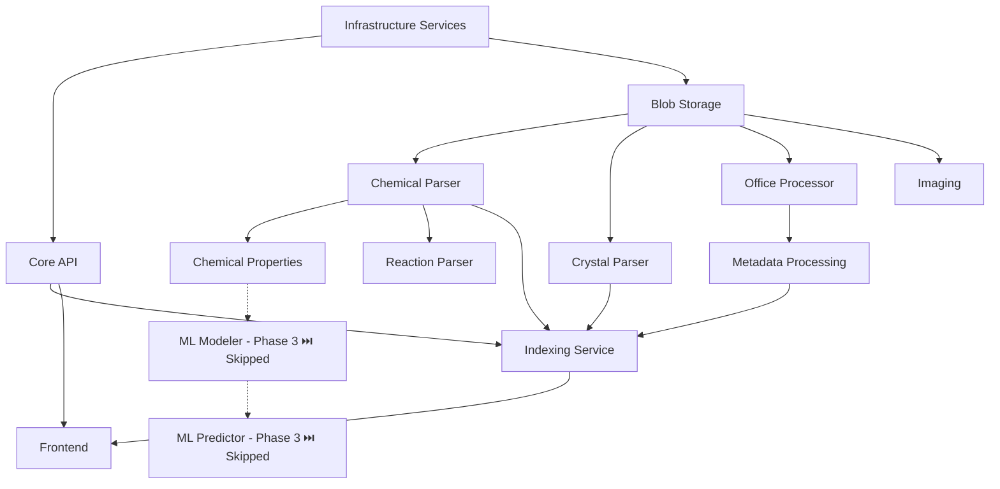

# Leanda NG Agent Coordination

**Last Updated**: 2025-12-27  
**Project Status**: Phase 1 Complete ✅ | Phase 2 Complete ✅ | Phase 3 Skipped ⏭️ | Phase 4 Planned  
**Structure**: Consolidated (services/, shared/, docker/, frontend/, infrastructure/)

---

## Quick Status

| Phase | Status | Agents | Completion |
|-------|--------|--------|------------|
| **Phase 1: Core Services** | ✅ Complete | 5 agents | 100% |
| **Phase 2: Domain Parsers** | ✅ Complete | 10 agents | 100% |
| **Phase 3: ML Services** | ⏭️ Skipped | 0 agents | N/A (will be re-implemented differently) |
| **Phase 4: Production** | 📋 Planned | 6 agents | 0% |
| **Continuous: Team Lead** | 🟢 Active | 1 agent | Ongoing |
| **Continuous: Cloud QA** | 🟢 Active | 1 agent | Ongoing |
| **Continuous: UI/UX** | 🟢 Active | 1 agent | Ongoing |

**Legend**: ⏳ Not Started | 🟢 In Progress | 🟡 Blocked | ✅ Complete

---

## Current Agent Status

### Phase 1 Agents (Complete ✅)

| Agent | Scope | Status | Services |
|-------|-------|--------|----------|
| Agent 1 | Core API & REST | ✅ Complete | core-api |
| Agent 2 | Domain Services & Events | ✅ Complete | Event handlers |
| Agent 3 | Persistence & Data | ✅ Complete | Models, repositories |
| Agent 4 | Testing Infrastructure | ✅ Complete | Test framework |
| Agent 5 | Docker & Infrastructure | ✅ Complete | docker-compose.yml |

### Phase 2 Agents (In Progress 🟢)

| Agent | Scope | Status | Services |
|-------|-------|--------|----------|
| Agent 1 | Java Parsers Group A | ✅ Complete | chemical-parser, chemical-properties, reaction-parser |
| Agent 2 | Java Parsers Group B | ✅ Complete | crystal-parser, spectra-parser, imaging |
| Agent 3 | Blob Storage + Office | ✅ Complete | blob-storage, office-processor |
| Agent 4 | Metadata + Indexing | ✅ Complete | metadata-processing, indexing |
| Agent 5 | ML Services | ⏳ Pending | feature-vectors, modeler, predictor |
| Agent 6 | Frontend | ✅ Complete | Angular 21 application |
| Agent 7 | Testing Infrastructure | ✅ Complete | Test utilities |
| Agent 8 | Docker + Integration | ✅ Complete | docker-compose.yml |
| Agent 9 | Phase 1-2 Integration | ✅ Complete | Event contracts, WebSocket |
| Agent 10 | Verification & QA | ✅ Complete | Contract verification, test coverage audit |

### Phase 3 Agents (Skipped ⏭️)

| Agent | Scope | Status | Services |
|-------|-------|--------|----------|
| Agent ML-1 | Feature Vectors | ⏭️ Skipped | Will be re-implemented differently |
| Agent ML-2 | ML Modeler | ⏭️ Skipped | Will be re-implemented differently |
| Agent ML-3 | ML Predictor | ⏭️ Skipped | Will be re-implemented differently |

**Note**: Phase 3 ML Services are being skipped. The logic will be re-implemented in a different way in the future.

### Continuous Agents (Active 🟢)

| Agent | Scope | Status | Services |
|-------|-------|--------|----------|
| Agent Lead | Team Lead | 🟢 Active | Technology oversight, best practices, timeline management |
| Agent QA-Cloud | Senior Cloud QA | 🟢 Active | Continuous testing strategies, quality assurance |
| Agent UI-UX | Senior UI/UX Engineer | 🟢 Active | Frontend design, UX patterns, accessibility, component design |

### Phase 4 Agents (In Progress 🟢)

| Agent | Scope | Status | Services |
|-------|-------|--------|----------|
| Agent PROD-0 | Cloud Architect | ✅ Complete | Architecture design, Well-Architected Framework |
| Agent PROD-1 | AWS CDK Deployment | 📋 Planned | infrastructure/ |
| Agent PROD-2 | CI/CD Pipelines | ✅ Complete | .github/workflows/ |
| Agent PROD-3 | Monitoring & Alerting | 📋 Planned | Observability |
| Agent PROD-4 | Cloud Security | ✅ Complete | Security architecture, IAM, compliance |
| Agent PROD-5 | FinOps Architect | ✅ Complete | Cost optimization, billing, cost management |

---

## Project Structure (Consolidated)

All paths use the new consolidated structure:

```
mono-repo/
├── services/              # All microservices (11 services)
│   ├── core-api/         # Phase 1 ✅
│   ├── blob-storage/     # Phase 2 ✅
│   ├── office-processor/  # Phase 2 ✅
│   ├── chemical-parser/   # Phase 2 ✅
│   ├── chemical-properties/ # Phase 2 ✅
│   ├── reaction-parser/   # Phase 2 ✅
│   ├── crystal-parser/    # Phase 2 ✅
│   ├── spectra-parser/    # Phase 2 ✅
│   ├── imaging/          # Phase 2 ✅
│   ├── metadata-processing/ # Phase 2 ✅
│   └── indexing/         # Phase 2 ✅
├── ml-services/         # Python ML services (Phase 3 ⏳)
├── shared/                # Shared models, contracts, specs
├── frontend/              # Angular 21 application ✅
├── infrastructure/        # AWS CDK stacks (Phase 4 📋)
├── docker/                # docker-compose.yml ✅
├── tests/                 # Integration and E2E tests ✅
└── docs/                  # Documentation
```

---

## Active Agent Tracking

### Currently Active Agents

1. **Agent Lead: Team Lead** (Continuous)
   - Status: 🟢 Active - Continuously monitoring technology trends and managing timelines
   - See: `docs/agents/AGENT_PROMPTS.md` (Agent Lead)
   - **Purpose**: Continuously monitor latest stable technologies, enforce best practices, and track project timelines

2. **Agent QA-Cloud: Senior Cloud QA** (Continuous)
   - Status: 🟢 Active - Continuously providing testing strategies
   - See: `docs/agents/AGENT_PROMPTS.md` (Agent QA-Cloud)
   - **Purpose**: Continuously provide testing strategies and quality assurance guidance

3. **Agent UI-UX: Senior UI/UX Engineer** (Continuous)
   - Status: 🟢 Active - Continuously overseeing frontend design and UX
   - See: `docs/agents/AGENT_PROMPTS.md` (Agent UI-UX)
   - **Purpose**: Continuously provide UI/UX guidance, design patterns, and frontend best practices

### Next Agents to Start

1. **Agent PROD-0: Cloud Architect** (Phase 4)
   - Dependencies: ✅ Phase 2 complete
   - Status: Ready to start
   - See: `docs/agents/AGENT_PROMPTS.md` (Agent PROD-0)
   - **Priority**: High - Should design architecture before deployment

2. **Agent PROD-1: AWS CDK Deployment** (Phase 4)
   - Dependencies: Agent PROD-0 (Cloud Architect)
   - Status: Waiting for dependencies

5. **Agent PROD-0: Cloud Architect** (Phase 4)
   - Dependencies: ⏳ Phase 3 complete or in progress (to understand service requirements)
   - Status: Ready to start (can start early)
   - See: `docs/agents/AGENT_PROMPTS.md` (Agent PROD-0)
   - **Priority**: High - Should provide architecture guidance before deployment

6. **Agent PROD-4: Cloud Security** (Phase 4)
   - Dependencies: ⏳ PROD-0 (Cloud Architect) for architecture guidance
   - Status: Ready to start (can work in parallel with PROD-1)
   - See: `docs/agents/AGENT_PROMPTS.md` (Agent PROD-4)
   - **Priority**: High - Security should be designed early

7. **Agent PROD-5: FinOps Architect** (Phase 4)
   - Dependencies: ✅ PROD-0 (Cloud Architect) complete
   - Status: ✅ Complete
   - See: `docs/agents/AGENT_PROMPTS.md` (Agent PROD-5)
   - **Priority**: High - Cost optimization should be designed early

---

### Agent PROD-0: Cloud Architect - Architecture Design & Review

**Status**: ✅ Complete  
**Scope**: Cloud architecture design, AWS Well-Architected Framework review, ADRs  
**Current Task**: Architecture design complete  
**Dependencies**: ✅ Phase 2 complete (all services implemented)

**Results**:
- ✅ Comprehensive cloud architecture document created (`docs/cloud-architecture.md`)
- ✅ AWS Well-Architected Framework review completed (all 5 pillars)
- ✅ 6 Architecture Decision Records (ADRs) created:
  - ADR-0001: Use ECS Fargate for Compute
  - ADR-0002: Use MSK Serverless for Messaging
  - ADR-0003: Use DocumentDB for Metadata
  - ADR-0004: Multi-AZ Deployment Strategy
  - ADR-0005: Multi-Layer Caching Strategy
  - ADR-0006: Disaster Recovery Strategy
- ✅ Architecture diagrams created (`docs/architecture-diagrams.md`)
- ✅ Scalability and performance architecture designed
- ✅ Disaster recovery architecture designed
- ✅ Service selection rationale documented

**Key Deliverables**:
- `docs/cloud-architecture.md` - Comprehensive architecture design
- `docs/architecture-diagrams.md` - Visual architecture diagrams (Mermaid)
- `docs/adr/` - Architecture Decision Records directory with 6 ADRs

**Architecture Highlights**:
- **Compute**: ECS Fargate with auto-scaling (2-20 tasks per service)
- **Messaging**: MSK Serverless for Kafka (auto-scaling, multi-AZ)
- **Database**: DocumentDB with multi-AZ, automated backups
- **Caching**: Three-layer strategy (CloudFront, ElastiCache Redis, Application)
- **Disaster Recovery**: Multi-region backup strategy (RTO: 4h, RPO: 1h)
- **Security**: VPC isolation, IAM least privilege, encryption at rest/in-transit
- **Observability**: CloudWatch, X-Ray, structured logging

**Next Steps for Other Agents**:
- PROD-1: Implement CDK stacks with architecture enhancements
- PROD-2: Create CI/CD pipelines based on architecture
- PROD-3: Set up monitoring and alerting per architecture
- PROD-4: Implement security architecture (coordinate with PROD-0)
- PROD-5: Implement cost optimization strategies (coordinate with PROD-0)

**Responsibilities**:
1. **Architecture Design**
   - Design cloud architecture following AWS Well-Architected Framework
   - Document service selection rationale and trade-offs
   - Create architecture diagrams and documentation

2. **AWS Well-Architected Framework Review**
   - Operational Excellence: CI/CD, runbooks, monitoring
   - Security: IAM, encryption, network security
   - Reliability: Multi-AZ, disaster recovery, fault tolerance
   - Performance Efficiency: Caching, database optimization, CDN
   - Cost Optimization: Right-sizing, resource tagging, cost allocation

3. **Architecture Decision Records (ADRs)**
   - Document major architectural decisions
   - Include context, decision, consequences, alternatives
   - Store in `docs/adr/` directory

4. **Scalability and Performance Design**
   - Design auto-scaling strategies
   - Design caching layers
   - Design database optimization strategies
   - Design CDN and edge computing strategies

5. **Disaster Recovery Design**
   - Design backup and restore procedures
   - Design multi-region failover architecture
   - Define RTO/RPO targets and procedures

6. **Coordination**
   - Provide architecture guidance to PROD-1 (CDK deployment)
   - Coordinate with PROD-4 on security architecture
   - Coordinate with PROD-5 on cost optimization strategies

**Key Files**:
- Architecture: `docs/cloud-architecture.md`
- Diagrams: `docs/architecture-diagrams.md`
- ADRs: `docs/adr/0001-*.md` through `docs/adr/0006-*.md`
- Infrastructure: `infrastructure/lib/stacks/`

**Next**: Architecture design complete. Ready for PROD-1 to implement CDK stacks.

---

### Agent PROD-2: CI/CD Pipelines - GitHub Actions Setup

**Status**: ✅ Complete  
**Scope**: GitHub Actions workflows, automated testing, automated deployment, OIDC setup  
**Current Task**: CI/CD pipelines complete  
**Dependencies**: ✅ Phase 2 complete (all services implemented)

**Results**:
- ✅ GitHub Actions workflows created for all components:
  - Java services workflow (build and test all 11 services)
  - Frontend workflow (lint, test, build, E2E)
  - Infrastructure workflow (CDK validation and synth)
  - Staging deployment workflow
  - Production deployment workflow
- ✅ OIDC configuration documented for AWS authentication
- ✅ Secrets management guide created
- ✅ Comprehensive deployment guide created
- ✅ All workflows configured with proper triggers and conditions
- ✅ Matrix builds for parallel service testing
- ✅ Artifact uploads for test results and build outputs

**Key Deliverables**:
- `.github/workflows/java-services.yml` - Java services build and test
- `.github/workflows/frontend.yml` - Frontend build, test, and E2E
- `.github/workflows/infrastructure.yml` - CDK validation
- `.github/workflows/deploy-staging.yml` - Staging deployment
- `.github/workflows/deploy-production.yml` - Production deployment
- `docs/deployment/oidc-setup.md` - OIDC authentication setup guide
- `docs/deployment/deployment-guide.md` - Comprehensive deployment guide
- `docs/deployment/secrets-management.md` - Secrets management guide

**Workflow Features**:
- **Java Services**: Matrix build for 11 services, unit and integration tests, test result artifacts
- **Frontend**: Lint, unit tests with coverage, production build, Playwright E2E tests
- **Infrastructure**: CDK TypeScript build, synth, and diff validation
- **Staging Deployment**: Automatic on `develop` branch, manual service selection
- **Production Deployment**: Automatic on `main` branch, confirmation required for manual dispatch
- **OIDC Authentication**: Secure AWS authentication without long-lived credentials
- **Secrets Management**: GitHub secrets for CI/CD, AWS Secrets Manager for runtime

**Next Steps for Other Agents**:
- PROD-1: Can now use these workflows for CDK deployment automation
- PROD-3: Can integrate monitoring and alerting into deployment workflows
- All agents: Can use workflows for automated testing and validation

**Responsibilities**:
1. **GitHub Actions Workflows**
   - Create build and test workflows for Java services
   - Create build and test workflows for frontend
   - Create validation workflow for infrastructure (CDK)
   - Create deployment workflows for staging and production

2. **OIDC Configuration**
   - Document OIDC setup for AWS authentication
   - Configure IAM roles for GitHub Actions
   - Set up trust policies for staging and production

3. **Secrets Management**
   - Document GitHub secrets configuration
   - Document AWS Secrets Manager usage
   - Document AWS Systems Manager Parameter Store usage

4. **Deployment Documentation**
   - Create comprehensive deployment guide
   - Document manual deployment procedures
   - Document rollback procedures
   - Document troubleshooting steps

**Key Files**:
- Workflows: `.github/workflows/*.yml`
- OIDC Setup: `docs/deployment/oidc-setup.md`
- Deployment Guide: `docs/deployment/deployment-guide.md`
- Secrets Management: `docs/deployment/secrets-management.md`

**Next**: CI/CD pipelines complete. Ready for PROD-1 to use workflows for CDK deployment.

---

### Agent PROD-5: FinOps Architect - Cost Optimization & Cost Management

**Status**: ✅ Complete  
**Scope**: Cost optimization strategies, AWS Budgets, cost allocation tags, FinOps documentation  
**Current Task**: Cost optimization implementation complete  
**Dependencies**: ✅ PROD-0 (Cloud Architect) complete

**Results**:
- ✅ FinOps CDK stack created (`infrastructure/lib/stacks/finops-stack.ts`)
  - AWS Budgets configured (dev: $1,000, staging: $5,000, prod: $10,000)
  - Budget alerts at 50%, 80%, 100%, and forecasted thresholds
  - SNS topics for budget and cost anomaly alerts
- ✅ Cost allocation tagging utility created (`infrastructure/lib/utils/tagging.ts`)
  - Mandatory tags: Project, Environment, Service, CostCenter, Owner
  - Applied to all CDK stacks
- ✅ S3 lifecycle policies enhanced
  - Intelligent-Tiering for automatic cost optimization
  - Glacier transition after 90 days
  - Deep Archive transition after 180 days
  - Automatic cleanup of incomplete multipart uploads
- ✅ Cost optimization ADR created (`docs/adr/0007-cost-optimization-strategy.md`)
- ✅ FinOps playbook created (`docs/finops/README.md`)
- ✅ Cost baseline document created (`docs/finops/cost-baseline.md`)
- ✅ Infrastructure README updated with cost optimization information

**Key Deliverables**:
- `infrastructure/lib/stacks/finops-stack.ts` - FinOps CDK stack
- `infrastructure/lib/utils/tagging.ts` - Cost allocation tagging utility
- `docs/adr/0007-cost-optimization-strategy.md` - Cost optimization ADR
- `docs/finops/README.md` - FinOps playbook and procedures
- `docs/finops/cost-baseline.md` - Cost baseline and optimization recommendations
- `infrastructure/README.md` - Updated with cost optimization section

**Cost Optimization Strategies**:
- **Cost Allocation**: Comprehensive tagging strategy for cost visibility
- **AWS Budgets**: Budget tracking and alerts per environment
- **S3 Optimization**: Intelligent-Tiering and lifecycle policies
- **Right-Sizing**: Procedures for ECS, DocumentDB, ElastiCache
- **Reserved Capacity**: Strategy for predictable workloads
- **Cost Monitoring**: Cost Explorer, budgets, anomaly detection

**Next Steps for Other Agents**:
- PROD-1: Ensure cost allocation tags are applied to all resources
- PROD-3: Coordinate on cost monitoring dashboards
- All agents: Follow cost optimization procedures in FinOps playbook

**Responsibilities**:
1. **Cost Allocation and Tagging**
   - Design comprehensive tagging strategy
   - Implement tags in all CDK stacks
   - Enable cost allocation reports

2. **AWS Budgets and Cost Monitoring**
   - Configure AWS Budgets per environment
   - Set up budget alerts and notifications
   - Enable cost anomaly detection (manual setup required)
   - Create cost monitoring dashboards

3. **Cost Optimization Strategies**
   - Design right-sizing strategies
   - Implement S3 lifecycle policies
   - Design Reserved Instance/Savings Plans strategy
   - Create cost optimization procedures

4. **Cost Review and Reporting**
   - Monthly cost review procedures
   - Quarterly cost review procedures
   - Cost allocation reports
   - Cost optimization recommendations

5. **Documentation**
   - Create FinOps playbook
   - Create cost optimization ADRs
   - Create cost baseline documents
   - Update infrastructure documentation

**Key Files**:
- FinOps Stack: `infrastructure/lib/stacks/finops-stack.ts`
- Tagging Utility: `infrastructure/lib/utils/tagging.ts`
- Cost Optimization ADR: `docs/adr/0007-cost-optimization-strategy.md`
- FinOps Playbook: `docs/finops/README.md`
- Cost Baseline: `docs/finops/cost-baseline.md`
- Infrastructure README: `infrastructure/README.md`

**Next**: Cost optimization implementation complete. Manual setup required for Cost Anomaly Detection and billing alarms.

---

## Dependency Graph



---

## Shared Artifacts Status

### Contracts (AsyncAPI/OpenAPI)

- ✅ Core API (OpenAPI 3.1) - `shared/specs/api/core-api.yaml`
- ✅ Domain Events (AsyncAPI) - `shared/specs/events/domain-events.yaml`
- ✅ Blob Storage API (OpenAPI 3.1) - `shared/contracts/blob-storage-api.yaml`
- ✅ Blob Events (AsyncAPI) - `shared/contracts/events/blob-events.yaml`
- ✅ Chemical Parser Events - `shared/contracts/events/chemical-parser-events.yaml`
- ✅ Chemical Properties Events - `shared/contracts/events/chemical-properties-events.yaml`
- ✅ Reaction Parser Events - `shared/contracts/events/reaction-parser-events.yaml`
- ✅ Crystal Parser Events - `shared/contracts/events/crystal-parser-events.yaml`
- ✅ Spectra Parser Events - `shared/contracts/events/spectra-parser-events.yaml`
- ✅ Imaging Events - `shared/contracts/events/imaging-events.yaml`
- ✅ Office Processor Events - `shared/contracts/events/office-processor-events.yaml`
- ✅ Metadata Events - `shared/contracts/events/metadata-events.yaml`
- ✅ Indexing Events - `shared/contracts/events/indexing-events.yaml`
- ⏭️ ML Services API (OpenAPI 3.1) - Skipped (will be re-implemented differently)

### Models

- ✅ User.java - `shared/models/User.java`
- ✅ File.java - `shared/models/File.java`
- ✅ BlobInfo.java - `shared/models/BlobInfo.java`
- ✅ LoadedBlobInfo.java - `shared/models/LoadedBlobInfo.java`
- ✅ Property.java - `shared/models/Property.java`
- ✅ VersionInfo.java - `shared/models/VersionInfo.java`
- ✅ Event models - `shared/models/events/` (UserCreated, FileCreated, etc.)

---

## Change Proposals

*No pending change proposals*

**How to propose changes:**
1. Add your proposal below with `[Agent Name]` prefix
2. Describe the change and rationale
3. Wait for coordination before implementing
4. Update this section when proposal is accepted/rejected

---

## Integration Checkpoints

### Checkpoint 1: Phase 1 Complete
**Date**: 2025-12-27  
**Status**: ✅ Complete  
**Results**:
- ✅ Core API service implemented
- ✅ Event-driven architecture established
- ✅ Docker infrastructure ready
- ✅ Testing infrastructure in place

### Checkpoint 2: Phase 2 Complete
**Date**: 2025-12-27  
**Status**: ✅ Complete  
**Results**:
- ✅ All domain parsers migrated
- ✅ Blob storage and office processor complete
- ✅ Metadata processing and indexing complete
- ✅ Frontend migrated to Angular 21
- ✅ Phase 1-2 integration complete

### Checkpoint 3: Phase 2 Verification
**Date**: 2025-12-27  
**Status**: ✅ Complete  
**Results**:
- ✅ All 11 services verified against contracts
- ✅ Integration test coverage audited (15 integration tests documented)
- ✅ docker-compose.yml verified for consolidated structure
- ✅ Verification report created: `docs/agents/VERIFICATION_REPORT.md`
- ✅ No critical issues found
- ⚠️ 3 services have topic name mismatches (crystal-parser, spectra-parser, imaging) - medium priority
- ⚠️ 1 service has API version mismatch (core-api) - medium priority

### Checkpoint 4: Phase 3 Status
**Date**: 2025-12-27  
**Status**: ⏭️ Skipped  
**Decision**: Phase 3 ML Services will be re-implemented in a different way. Skipping modernization for now.

### Checkpoint 5: Continuous QA Established
**Date**: 2025-12-27  
**Status**: 🟢 Active  
**Results**:
- ✅ Senior Cloud QA Agent (QA-Cloud) established
- ✅ Continuous testing strategy guidance available
- ✅ Quality assurance processes documented

---

## Detailed Agent Status

### Agent 10: Verification & Quality Assurance

**Status**: ✅ Complete  
**Scope**: Comprehensive verification of all Phase 2 services  
**Current Task**: Verification complete - all 11 services verified  
**Dependencies**: ✅ All Phase 2 services complete (Agents 1-4, 6-9)

**Results**:
- ✅ All 11 services verified against OpenAPI/AsyncAPI contracts
- ✅ Docker-compose.yml verified and valid (all services configured correctly)
- ✅ Integration test coverage audited (15 integration tests found)
- ✅ Verification report created: `docs/agents/VERIFICATION_REPORT.md`
- ✅ No critical issues found
- ⚠️ Medium priority: 3 services have topic name mismatches (crystal-parser, spectra-parser, imaging)
- ⚠️ Medium priority: core-api has API version mismatch (v1 vs v2)

**Findings**:
- All verified services match their contracts (event schemas, field names, types)
- Docker-compose configuration is correct (all services, health checks, dependencies)
- Integration test coverage is good for core services, partial for parser services
- Topic name mismatches: Contracts specify single topics but implementations use separate topics per event type (may be intentional for routing)
- API version: core-api uses `/api/v1/users` but contract specifies `/api/v2/users`

**Responsibilities**:
1. **Contract Verification**
   - Verify all 11 Phase 2 services match their OpenAPI/AsyncAPI contracts
   - Check event field names, types, and required fields
   - Verify Kafka topic names match contracts
   - Verify API endpoints match OpenAPI specs

2. **Integration Test Coverage Audit**
   - List all Phase 2 services
   - Check if each service has integration tests
   - Verify test coverage is >80% for critical paths
   - Identify gaps in test coverage
   - Create missing integration tests if needed

3. **Docker Compose Verification**
   - Verify all services are in docker/docker-compose.yml
   - Check service paths use consolidated structure (`services/`, not old paths)
   - Verify health checks are configured and working
   - Verify service dependencies are correct
   - Verify environment variables are set correctly

4. **Create Verification Report**
   - Document all findings
   - List any issues found (contract mismatches, missing tests, etc.)
   - Provide recommendations for fixes
   - Update COORDINATION.md with results

**Services to Verify**:
- ✅ core-api (Phase 1)
- ✅ blob-storage
- ✅ office-processor
- ✅ chemical-parser
- ✅ chemical-properties
- ✅ reaction-parser
- ✅ crystal-parser
- ✅ spectra-parser
- ✅ imaging
- ✅ metadata-processing
- ✅ indexing

**Contracts to Verify**:
- `shared/contracts/blob-storage-api.yaml` (OpenAPI)
- `shared/contracts/events/blob-events.yaml` (AsyncAPI)
- `shared/contracts/events/chemical-parser-events.yaml` (AsyncAPI)
- `shared/contracts/events/chemical-properties-events.yaml` (AsyncAPI)
- `shared/contracts/events/reaction-parser-events.yaml` (AsyncAPI)
- `shared/contracts/events/crystal-parser-events.yaml` (AsyncAPI)
- `shared/contracts/events/spectra-parser-events.yaml` (AsyncAPI)
- `shared/contracts/events/imaging-events.yaml` (AsyncAPI)
- `shared/contracts/events/office-processor-events.yaml` (AsyncAPI)
- `shared/contracts/events/metadata-events.yaml` (AsyncAPI)
- `shared/contracts/events/indexing-events.yaml` (AsyncAPI)
- `shared/specs/events/domain-events.yaml` (AsyncAPI - Phase 1 events)

**Next**: Start comprehensive verification of all Phase 2 services

---

### Agent QA-Cloud: Senior Cloud QA - Testing Strategies

**Status**: 🟢 Active  
**Scope**: Continuous testing strategies and quality assurance guidance  
**Current Task**: Testing strategy documentation complete, implementing test improvements  
**Dependencies**: ✅ Phase 2 services complete (can review their tests)

**Results**:
- ✅ Comprehensive testing strategy document created (`docs/testing/testing-strategy.md`)
- ✅ Quick reference guide created (`docs/testing/quick-reference.md`)
- ✅ Implementation status tracking created (`docs/testing/implementation-status.md`)
- ✅ Added Kafka event consumption integration tests for parser services:
  - ChemicalParserEventConsumptionTest
  - CrystalParserEventConsumptionTest
  - SpectraParserEventConsumptionTest
  - ImagingEventConsumptionTest
- ✅ Created CI/CD GitHub Actions workflow (`.github/workflows/test.yml`)
  - Unit tests (Java + Frontend)
  - Integration tests
  - E2E tests
  - Security scanning

**Responsibilities**:
1. **Continuous Testing Strategy Review**
   - Review test coverage across all services
   - Identify gaps in test coverage
   - Recommend testing improvements
   - Review test execution times and reliability

2. **Provide Testing Strategies**
   - Unit testing strategies (Java/Quarkus, Python/FastAPI)
   - Integration testing strategies (microservices, event-driven)
   - End-to-end testing strategies (Playwright, Cypress)
   - Performance testing strategies (k6, JMeter, Gatling)
   - Security testing strategies (OWASP ZAP, Snyk)
   - Chaos engineering and resilience testing
   - Cloud-native testing strategies (AWS services, serverless)

3. **Review and Improve Test Infrastructure**
   - Review BaseIntegrationTest and test utilities
   - Recommend test infrastructure improvements
   - Review test container configurations
   - Recommend test environment management

4. **CI/CD Testing Integration**
   - Review CI/CD pipeline configurations
   - Recommend test execution strategies
   - Guide on test result reporting
   - Recommend test parallelization

5. **Document Testing Strategies**
   - Create testing strategy documents
   - Document testing patterns and best practices
   - Create testing runbooks and guides

**Key Files**:
- Coordination: `docs/agents/COORDINATION.md`
- Test Infrastructure: `tests/integration/`, `tests/e2e/`
- Service Tests: `services/*/src/test/`
- Verification Report: `docs/agents/VERIFICATION_REPORT.md`
- Testing Documentation: `docs/testing/` ✅
  - `testing-strategy.md` - Comprehensive testing strategy
  - `quick-reference.md` - Quick reference guide
  - `implementation-status.md` - Implementation tracking

**Next**: 
- Expand E2E tests with Page Object Model
- Add error handling integration tests
- Set up performance testing

---

### Agent UI-UX: Senior UI/UX Engineer - Frontend Design & UX

**Status**: 🟢 Active  
**Scope**: Continuous frontend design, UX patterns, and component architecture oversight  
**Current Task**: Continuously providing UI/UX guidance and frontend best practices  
**Dependencies**: ✅ Angular 21 frontend exists (can review and improve)

**Responsibilities**:
1. **Continuous UI/UX Review**
   - Review component architecture and organization
   - Review UI/UX patterns and consistency
   - Check accessibility compliance (WCAG 2.1 AA)
   - Review responsive design implementation
   - Analyze performance metrics

2. **Provide UI/UX Design Strategies**
   - Component design patterns (standalone, smart/dumb, composition)
   - User experience patterns (loading states, error handling, navigation)
   - Accessibility strategies (WCAG 2.1 AA, ARIA, keyboard navigation)
   - Responsive design strategies (mobile-first, breakpoints)
   - Performance optimization (bundle size, lazy loading, change detection)
   - State management patterns (Signals, RxJS, shared vs local state)

3. **Review and Improve Frontend Architecture**
   - Review component organization and structure
   - Recommend feature module improvements
   - Review service architecture patterns
   - Recommend routing and navigation improvements
   - Review API service patterns

4. **Design System & Consistency**
   - Review design system components
   - Recommend design token system
   - Guide on component library organization
   - Review theme and theming strategies

5. **Frontend Testing Strategies**
   - Review unit test patterns (Jasmine/Karma)
   - Recommend component testing strategies
   - Guide on E2E testing with Playwright
   - Recommend accessibility testing

6. **Document UI/UX Strategies**
   - Create UI/UX strategy documents
   - Document design patterns and component guidelines
   - Create accessibility guidelines
   - Document responsive design patterns

**Key Files**:
- Coordination: `docs/agents/COORDINATION.md`
- Frontend Code: `frontend/src/`
- Frontend README: `frontend/README.md`
- Migration Status: `frontend/MIGRATION_STATUS.md`
- UI/UX Documentation: `docs/frontend/` (create if needed)

**Next**: Continuously review frontend state and provide UI/UX recommendations

---

### Agent Lead: Team Lead - Technology Oversight & Timeline Management

**Status**: 🟢 Active  
**Scope**: Continuous technology monitoring, best practices enforcement, and timeline management  
**Current Task**: Continuously monitoring technology trends and managing project timelines  
**Dependencies**: ✅ All agents and phases (coordinate across entire project)

**Responsibilities**:
1. **Technology Monitoring** (Weekly)
   - Monitor latest stable versions of all technologies (Java, Quarkus, Angular, TypeScript, Python, FastAPI, AWS services)
   - Review security advisories and CVE reports
   - Review technology trends and industry best practices
   - Monitor AWS Well-Architected Framework updates

2. **Best Practices Enforcement** (Continuous)
   - Code quality standards (formatting, test coverage, type safety)
   - Architecture best practices (contract-first, event-driven, DDD)
   - Security best practices (no secrets, authentication, encryption)
   - DevOps best practices (IaC, CI/CD, monitoring, logging)
   - Documentation best practices (READMEs, API docs, ADRs)

3. **Timeline Management** (Weekly)
   - Review project milestones and phases
   - Track agent progress and status
   - Manage dependencies and critical path
   - Report progress and identify blockers

4. **Technology Decision Coordination** (As Needed)
   - Review and approve technology proposals
   - Coordinate technology upgrades
   - Maintain technology standards and compatibility matrix
   - Document upgrade policies and procedures

5. **Dependency Management** (Monthly)
   - Review dependency versions and security vulnerabilities
   - Maintain dependency consistency across services
   - Plan and coordinate dependency upgrades
   - Track dependency licenses

6. **Project Coordination** (Continuous)
   - Review agent coordination and resolve conflicts
   - Review architecture decisions for consistency
   - Review code quality and technical debt
   - Coordinate shared artifact changes

7. **Document Technology Strategy**
   - Create technology strategy documents
   - Document technology standards and policies
   - Create technology upgrade roadmaps
   - Document best practices guides

**Key Files**:
- Coordination: `docs/agents/COORDINATION.md`
- Technology Stack: `README.md`, `docs/architecture.md`
- Dependencies: `services/*/pom.xml`, `frontend/package.json`, `infrastructure/package.json`
- Migration Plans: `docs/phases/`
- Technology Documentation: `docs/technology/` (create if needed)
- ADRs: `docs/adr/` (create if needed)

**Next**: Continuously monitor technology trends and manage project timelines

---

## Notes for Agents

### Before Starting Work

1. **Read this file first** - Check dependencies and current status
2. **Read your agent prompt** - See `docs/agents/AGENT_PROMPTS.md`
3. **Check path structure** - All paths use consolidated structure (see above)
4. **Update status** - Mark yourself as "In Progress" when starting

### During Work

1. **Update regularly** - Update your status every 30-60 minutes
2. **Propose changes** - Use Change Proposals section for shared artifacts
3. **Coordinate** - Check for conflicts with other agents
4. **Test** - Ensure >80% code coverage before marking complete

### When Completing

1. **Update status** - Mark as "✅ Complete"
2. **Document** - Update service READMEs
3. **Test** - Run all tests and verify coverage
4. **Report** - Document what you completed and any blockers

### Path Reference

- **Services**: `services/[service-name]/`
- **Shared**: `shared/`
- **Tests**: `tests/`
- **Docker**: `docker/docker-compose.yml`
- **Frontend**: `frontend/`
- **Infrastructure**: `infrastructure/`
- **Documentation**: `docs/`

---

## Quick Commands

```bash
# Check agent status
./docs/agents/scripts/agent-status.sh

# Initialize agent session
./docs/agents/scripts/agent-init.sh [agent-name]

# Check service health
./docs/agents/scripts/health-check.sh

# Start all services
cd docker && docker-compose up -d

# Run tests
cd services/[service-name] && mvn test
```

---

**Last Major Update**: 2025-12-27 - Project consolidation complete, agent system updated for new structure

