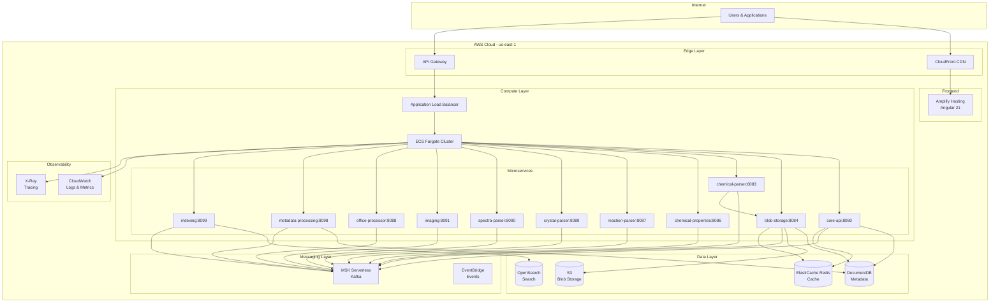
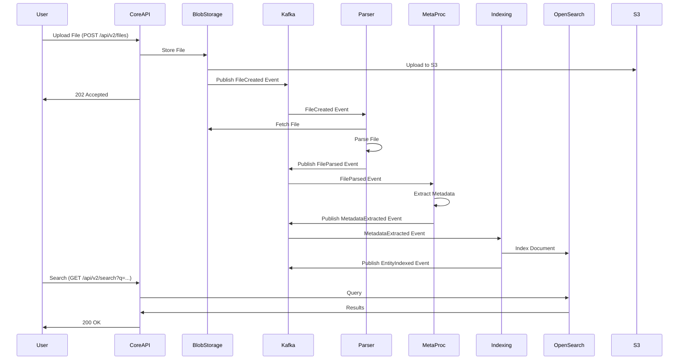
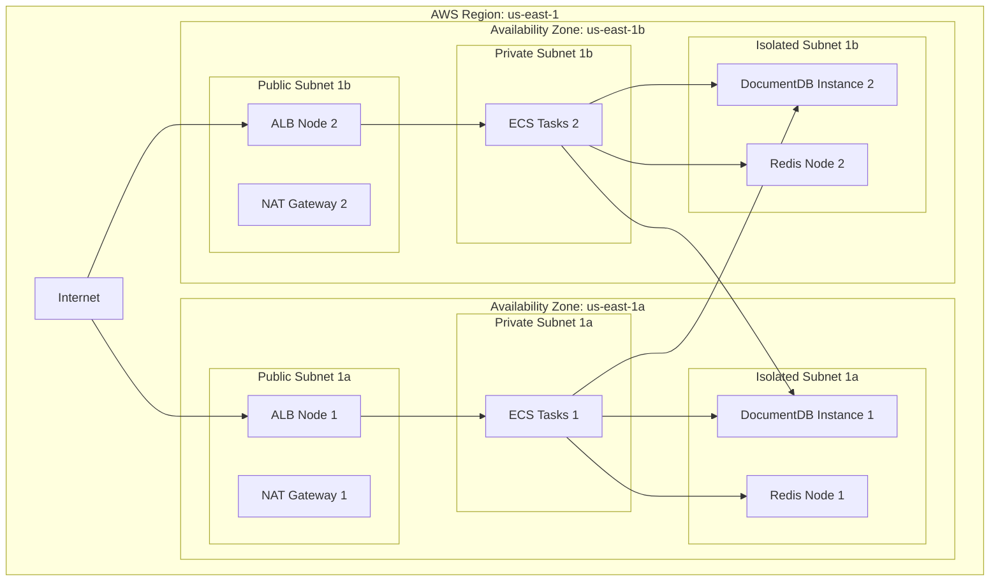
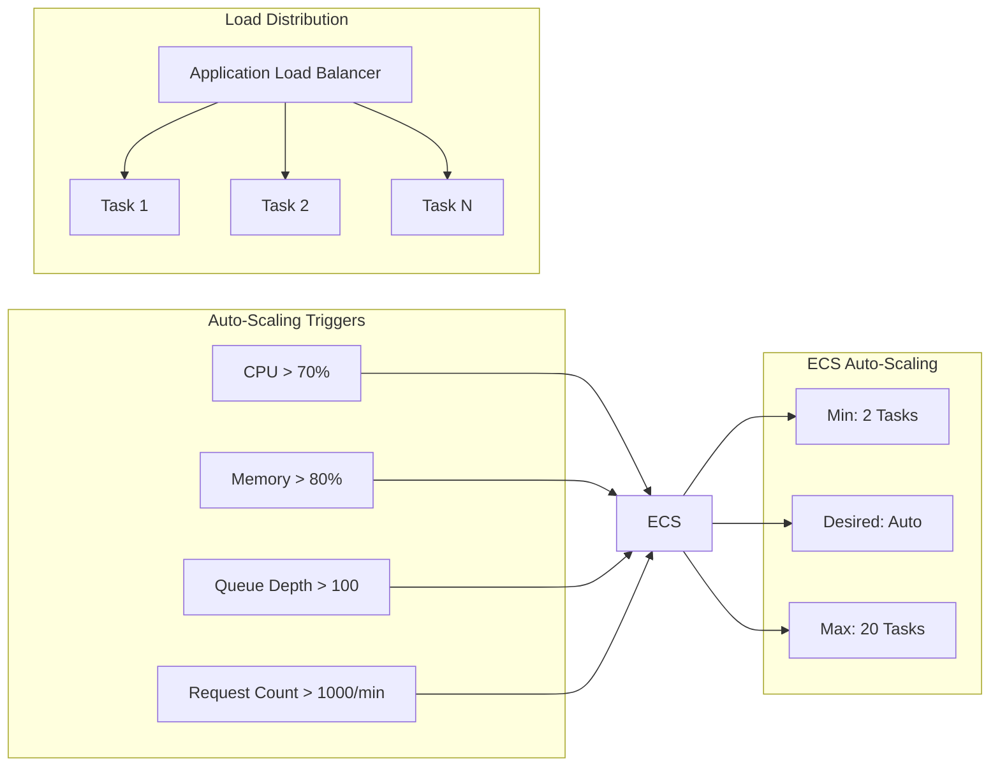
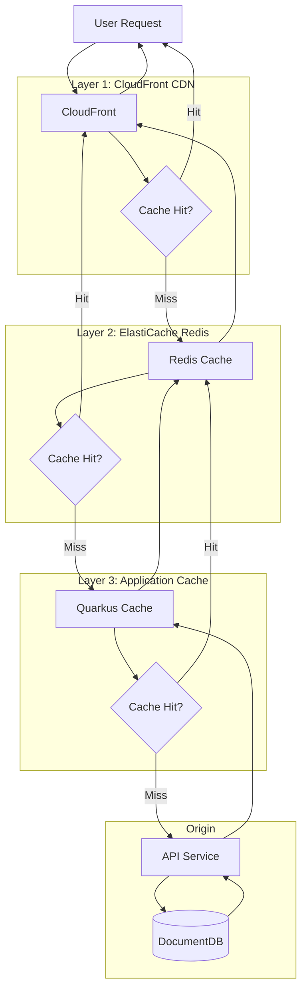
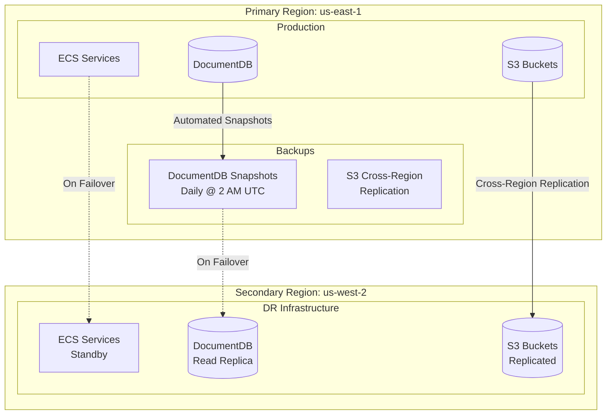
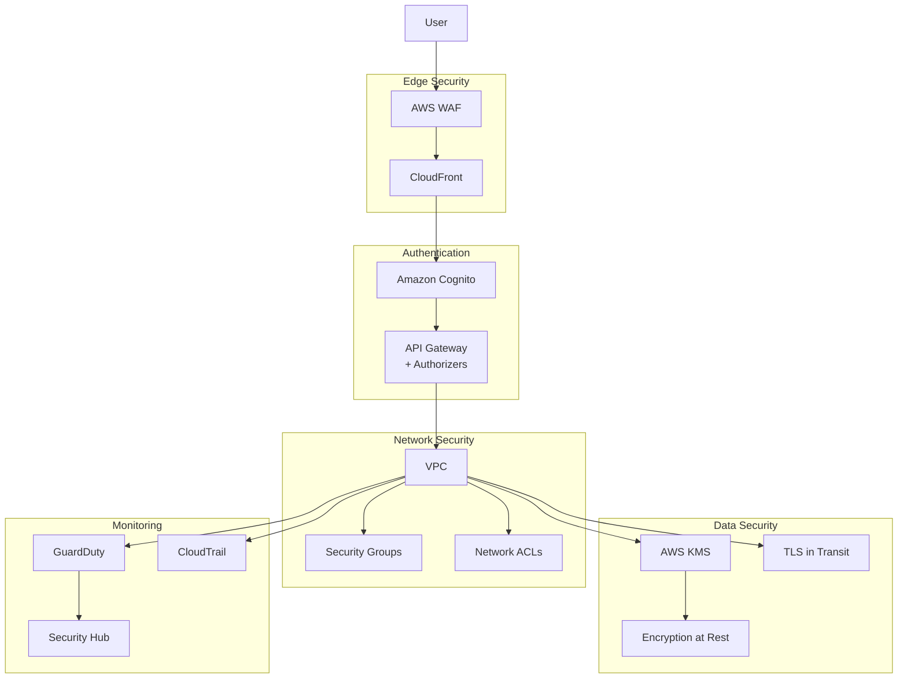
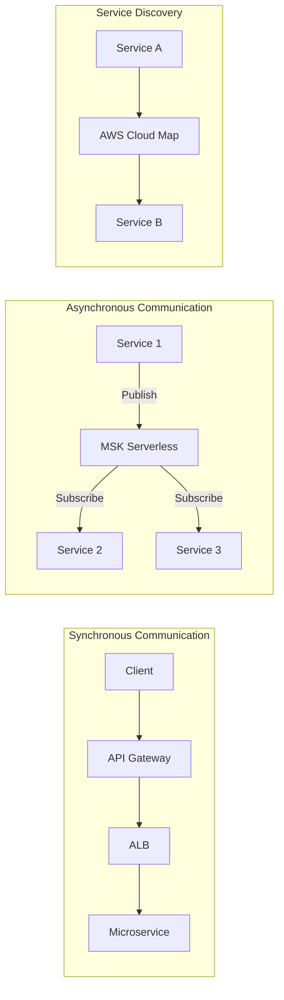
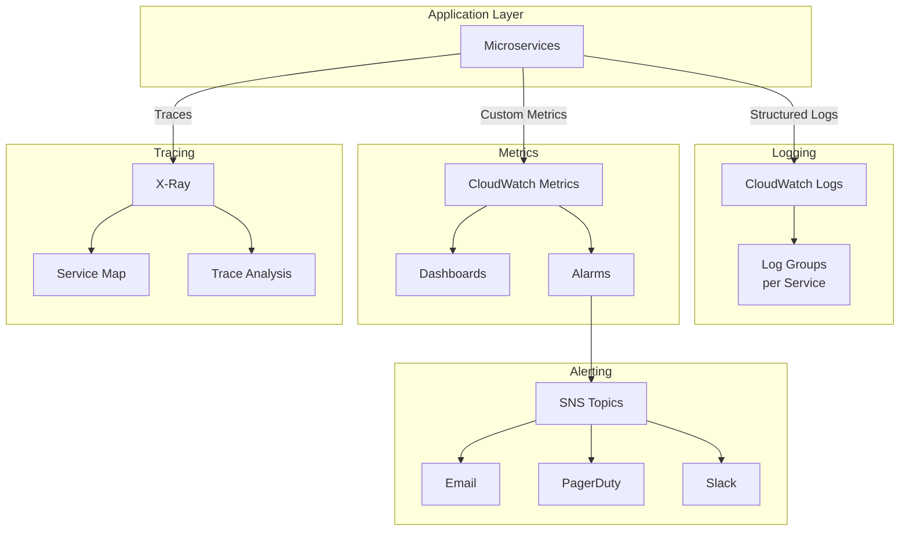

# Leanda.io Architecture Diagrams

**Status**: Complete  
**Last Updated**: 2025-12-27  
**Architect**: Agent PROD-0 (Cloud Architect)

## High-Level Architecture

## Event-Driven Architecture Flow

## Multi-AZ Deployment Architecture

## Scalability Architecture

## Caching Architecture

## Disaster Recovery Architecture

## Security Architecture

## Service Integration Patterns

## Observability Architecture

