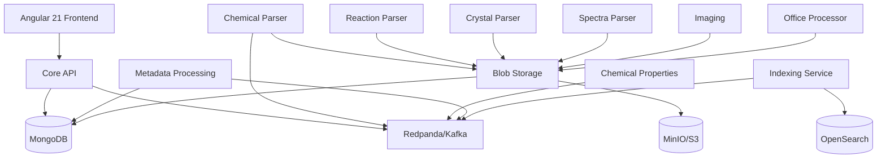
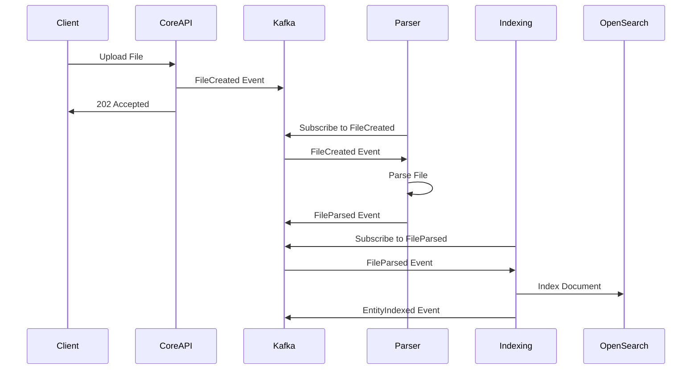

# Project Structure Architecture

This document explains the consolidated organization of the Leanda NG modernization project.

## Overview

The Leanda NG project has been consolidated into a unified folder structure for clarity and maintainability:

```
mono-repo/
├── infrastructure/          # AWS CDK stacks (TypeScript)
├── frontend/                # Angular 21 application
├── services/                # All Java/Quarkus microservices
├── ml-services/             # Python ML services
├── shared/                  # Shared models, contracts, specs
├── tests/                   # Integration and E2E tests
├── docker/                  # Docker Compose for local development
├── docs/                    # Documentation
└── legacy/                  # Legacy projects (pre-2021, EOL)
```

## Folder Purposes

### infrastructure/

**Role**: AWS CDK Infrastructure as Code

**Contents**:
- `bin/` - CDK app entry point
- `lib/stacks/` - Infrastructure stacks (IAM, Networking, Database, Messaging, Compute, Observability)
- `iam/` - IAM policy files

**Technologies**: TypeScript, AWS CDK

### frontend/

**Role**: Angular 21 Frontend Application

**Contents**:
- `src/app/` - Angular application source code
- `e2e/` - Playwright E2E tests
- Modern zoneless architecture with Signal Forms

**Technologies**: Angular 21, TypeScript, Playwright

### services/

**Role**: All Backend Microservices

**Contents**:

| Service | Description | Port |
|---------|-------------|------|
| `core-api` | Core API with user management, events, WebSocket | 8080 |
| `blob-storage` | Blob/file storage service | 8084 |
| `chemical-parser` | Chemical file parser (SDF, MOL) | 8083 |
| `chemical-properties` | Chemical properties calculator | 8086 |
| `reaction-parser` | Chemical reaction parser (RXN) | 8087 |
| `crystal-parser` | Crystal structure parser (CIF) | 8089 |
| `spectra-parser` | Spectra file parser (JDX) | 8090 |
| `imaging` | Image processing service | 8091 |
| `office-processor` | Office document processor | 8088 |
| `metadata-processing` | Metadata extraction service | 8098 |
| `indexing` | OpenSearch indexing service | 8099 |

**Technologies**: Java 21, Quarkus 3.17+, MongoDB, Kafka

### ml-services/

**Role**: Python ML/AI Services

**Contents**:
- `ml-pipeline/` - ML training and inference pipelines
- `text-mining/` - Text mining and NLP services

**Technologies**: Python 3.12+, FastAPI

### shared/

**Role**: Shared Code and Contracts

**Contents**:
- `models/` - Domain models (User, File, events)
- `contracts/` - Event schemas (AsyncAPI)
- `specs/` - API specifications (OpenAPI)
- `interfaces/` - Repository interfaces

### tests/

**Role**: Integration and E2E Tests

**Contents**:
- `integration/` - Service integration tests
- `e2e/` - End-to-end tests
- `fixtures/` - Test data builders
- `utils/` - Test utilities

### docker/

**Role**: Local Development Environment

**Contents**:
- `docker-compose.yml` - Orchestrates all services
- `prometheus/` - Prometheus configuration
- `grafana/` - Grafana dashboards and provisioning

## Development Workflow

### Starting the Full Stack

```bash
cd docker
docker-compose up -d
```

This starts:
- Infrastructure: MongoDB, Redis, Redpanda (Kafka), OpenSearch, MinIO
- All backend services
- Monitoring: Prometheus, Grafana

### Running a Single Service

```bash
cd services/core-api
mvn quarkus:dev
```

### Running Frontend

```bash
cd frontend
npm install
ng serve
```

### Deploying Infrastructure

```bash
cd infrastructure
npm install
npx cdk deploy --all
```

## Service Architecture



## Event Flow



## Agent Coordination System

The project uses a multi-agent coordination system for parallel development. AI agents work on different parts of the project simultaneously while maintaining coordination.

### Key Components

- **`docs/agents/COORDINATION.md`** - Single source of truth for agent status, dependencies, and project state
- **`docs/agents/AGENT_PROMPTS.md`** - Ready-to-use prompts for each agent
- **`docs/agents/scripts/`** - Helper scripts for agent initialization and status checking

### How It Works

1. **Agent Selection**: Choose an agent from `AGENT_PROMPTS.md`
2. **Initialization**: Agent reads `COORDINATION.md` to check dependencies
3. **Work Execution**: Agent updates status and implements features
4. **Coordination**: Agents coordinate through `COORDINATION.md`

### Current Status

- ✅ **Phase 1**: Complete (Core API, Domain Services, Persistence, Testing, Docker)
- ✅ **Phase 2**: Complete (Parsers, Blob Storage, Office, Metadata, Indexing, Frontend, Integration)
- ⏳ **Phase 3**: Pending (ML Services)
- 📋 **Phase 4**: Planned (Production Deployment)

See [Agent Coordination System](./agents/README.md) for detailed documentation.

## Archived Folders

Previous folder structure has been archived to `.archive/`:

- `.archive/leanda-ng-phase1/` - Former `leanda-ng-core-distro` (Phase 1 reference)
- `.archive/leanda-ng-original/` - Former `leanda-ng` (original greenfield plan)
- `.archive/leanda-ng-phase2/` - Former Phase 2 coordination files

These are preserved for reference but are no longer actively used.

## Technology Stack

| Layer | Technology |
|-------|------------|
| Frontend | Angular 21, TypeScript, Signal Forms |
| Backend | Java 21, Quarkus 3.17+ |
| ML Services | Python 3.12+, FastAPI |
| Database | MongoDB 7.0 (DocumentDB compatible) |
| Cache | Redis 7.2 |
| Messaging | Redpanda (Kafka compatible) |
| Search | OpenSearch 2.11 |
| Storage | MinIO (S3 compatible) |
| Infrastructure | AWS CDK, TypeScript |
| Monitoring | Prometheus, Grafana |

## Cloud Architecture

For detailed cloud architecture design, see:
- **[Cloud Architecture Design](./cloud-architecture.md)** - Comprehensive AWS architecture following Well-Architected Framework
- **[Architecture Diagrams](./architecture-diagrams.md)** - Visual architecture diagrams
- **[Architecture Decision Records](./adr/)** - ADRs for major architectural decisions

**Key Cloud Components**:
- **Compute**: Amazon ECS Fargate (serverless containers)
- **Messaging**: Amazon MSK Serverless (Kafka)
- **Database**: Amazon DocumentDB (MongoDB-compatible)
- **Storage**: Amazon S3 (blob storage)
- **Cache**: Amazon ElastiCache Redis
- **Search**: Amazon OpenSearch
- **CDN**: Amazon CloudFront
- **API**: Amazon API Gateway

## Key Design Decisions

1. **Unified Services Folder**: All microservices in one place for consistency
2. **Single Docker Compose**: One file to start everything
3. **Shared Contracts**: AsyncAPI and OpenAPI specs for all services
4. **Event-Driven Architecture**: Kafka for inter-service communication
5. **Infrastructure as Code**: AWS CDK for production deployment
6. **Agent Coordination**: Multi-agent system for parallel development
7. **Serverless-First**: Prefer managed services (ECS Fargate, MSK Serverless) for reduced operational overhead
8. **Multi-AZ Deployment**: All services deployed across 2+ availability zones for high availability
9. **Three-Layer Caching**: CloudFront, ElastiCache Redis, and application-level caching
10. **Disaster Recovery**: Multi-region backup strategy with RTO: 4h, RPO: 1h
