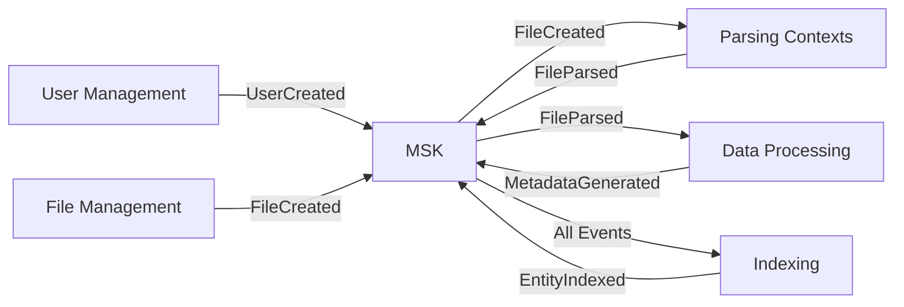

# Bounded Contexts Diagram (DDD)

**Status**: Current State  
**Last Updated**: 2025-01-15

## Overview

Bounded contexts represent the core domain boundaries in Leanda.io, following Domain-Driven Design (DDD) principles. Each bounded context has its own domain model, language, and responsibilities.

## Bounded Contexts Diagram

```mermaid
graph TD
    subgraph "Core Domain"
        UserMgmt[User Management Context<br/>Core API Service<br/>Users, Authentication, Permissions]
        FileMgmt[File Management Context<br/>Core API + Blob Storage<br/>Files, Folders, Storage]
        DataProcessing[Data Processing Context<br/>Metadata Processing<br/>Data Transformation]
    end
    
    subgraph "Supporting Contexts"
        ChemicalParsing[Chemical Parsing Context<br/>Chemical Parser + Properties<br/>SDF, MOL, Properties]
        ReactionParsing[Reaction Parsing Context<br/>Reaction Parser<br/>RXN Files]
        CrystalParsing[Crystal Parsing Context<br/>Crystal Parser<br/>CIF Files]
        SpectraParsing[Spectra Parsing Context<br/>Spectra Parser<br/>JDX Files]
        ImagingContext[Imaging Context<br/>Imaging Service<br/>Image Processing]
        OfficeContext[Office Context<br/>Office Processor<br/>Document Conversion]
        IndexingContext[Indexing Context<br/>Indexing Service<br/>Search, Indexing]
    end
    
    subgraph "Generic Contexts"
        StorageContext[Storage Context<br/>Blob Storage + S3<br/>File Storage, Blobs]
        MessagingContext[Messaging Context<br/>MSK Serverless<br/>Event Streaming]
        SearchContext[Search Context<br/>OpenSearch<br/>Full-Text Search]
    end
    
    subgraph "Shared Kernel"
        SharedModels[Shared Models<br/>User, File, Events<br/>Common Domain Models]
        SharedContracts[Shared Contracts<br/>AsyncAPI, OpenAPI<br/>Event Schemas, API Contracts]
    end
    
    UserMgmt -->|"Uses"| SharedModels
    FileMgmt -->|"Uses"| SharedModels
    DataProcessing -->|"Uses"| SharedModels
    
    UserMgmt -->|"Publishes Events"| MessagingContext
    FileMgmt -->|"Publishes Events"| MessagingContext
    DataProcessing -->|"Publishes Events"| MessagingContext
    
    FileMgmt -->|"Stores Files"| StorageContext
    ChemicalParsing -->|"Reads Files"| StorageContext
    ReactionParsing -->|"Reads Files"| StorageContext
    CrystalParsing -->|"Reads Files"| StorageContext
    SpectraParsing -->|"Reads Files"| StorageContext
    ImagingContext -->|"Reads Files"| StorageContext
    OfficeContext -->|"Reads/Writes Files"| StorageContext
    
    ChemicalParsing -->|"Consumes Events"| MessagingContext
    ReactionParsing -->|"Consumes Events"| MessagingContext
    CrystalParsing -->|"Consumes Events"| MessagingContext
    SpectraParsing -->|"Consumes Events"| MessagingContext
    ImagingContext -->|"Consumes Events"| MessagingContext
    OfficeContext -->|"Consumes Events"| MessagingContext
    DataProcessing -->|"Consumes Events"| MessagingContext
    IndexingContext -->|"Consumes Events"| MessagingContext
    
    ChemicalParsing -->|"Publishes Events"| MessagingContext
    ReactionParsing -->|"Publishes Events"| MessagingContext
    CrystalParsing -->|"Publishes Events"| MessagingContext
    SpectraParsing -->|"Publishes Events"| MessagingContext
    ImagingContext -->|"Publishes Events"| MessagingContext
    OfficeContext -->|"Publishes Events"| MessagingContext
    DataProcessing -->|"Publishes Events"| MessagingContext
    IndexingContext -->|"Publishes Events"| MessagingContext
    
    IndexingContext -->|"Indexes to"| SearchContext
    UserMgmt -->|"Queries"| SearchContext
    FileMgmt -->|"Queries"| SearchContext
    
    SharedModels -->|"Defines"| SharedContracts
```

## Context Mapping

### Core Domain Contexts

#### User Management Context
- **Service**: `core-api`
- **Responsibility**: User lifecycle, authentication, authorization
- **Domain Models**: User, UserCreated, UserUpdated, UserDeleted
- **Relationships**:
  - **Upstream**: None (entry point)
  - **Downstream**: Indexing Context (indexes users)
  - **Shared Kernel**: Uses User model

#### File Management Context
- **Services**: `core-api`, `blob-storage`
- **Responsibility**: File upload, storage, metadata management
- **Domain Models**: File, Folder, FileCreated, FilePersisted, FolderPersisted
- **Relationships**:
  - **Upstream**: User Management Context (user ownership)
  - **Downstream**: All parsing contexts (consume FileCreated events)
  - **Storage Context**: Uses for file storage

#### Data Processing Context
- **Service**: `metadata-processing`
- **Responsibility**: Metadata extraction, type qualification, metadata generation
- **Domain Models**: Metadata, InfoboxMetadata, EntityMetadata, FieldDefinition
- **Relationships**:
  - **Upstream**: Parsing contexts (consumes FileParsed events)
  - **Downstream**: Indexing Context (provides metadata for indexing)

### Supporting Contexts

#### Chemical Parsing Context
- **Services**: `chemical-parser`, `chemical-properties`
- **Responsibility**: Parse chemical structures (SDF, MOL), calculate properties
- **Domain Models**: ChemicalStructure, MolecularProperties, FileParsed
- **Relationships**:
  - **Upstream**: File Management Context (consumes FileCreated events)
  - **Downstream**: Data Processing Context (publishes FileParsed events)

#### Reaction Parsing Context
- **Service**: `reaction-parser`
- **Responsibility**: Parse chemical reactions (RXN)
- **Domain Models**: Reaction, FileParsed
- **Relationships**: Similar to Chemical Parsing Context

#### Crystal Parsing Context
- **Service**: `crystal-parser`
- **Responsibility**: Parse crystal structures (CIF)
- **Domain Models**: CrystalStructure, FileParsed
- **Relationships**: Similar to Chemical Parsing Context

#### Spectra Parsing Context
- **Service**: `spectra-parser`
- **Responsibility**: Parse spectra files (JDX)
- **Domain Models**: Spectra, FileParsed
- **Relationships**: Similar to Chemical Parsing Context

#### Imaging Context
- **Service**: `imaging`
- **Responsibility**: Image processing and analysis
- **Domain Models**: Image, ImageProcessed
- **Relationships**: Similar to Chemical Parsing Context

#### Office Context
- **Service**: `office-processor`
- **Responsibility**: Office document conversion (PDF), metadata extraction
- **Domain Models**: Document, ConvertedToPdf, MetaExtracted
- **Relationships**: Similar to Chemical Parsing Context

#### Indexing Context
- **Service**: `indexing`
- **Responsibility**: Full-text search indexing
- **Domain Models**: IndexedEntity, EntityIndexed
- **Relationships**:
  - **Upstream**: All contexts (consumes entity events)
  - **Downstream**: Search Context (indexes to OpenSearch)

### Generic Contexts

#### Storage Context
- **Service**: `blob-storage`
- **Responsibility**: File storage abstraction (S3, GridFS)
- **Domain Models**: BlobInfo, LoadedBlobInfo
- **Relationships**: Used by File Management and all parsing contexts

#### Messaging Context
- **Service**: MSK Serverless (Kafka)
- **Responsibility**: Event streaming and messaging
- **Domain Models**: Events (FileCreated, FileParsed, etc.)
- **Relationships**: Used by all contexts for event-driven communication

#### Search Context
- **Service**: OpenSearch
- **Responsibility**: Full-text search and indexing
- **Domain Models**: SearchQuery, SearchResults
- **Relationships**: Used by Indexing Context and queried by User/File Management

### Shared Kernel

#### Shared Models
- **Location**: `shared/models/`
- **Purpose**: Common domain models used across contexts
- **Models**: User, File, Folder, Record, Events (FileCreated, UserCreated, etc.)
- **Usage**: Imported by all contexts that need these models

#### Shared Contracts
- **Location**: `shared/contracts/`, `shared/specs/`
- **Purpose**: API contracts (OpenAPI) and event schemas (AsyncAPI)
- **Contracts**: REST API specifications, event schemas
- **Usage**: Used for API documentation and event validation

## Context Relationships

### Partnership
- **Chemical Parser ↔ Chemical Properties**: Work together on chemical data
- **Core API ↔ Blob Storage**: Coordinate file management

### Shared Kernel
- **All Contexts ↔ Shared Models**: Use common domain models
- **All Contexts ↔ Shared Contracts**: Use common API/event contracts

### Customer-Supplier
- **File Management → Parsing Contexts**: File Management supplies files to parsers
- **Parsing Contexts → Data Processing**: Parsers supply parsed data to metadata processing
- **Data Processing → Indexing**: Metadata processing supplies metadata to indexing

### Conformist
- **All Contexts → Messaging Context**: All contexts conform to Kafka event format
- **All Contexts → Storage Context**: All contexts conform to storage API

### Anticorruption Layer
- **Indexing Context**: Translates domain events to OpenSearch documents
- **Storage Context**: Abstracts S3/GridFS differences

## Domain Events Flow

## Bounded Context Principles

### Ubiquitous Language
Each bounded context has its own domain language:
- **User Management**: User, Authentication, Authorization, Permissions
- **File Management**: File, Folder, Blob, Storage
- **Chemical Parsing**: Molecule, Structure, Properties, SMILES
- **Indexing**: Index, Search, Query, Results

### Context Boundaries
- Clear boundaries prevent domain model leakage
- Each context owns its domain models
- Shared Kernel provides common models only

### Integration
- Contexts integrate via events (asynchronous)
- REST APIs for synchronous integration
- Shared Kernel for common models

## Related Diagrams

- [Container Diagram](./container-diagram.md) - Technical containers
- [Integration Patterns](./integration-patterns.md) - Context integration
- [Data Flow Diagrams](./data-flow-diagrams.md) - Data flows between contexts

---

**Document Version**: 1.0
