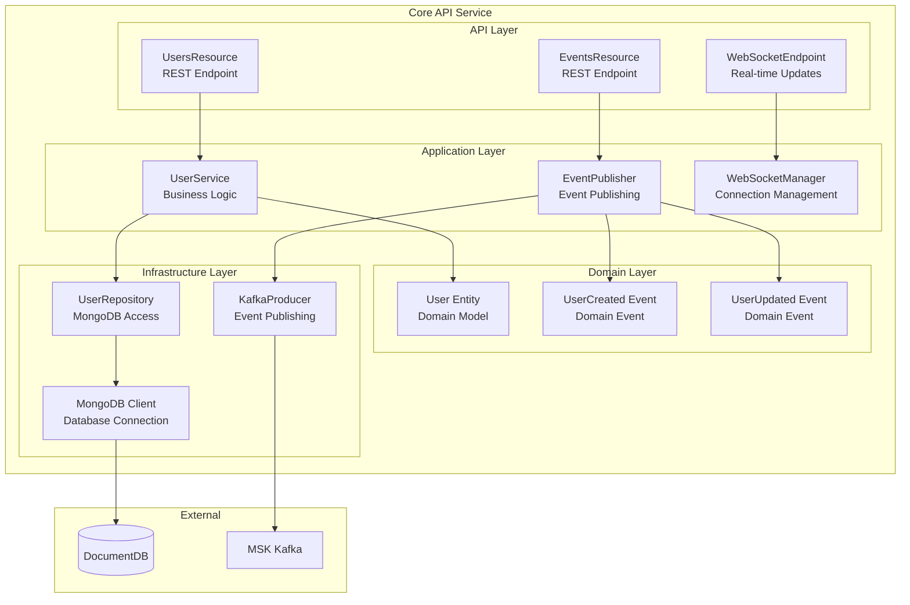
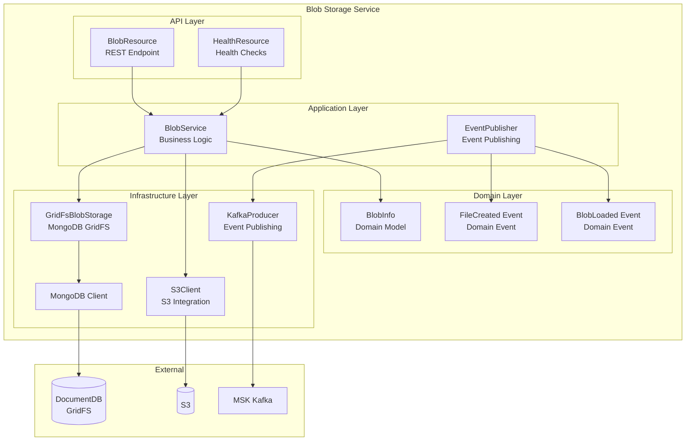
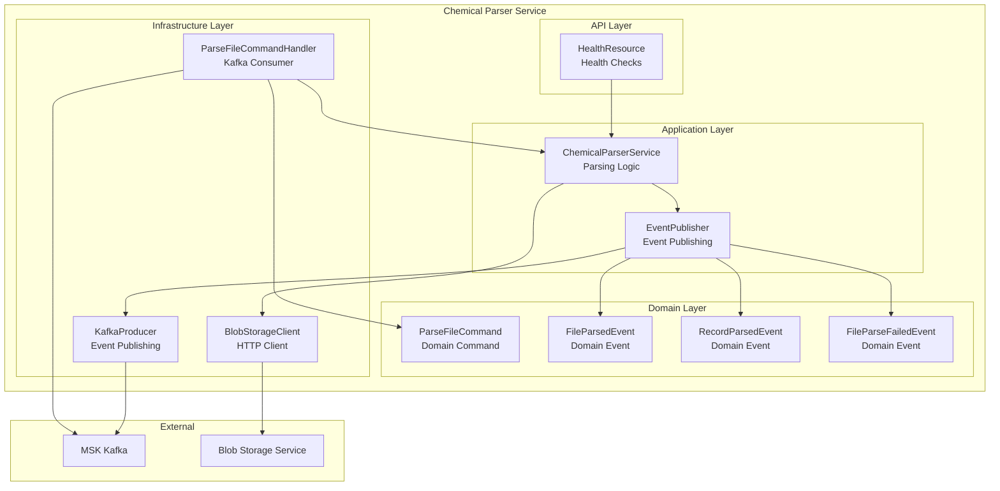
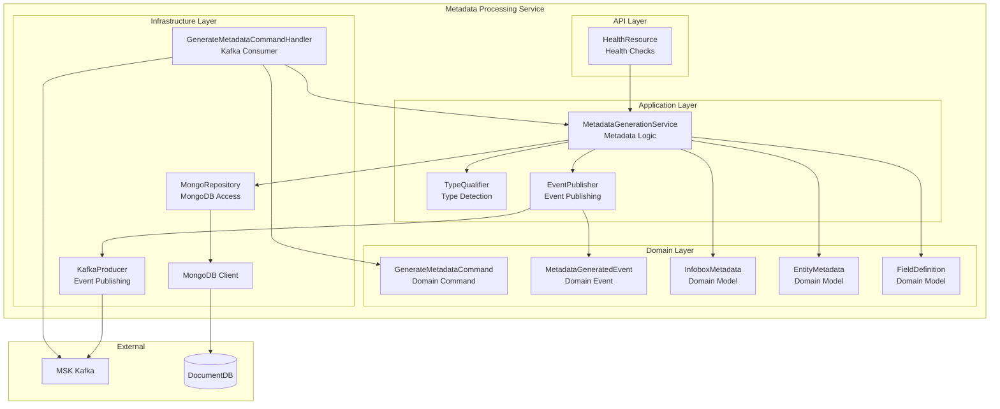
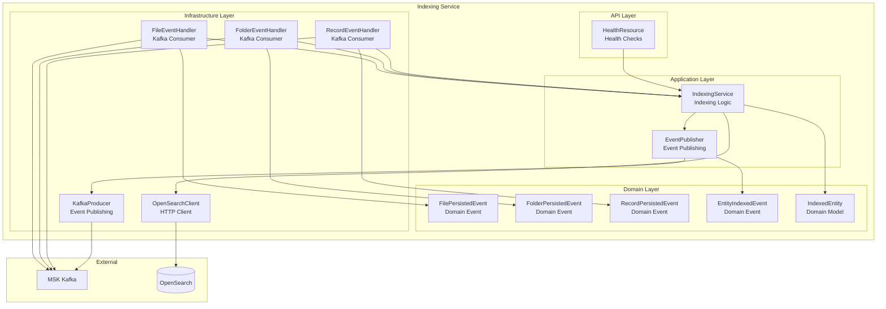

# Component Diagrams

**Status**: Current State  
**Last Updated**: 2025-01-15

## Overview

Component diagrams show the internal structure of key containers, breaking them down into their constituent components.

## Core API Service Components

## Blob Storage Service Components

## Chemical Parser Service Components

## Metadata Processing Service Components

## Indexing Service Components

## Component Responsibilities

### API Layer
- **Purpose**: Handle HTTP requests and responses
- **Components**: REST endpoints, WebSocket endpoints, health checks
- **Responsibilities**:
  - Request validation
  - Response formatting
  - Error handling
  - Authentication/authorization

### Application Layer
- **Purpose**: Business logic and orchestration
- **Components**: Services, managers, coordinators
- **Responsibilities**:
  - Business rule enforcement
  - Transaction management
  - Service orchestration
  - Event publishing

### Domain Layer
- **Purpose**: Core domain models and logic
- **Components**: Entities, value objects, domain events, commands
- **Responsibilities**:
  - Domain model representation
  - Business invariants
  - Domain events
  - Commands

### Infrastructure Layer
- **Purpose**: Technical implementation details
- **Components**: Repositories, clients, adapters
- **Responsibilities**:
  - Database access
  - External service integration
  - Message queue integration
  - File system access

## Design Patterns

### Repository Pattern
- **Usage**: Data access abstraction
- **Examples**: UserRepository, MongoRepository
- **Benefits**: Decouples domain from persistence

### Command Handler Pattern
- **Usage**: Event-driven command processing
- **Examples**: ParseFileCommandHandler, GenerateMetadataCommandHandler
- **Benefits**: Decouples command from execution

### Event Publisher Pattern
- **Usage**: Asynchronous event publishing
- **Examples**: EventPublisher in all services
- **Benefits**: Loose coupling between services

### Client Pattern
- **Usage**: External service integration
- **Examples**: BlobStorageClient, OpenSearchClient
- **Benefits**: Abstraction of external dependencies

## Related Diagrams

- [Container Diagram](./container-diagram.md) - High-level containers
- [Deployment Diagram](./deployment-diagram.md) - Infrastructure deployment
- [Sequence Diagrams](./sequence-diagrams.md) - Component interactions

---

**Document Version**: 1.0
