# Container Diagram

**Status**: Current State  
**Last Updated**: 2025-01-15

## Overview

The Container diagram shows the high-level technical building blocks (containers) that make up the Leanda.io system. Each container is a separately deployable unit.

## Container Diagram

```mermaid
graph TD
    subgraph "Client Layer"
        WebBrowser[Web Browser<br/>Angular 21 Application]
    end
    
    subgraph "Frontend Container"
        AngularApp[Angular 21 Frontend<br/>Zoneless Architecture<br/>Signal Forms]
    end
    
    subgraph "API Gateway"
        APIGateway[API Gateway<br/>Authentication<br/>Rate Limiting<br/>Routing]
    end
    
    subgraph "Backend Microservices"
        CoreAPI[Core API<br/>Java 21 / Quarkus<br/>Port: 8080<br/>Users, Events, WebSocket]
        BlobStorage[Blob Storage<br/>Java 21 / Quarkus<br/>Port: 8084<br/>File Storage]
        ChemicalParser[Chemical Parser<br/>Java 21 / Quarkus<br/>Port: 8083<br/>SDF, MOL Parsing]
        ChemicalProps[Chemical Properties<br/>Java 21 / Quarkus<br/>Port: 8086<br/>Property Calculation]
        ReactionParser[Reaction Parser<br/>Java 21 / Quarkus<br/>Port: 8087<br/>RXN Parsing]
        CrystalParser[Crystal Parser<br/>Java 21 / Quarkus<br/>Port: 8089<br/>CIF Parsing]
        SpectraParser[Spectra Parser<br/>Java 21 / Quarkus<br/>Port: 8090<br/>JDX Parsing]
        Imaging[Imaging Service<br/>Java 21 / Quarkus<br/>Port: 8091<br/>Image Processing]
        OfficeProcessor[Office Processor<br/>Java 21 / Quarkus<br/>Port: 8088<br/>Document Conversion]
        MetaProcessing[Metadata Processing<br/>Java 21 / Quarkus<br/>Port: 8098<br/>Metadata Extraction]
        Indexing[Indexing Service<br/>Java 21 / Quarkus<br/>Port: 8099<br/>OpenSearch Indexing]
    end
    
    subgraph "ML Services"
        MLPipeline[ML Pipeline<br/>Python 3.12 / FastAPI<br/>Model Training/Inference]
        TextMining[Text Mining<br/>Python 3.12 / FastAPI<br/>NLP Services]
    end
    
    subgraph "Data Layer"
        DocumentDB[(DocumentDB<br/>MongoDB-Compatible<br/>Metadata Storage)]
        S3[(S3<br/>Object Storage<br/>File Blobs)]
        Redis[(ElastiCache Redis<br/>Cache Layer)]
        OpenSearch[(OpenSearch<br/>Search Engine<br/>Full-Text Search)]
    end
    
    subgraph "Messaging Layer"
        MSK[MSK Serverless<br/>Kafka<br/>Event Streaming]
    end
    
    WebBrowser -->|"HTTPS"| AngularApp
    AngularApp -->|"REST API"| APIGateway
    
    APIGateway -->|"REST API"| CoreAPI
    APIGateway -->|"REST API"| BlobStorage
    
    CoreAPI -->|"Store metadata"| DocumentDB
    CoreAPI -->|"Publish events"| MSK
    CoreAPI -->|"Cache data"| Redis
    CoreAPI -->|"WebSocket"| WebBrowser
    
    BlobStorage -->|"Store files"| S3
    BlobStorage -->|"Store metadata"| DocumentDB
    BlobStorage -->|"Publish events"| MSK
    BlobStorage -->|"Cache data"| Redis
    
    ChemicalParser -->|"Consume events"| MSK
    ChemicalParser -->|"Fetch files"| BlobStorage
    ChemicalParser -->|"Publish events"| MSK
    
    ChemicalProps -->|"Consume events"| MSK
    ChemicalProps -->|"Fetch files"| BlobStorage
    ChemicalProps -->|"Publish events"| MSK
    
    ReactionParser -->|"Consume events"| MSK
    ReactionParser -->|"Fetch files"| BlobStorage
    ReactionParser -->|"Publish events"| MSK
    
    CrystalParser -->|"Consume events"| MSK
    CrystalParser -->|"Fetch files"| BlobStorage
    CrystalParser -->|"Publish events"| MSK
    
    SpectraParser -->|"Consume events"| MSK
    SpectraParser -->|"Fetch files"| BlobStorage
    SpectraParser -->|"Publish events"| MSK
    
    Imaging -->|"Consume events"| MSK
    Imaging -->|"Fetch files"| BlobStorage
    Imaging -->|"Publish events"| MSK
    
    OfficeProcessor -->|"Consume events"| MSK
    OfficeProcessor -->|"Fetch files"| BlobStorage
    OfficeProcessor -->|"Publish events"| MSK
    
    MetaProcessing -->|"Consume events"| MSK
    MetaProcessing -->|"Store metadata"| DocumentDB
    MetaProcessing -->|"Publish events"| MSK
    
    Indexing -->|"Consume events"| MSK
    Indexing -->|"Index documents"| OpenSearch
    Indexing -->|"Publish events"| MSK
    
    MLPipeline -->|"Consume events"| MSK
    MLPipeline -->|"Read data"| S3
    MLPipeline -->|"Store models"| S3
    MLPipeline -->|"Publish events"| MSK
    
    TextMining -->|"Consume events"| MSK
    TextMining -->|"Read data"| S3
    TextMining -->|"Publish events"| MSK
```

## Container Descriptions

### Frontend Container

**Angular 21 Frontend**
- **Technology**: Angular 21, TypeScript
- **Architecture**: Zoneless architecture with Signal Forms
- **Deployment**: AWS Amplify Hosting
- **Responsibilities**:
  - User interface rendering
  - User interaction handling
  - API communication
  - Real-time updates via WebSocket

### Backend Microservices

#### Core API
- **Port**: 8080
- **Responsibilities**:
  - User management (CRUD operations)
  - Authentication and authorization
  - WebSocket connections for real-time updates
  - Event publishing
  - API orchestration

#### Blob Storage
- **Port**: 8084
- **Responsibilities**:
  - File upload and download
  - File metadata management
  - S3 integration
  - File versioning

#### Domain Parsers
- **Chemical Parser** (Port: 8083): Parse SDF, MOL files
- **Chemical Properties** (Port: 8086): Calculate molecular properties
- **Reaction Parser** (Port: 8087): Parse RXN files
- **Crystal Parser** (Port: 8089): Parse CIF files
- **Spectra Parser** (Port: 8090): Parse JDX files

#### Processing Services
- **Imaging** (Port: 8091): Image processing and analysis
- **Office Processor** (Port: 8088): Office document conversion (PDF, etc.)
- **Metadata Processing** (Port: 8098): Metadata extraction and generation
- **Indexing** (Port: 8099): OpenSearch indexing for search

### ML Services

#### ML Pipeline
- **Technology**: Python 3.12, FastAPI
- **Responsibilities**:
  - Model training
  - Model inference
  - Feature extraction

#### Text Mining
- **Technology**: Python 3.12, FastAPI
- **Responsibilities**:
  - Natural language processing
  - Text extraction and analysis
  - Entity recognition

### Data Layer Containers

#### DocumentDB
- **Type**: Managed database service
- **Purpose**: Metadata storage (MongoDB-compatible)
- **Usage**: User data, file metadata, folder structures, records

#### S3
- **Type**: Object storage service
- **Purpose**: Blob storage for files
- **Usage**: Uploaded files, processed data, ML models

#### ElastiCache Redis
- **Type**: Managed cache service
- **Purpose**: High-performance caching
- **Usage**: API response caching, session storage

#### OpenSearch
- **Type**: Managed search service
- **Purpose**: Full-text search and indexing
- **Usage**: Entity indexing, search queries

### Messaging Layer

#### MSK Serverless
- **Type**: Managed Kafka service
- **Purpose**: Event-driven messaging
- **Usage**: Domain events, event streaming
- **Features**: Auto-scaling, managed infrastructure

## Communication Patterns

### Synchronous Communication
- **Frontend → API Gateway → Backend Services**: REST API calls
- **Backend Services → Data Layer**: Direct database/storage access

### Asynchronous Communication
- **Backend Services → MSK**: Event publishing
- **MSK → Backend Services**: Event consumption
- **Event-Driven Processing**: Parsers and processors consume events

## Deployment Model

### Container Orchestration
- **Platform**: Amazon ECS Fargate
- **Deployment**: Container-based deployment
- **Scaling**: Auto-scaling based on CPU, memory, and custom metrics
- **Multi-AZ**: All services deployed across 2+ availability zones

### Infrastructure
- **VPC**: Isolated network environment
- **Subnets**: Public, private, and isolated subnets
- **Security Groups**: Network-level access control
- **Load Balancing**: Application Load Balancer for service routing

## Related Diagrams

- [Component Diagrams](./component-diagrams.md) - Internal structure of containers
- [Deployment Diagram](./deployment-diagram.md) - Infrastructure deployment
- [Integration Patterns](./integration-patterns.md) - Communication patterns

---

**Document Version**: 1.0
