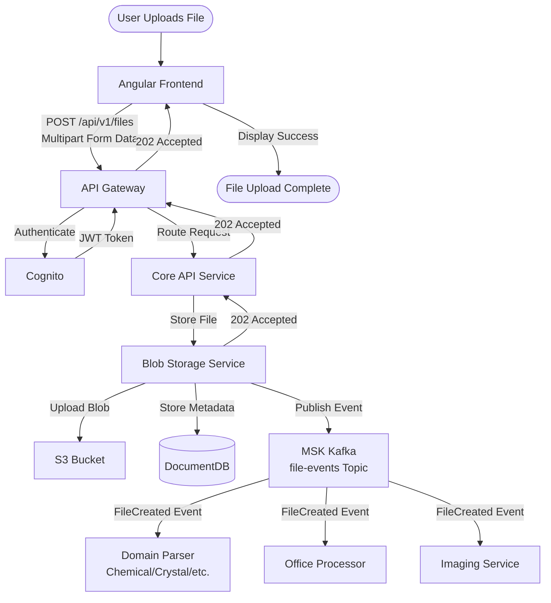
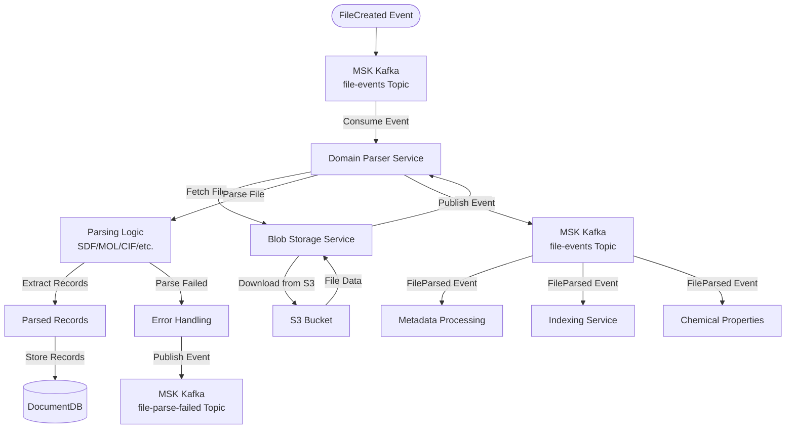
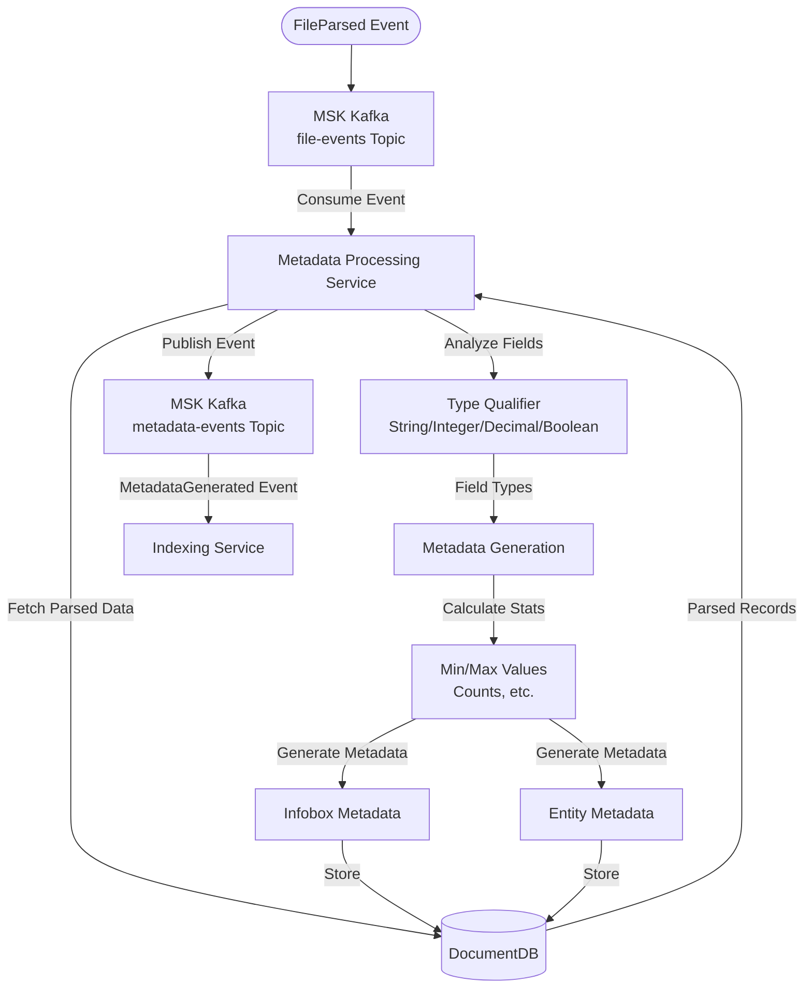
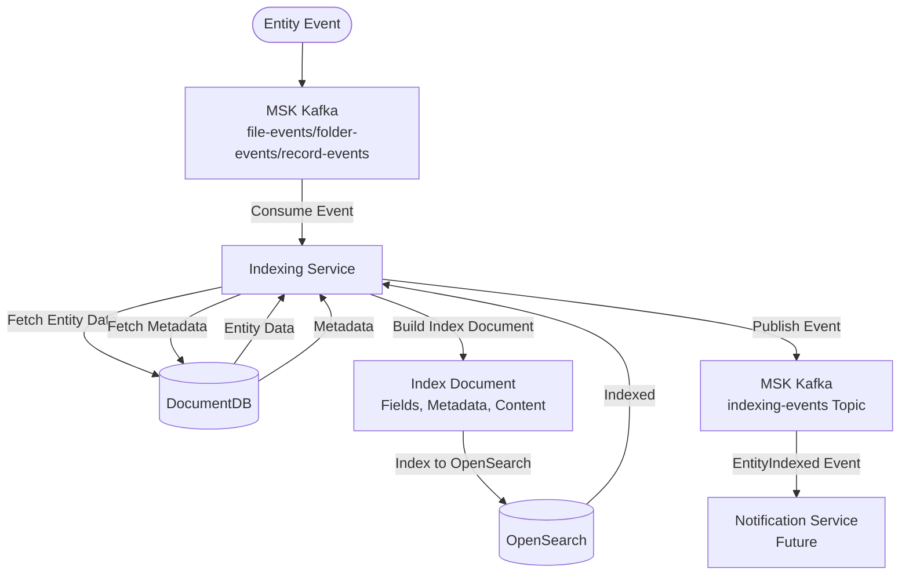
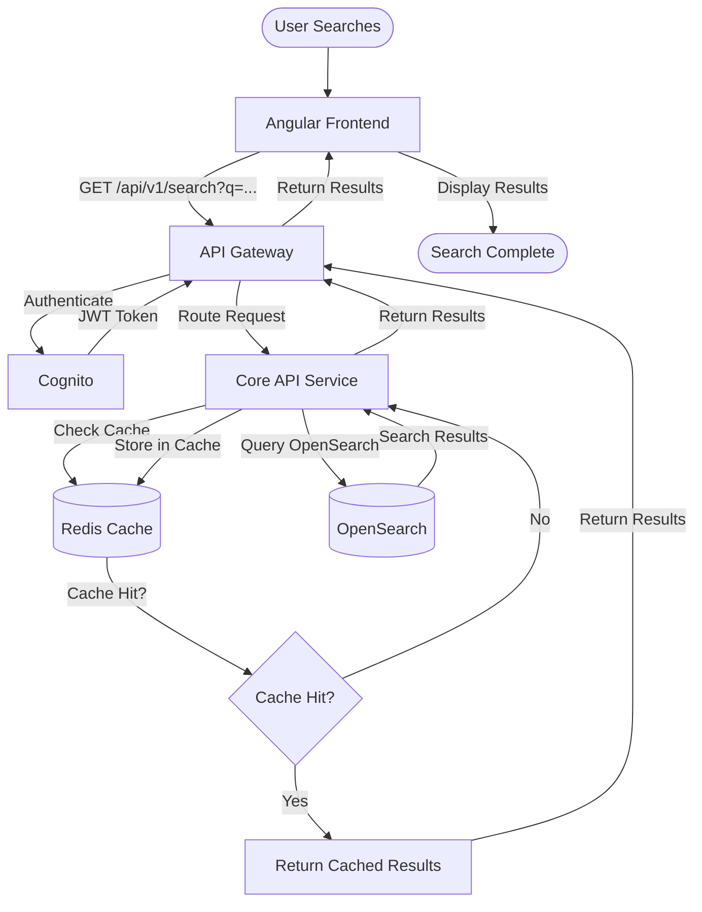
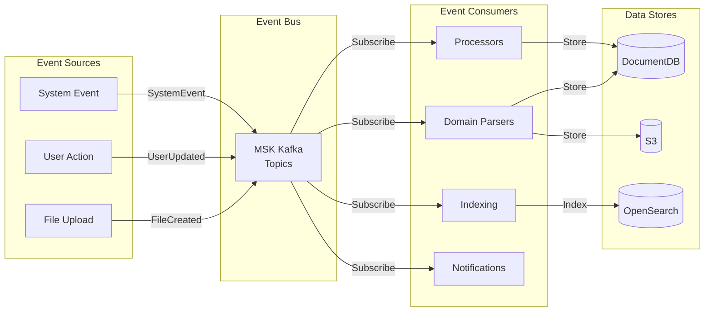
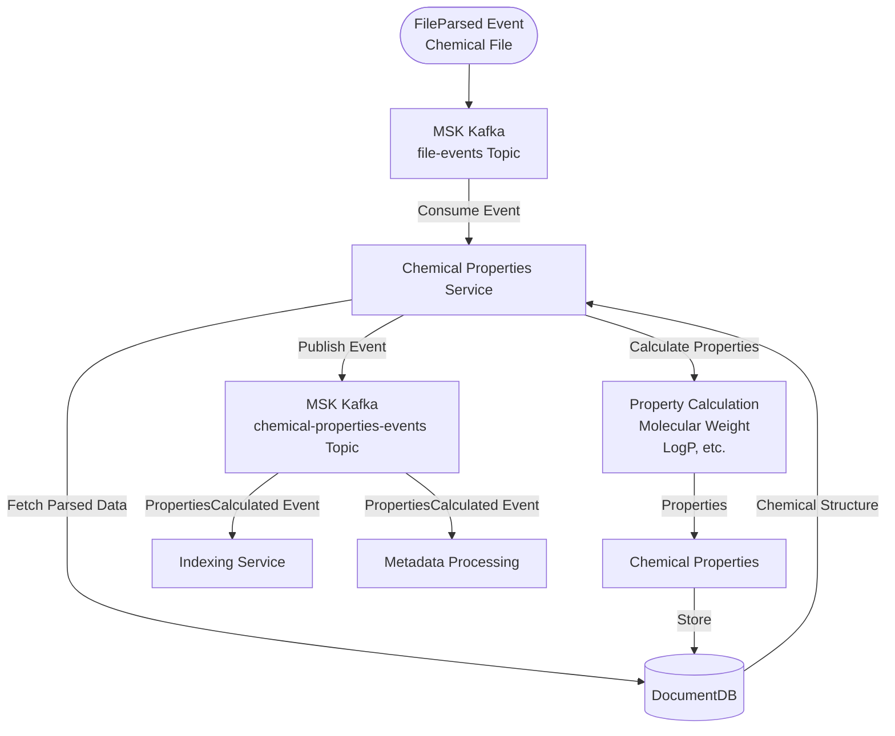
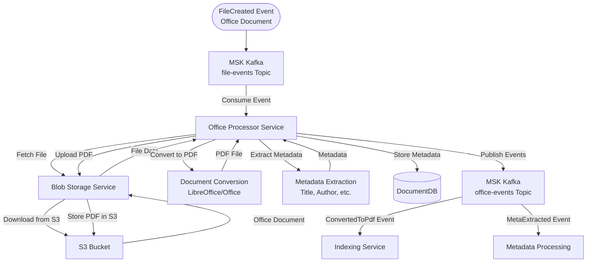

# Data Flow Diagrams

**Status**: Current State  
**Last Updated**: 2025-01-15

## Overview

Data flow diagrams show how data moves through the Leanda.io system, from user input to storage and processing.

## File Upload Flow

## File Parsing and Processing Flow

## Metadata Extraction Flow

## Indexing Flow

## Search Flow

## Event-Driven Processing Flow

## Chemical Properties Calculation Flow

## Office Document Conversion Flow

## Data Flow Characteristics

### Synchronous Flows
- **User-initiated actions**: File upload, search, user management
- **API requests**: REST API calls with immediate responses
- **Cache lookups**: Redis cache for frequently accessed data

### Asynchronous Flows
- **Event-driven processing**: File parsing, metadata extraction, indexing
- **Background jobs**: Long-running processing tasks
- **Event publishing**: Domain events for loose coupling

### Data Storage Patterns

1. **Write-Through**: Data written to both cache and database
2. **Write-Behind**: Events published, data written asynchronously
3. **Read-Through**: Cache checked first, then database if miss

### Error Handling

- **Retry Logic**: Exponential backoff for transient failures
- **Dead Letter Queues**: Failed events sent to DLQ
- **Error Events**: Error events published for monitoring
- **Circuit Breakers**: Prevent cascading failures

## Related Diagrams

- [Sequence Diagrams](./sequence-diagrams.md) - Detailed interaction sequences
- [Integration Patterns](./integration-patterns.md) - Communication patterns
- [Container Diagram](./container-diagram.md) - System containers

---

**Document Version**: 1.0
