# Deployment Diagram

**Status**: Current State  
**Last Updated**: 2025-01-15

## Overview

The Deployment diagram shows how the Leanda.io system is deployed on AWS infrastructure, including VPC structure, subnets, security groups, and service placement.

## AWS Infrastructure Deployment

```mermaid
graph TD
    subgraph "Internet"
        Users[Users & Applications]
    end
    
    subgraph "AWS Region: us-east-1"
        subgraph "Edge Layer"
            CloudFront[CloudFront CDN<br/>Global Edge Locations]
            WAF[AWS WAF<br/>DDoS Protection]
            APIGateway[API Gateway<br/>REST API Management]
        end
        
        subgraph "VPC: leanda-vpc"
            subgraph "Public Subnet - AZ 1a"
                NATGateway1[NAT Gateway 1]
                ALB1[ALB Node 1]
            end
            
            subgraph "Public Subnet - AZ 1b"
                NATGateway2[NAT Gateway 2]
                ALB2[ALB Node 2]
            end
            
            subgraph "Private Subnet - AZ 1a"
                ECSTasks1a[ECS Tasks 1a<br/>Microservices]
            end
            
            subgraph "Private Subnet - AZ 1b"
                ECSTasks1b[ECS Tasks 1b<br/>Microservices]
            end
            
            subgraph "Isolated Subnet - AZ 1a"
                DocDBInstance1[DocumentDB Instance 1]
                RedisNode1[Redis Node 1]
            end
            
            subgraph "Isolated Subnet - AZ 1b"
                DocDBInstance2[DocumentDB Instance 2]
                RedisNode2[Redis Node 2]
            end
        end
        
        subgraph "ECS Fargate Cluster"
            CoreAPIService[Core API Service<br/>2-20 Tasks]
            BlobStorageService[Blob Storage Service<br/>2-20 Tasks]
            ChemicalParserService[Chemical Parser Service<br/>2-10 Tasks]
            ChemicalPropsService[Chemical Properties Service<br/>2-10 Tasks]
            ReactionParserService[Reaction Parser Service<br/>2-10 Tasks]
            CrystalParserService[Crystal Parser Service<br/>2-10 Tasks]
            SpectraParserService[Spectra Parser Service<br/>2-10 Tasks]
            ImagingService[Imaging Service<br/>2-10 Tasks]
            OfficeProcessorService[Office Processor Service<br/>2-10 Tasks]
            MetaProcessingService[Metadata Processing Service<br/>2-10 Tasks]
            IndexingService[Indexing Service<br/>2-10 Tasks]
        end
        
        subgraph "Data Layer"
            DocumentDBCluster[DocumentDB Cluster<br/>Multi-AZ<br/>Encrypted]
            RedisCluster[ElastiCache Redis Cluster<br/>Multi-AZ]
            S3Bucket[S3 Bucket<br/>Versioned<br/>Encrypted]
            OpenSearchCluster[OpenSearch Cluster<br/>Multi-AZ]
        end
        
        subgraph "Messaging Layer"
            MSKCluster[MSK Serverless<br/>Kafka Cluster<br/>Auto-Scaling]
        end
        
        subgraph "Observability"
            CloudWatch[CloudWatch<br/>Logs, Metrics, Alarms]
            XRay[X-Ray<br/>Distributed Tracing]
            Prometheus[Prometheus<br/>Metrics Collection]
            Grafana[Grafana<br/>Dashboards]
        end
        
        subgraph "Security Services"
            Cognito[Cognito<br/>User Pools]
            KMS[KMS<br/>Encryption Keys]
            GuardDuty[GuardDuty<br/>Threat Detection]
            SecurityHub[Security Hub<br/>Security Findings]
            CloudTrail[CloudTrail<br/>API Audit Logs]
        end
    end
    
    Users --> CloudFront
    CloudFront --> WAF
    WAF --> APIGateway
    APIGateway --> ALB1
    APIGateway --> ALB2
    
    ALB1 --> ECSTasks1a
    ALB2 --> ECSTasks1b
    
    ECSTasks1a --> CoreAPIService
    ECSTasks1a --> BlobStorageService
    ECSTasks1a --> ChemicalParserService
    ECSTasks1a --> ChemicalPropsService
    ECSTasks1a --> ReactionParserService
    ECSTasks1a --> CrystalParserService
    ECSTasks1a --> SpectraParserService
    ECSTasks1a --> ImagingService
    ECSTasks1a --> OfficeProcessorService
    ECSTasks1a --> MetaProcessingService
    ECSTasks1a --> IndexingService
    
    ECSTasks1b --> CoreAPIService
    ECSTasks1b --> BlobStorageService
    ECSTasks1b --> ChemicalParserService
    ECSTasks1b --> ChemicalPropsService
    ECSTasks1b --> ReactionParserService
    ECSTasks1b --> CrystalParserService
    ECSTasks1b --> SpectraParserService
    ECSTasks1b --> ImagingService
    ECSTasks1b --> OfficeProcessorService
    ECSTasks1b --> MetaProcessingService
    ECSTasks1b --> IndexingService
    
    CoreAPIService --> DocumentDBCluster
    CoreAPIService --> RedisCluster
    CoreAPIService --> MSKCluster
    CoreAPIService --> Cognito
    
    BlobStorageService --> S3Bucket
    BlobStorageService --> DocumentDBCluster
    BlobStorageService --> RedisCluster
    BlobStorageService --> MSKCluster
    
    ChemicalParserService --> MSKCluster
    ChemicalPropsService --> MSKCluster
    ReactionParserService --> MSKCluster
    CrystalParserService --> MSKCluster
    SpectraParserService --> MSKCluster
    ImagingService --> MSKCluster
    OfficeProcessorService --> MSKCluster
    
    MetaProcessingService --> DocumentDBCluster
    MetaProcessingService --> MSKCluster
    
    IndexingService --> OpenSearchCluster
    IndexingService --> MSKCluster
    
    ECSTasks1a --> CloudWatch
    ECSTasks1b --> CloudWatch
    ECSTasks1a --> XRay
    ECSTasks1b --> XRay
    
    DocumentDBCluster --> DocDBInstance1
    DocumentDBCluster --> DocDBInstance2
    RedisCluster --> RedisNode1
    RedisCluster --> RedisNode2
    
    ECSTasks1a --> NATGateway1
    ECSTasks1b --> NATGateway2
    
    DocumentDBCluster --> KMS
    S3Bucket --> KMS
    RedisCluster --> KMS
    
    VPC --> GuardDuty
    VPC --> SecurityHub
    VPC --> CloudTrail
```

## VPC Structure

### Subnet Configuration

#### Public Subnets
- **Purpose**: Internet-facing resources
- **Components**: NAT Gateways, Application Load Balancer nodes
- **Availability Zones**: us-east-1a, us-east-1b
- **CIDR**: /24 per subnet

#### Private Subnets
- **Purpose**: Application services (ECS tasks)
- **Components**: ECS Fargate tasks, microservices
- **Availability Zones**: us-east-1a, us-east-1b
- **CIDR**: /24 per subnet
- **Egress**: Via NAT Gateways

#### Isolated Subnets
- **Purpose**: Database and cache services
- **Components**: DocumentDB instances, Redis nodes
- **Availability Zones**: us-east-1a, us-east-1b
- **CIDR**: /24 per subnet
- **Egress**: No internet access (VPC endpoints only)

## Service Deployment

### ECS Fargate Services

All microservices are deployed as ECS Fargate tasks:

- **Cluster**: `leanda-cluster-{environment}`
- **Service Type**: Fargate (serverless containers)
- **Scaling**: Auto-scaling (2-20 tasks per service)
- **Deployment**: Multi-AZ across private subnets
- **Health Checks**: Liveness and readiness probes

### Service Configuration

| Service | Min Tasks | Max Tasks | CPU | Memory |
|---------|-----------|-----------|-----|--------|
| core-api | 2 | 20 | 0.25-1 vCPU | 512MB-2GB |
| blob-storage | 2 | 20 | 0.25-1 vCPU | 512MB-2GB |
| chemical-parser | 2 | 10 | 0.25-0.5 vCPU | 512MB-1GB |
| chemical-properties | 2 | 10 | 0.25-0.5 vCPU | 512MB-1GB |
| reaction-parser | 2 | 10 | 0.25-0.5 vCPU | 512MB-1GB |
| crystal-parser | 2 | 10 | 0.25-0.5 vCPU | 512MB-1GB |
| spectra-parser | 2 | 10 | 0.25-0.5 vCPU | 512MB-1GB |
| imaging | 2 | 10 | 0.25-0.5 vCPU | 512MB-1GB |
| office-processor | 2 | 10 | 0.25-0.5 vCPU | 512MB-1GB |
| metadata-processing | 2 | 10 | 0.25-0.5 vCPU | 512MB-1GB |
| indexing | 2 | 10 | 0.25-0.5 vCPU | 512MB-1GB |

## Data Layer Deployment

### DocumentDB Cluster
- **Type**: Amazon DocumentDB 5.0
- **Instances**: 2 instances (production), 1 instance (development)
- **Instance Type**: db.t3.medium (development), db.r5.large (production)
- **Deployment**: Isolated subnets, multi-AZ
- **Encryption**: KMS encryption at rest
- **Backup**: Automated daily snapshots

### ElastiCache Redis
- **Type**: Redis 7.2
- **Node Type**: cache.t3.micro (development), cache.t3.small (production)
- **Deployment**: Isolated subnets, multi-AZ
- **Encryption**: In-transit and at-rest encryption

### S3 Bucket
- **Name**: `leanda-data-{environment}-{account-id}`
- **Versioning**: Enabled
- **Encryption**: KMS encryption
- **Lifecycle**: Intelligent-Tiering, Glacier after 90 days
- **Access**: Private, no public access

### OpenSearch Cluster
- **Type**: OpenSearch 2.11
- **Instance Type**: t3.small.search (development), r5.large.search (production)
- **Deployment**: Multi-AZ
- **Encryption**: KMS encryption

## Messaging Layer Deployment

### MSK Serverless
- **Type**: Amazon MSK Serverless
- **Deployment**: Private subnets, multi-AZ
- **Scaling**: Auto-scaling based on throughput
- **Topics**: Domain-specific topics (file-events, folder-events, etc.)

## Network Security

### Security Groups

#### ECS Security Group
- **Inbound**: Port 8080-8099 from ALB security group
- **Outbound**: HTTPS (443), HTTP (80), DNS (53)
- **Purpose**: Allow ALB to route traffic to ECS tasks

#### DocumentDB Security Group
- **Inbound**: Port 27017 from ECS security group
- **Outbound**: None
- **Purpose**: Allow ECS services to connect to DocumentDB

#### Redis Security Group
- **Inbound**: Port 6379 from ECS security group
- **Outbound**: None
- **Purpose**: Allow ECS services to connect to Redis

### VPC Endpoints

- **S3 Gateway Endpoint**: Private access to S3 (no cost)
- **DynamoDB Gateway Endpoint**: Private access to DynamoDB (no cost)
- **Secrets Manager Interface Endpoint**: Private access to Secrets Manager (production)
- **SSM Interface Endpoint**: Private access to Systems Manager (production)
- **CloudWatch Logs Interface Endpoint**: Private access to CloudWatch Logs (production)

## Load Balancing

### Application Load Balancer
- **Type**: Application Load Balancer
- **Deployment**: Public subnets, multi-AZ
- **Health Checks**: HTTP health checks on /health/live
- **SSL/TLS**: TLS 1.2+ termination
- **Routing**: Path-based routing to services

## Observability Deployment

### CloudWatch
- **Log Groups**: Per-service log groups
- **Metrics**: ECS, DocumentDB, Redis, S3, MSK metrics
- **Alarms**: CPU, memory, error rate alarms
- **Dashboards**: Service-specific and main dashboard

### X-Ray
- **Sampling**: 100% for errors, 10% for success
- **Service Map**: Automatic service discovery
- **Traces**: Distributed tracing across services

### Prometheus & Grafana
- **Deployment**: ECS Fargate tasks (development)
- **Purpose**: Additional metrics collection and visualization
- **Data Source**: CloudWatch Metrics

## Security Services

### Cognito
- **User Pools**: User authentication
- **Identity Pools**: AWS resource access
- **Integration**: API Gateway authorizers

### KMS
- **Purpose**: Encryption key management
- **Usage**: DocumentDB, S3, Redis encryption
- **Key Policy**: Least privilege access

### GuardDuty
- **Purpose**: Threat detection
- **Scope**: VPC Flow Logs, CloudTrail events
- **Alerts**: Security findings to Security Hub

### Security Hub
- **Purpose**: Centralized security findings
- **Sources**: GuardDuty, CloudTrail, Config
- **Compliance**: SOC 2 Type 2 compliance tracking

### CloudTrail
- **Purpose**: API audit logging
- **Scope**: All AWS API calls
- **Retention**: 1 year (production), 1 week (development)

## Multi-AZ Resilience

All critical services are deployed across multiple availability zones:

- **ECS Services**: Tasks distributed across AZs
- **DocumentDB**: Multi-AZ cluster with automatic failover
- **Redis**: Multi-AZ cluster
- **ALB**: Nodes in multiple AZs
- **NAT Gateways**: One per AZ for redundancy

## Related Diagrams

- [Container Diagram](./container-diagram.md) - Service containers
- [Security Architecture](./security-architecture.md) - Security layers
- [Observability Architecture](./observability-architecture.md) - Monitoring setup

---

**Document Version**: 1.0
