# Integration Patterns Diagram

**Status**: Current State  
**Last Updated**: 2025-01-15

## Overview

Integration patterns show how different parts of the Leanda.io system communicate and integrate with each other.

## Integration Patterns Diagram

```mermaid
graph TD
    subgraph "Synchronous Communication"
        Client[Client Application]
        APIGateway[API Gateway<br/>REST API]
        ALB[Application Load Balancer]
        Service1[Microservice 1<br/>REST Endpoint]
        Service2[Microservice 2<br/>REST Endpoint]
        
        Client -->|"HTTPS Request"| APIGateway
        APIGateway -->|"Route Request"| ALB
        ALB -->|"Load Balance"| Service1
        ALB -->|"Load Balance"| Service2
        Service1 -->|"HTTP Response"| ALB
        Service2 -->|"HTTP Response"| ALB
        ALB -->|"HTTP Response"| APIGateway
        APIGateway -->|"HTTPS Response"| Client
    end
    
    subgraph "Asynchronous Communication"
        Producer[Event Producer<br/>Service A]
        MSK[MSK Serverless<br/>Kafka Topics]
        Consumer1[Event Consumer 1<br/>Service B]
        Consumer2[Event Consumer 2<br/>Service C]
        Consumer3[Event Consumer 3<br/>Service D]
        
        Producer -->|"Publish Event"| MSK
        MSK -->|"Subscribe Topic 1"| Consumer1
        MSK -->|"Subscribe Topic 2"| Consumer2
        MSK -->|"Subscribe Topic 3"| Consumer3
    end
    
    subgraph "Service Discovery"
        ServiceA[Service A]
        CloudMap[AWS Cloud Map<br/>Service Registry]
        ServiceB[Service B]
        
        ServiceA -->|"Resolve Service B"| CloudMap
        CloudMap -->|"Return Endpoint"| ServiceA
        ServiceA -->|"HTTP Request"| ServiceB
    end
    
    subgraph "API Gateway Pattern"
        ExternalClient[External Client]
        APIGateway2[API Gateway<br/>Authentication, Rate Limiting]
        Cognito[Cognito<br/>Authentication Service]
        BackendService[Backend Service]
        
        ExternalClient -->|"API Request"| APIGateway2
        APIGateway2 -->|"Authenticate"| Cognito
        Cognito -->|"JWT Token"| APIGateway2
        APIGateway2 -->|"Authorized Request"| BackendService
        BackendService -->|"Response"| APIGateway2
        APIGateway2 -->|"Response"| ExternalClient
    end
    
    subgraph "Event-Driven Pattern"
        EventSource[Event Source<br/>File Upload, User Action]
        EventBus[Event Bus<br/>MSK Kafka]
        EventHandler1[EventHandler 1<br/>Parser]
        EventHandler2[EventHandler 2<br/>Processor]
        EventHandler3[EventHandler 3<br/>Indexer]
        
        EventSource -->|"Publish Event"| EventBus
        EventBus -->|"Route Event"| EventHandler1
        EventBus -->|"Route Event"| EventHandler2
        EventBus -->|"Route Event"| EventHandler3
        EventHandler1 -->|"Publish New Event"| EventBus
        EventHandler2 -->|"Publish New Event"| EventBus
    end
```

## Synchronous Communication Patterns

### REST API Pattern

**Use Case**: User-initiated actions requiring immediate response

**Flow**:
1. Client sends HTTPS request to API Gateway
2. API Gateway authenticates via Cognito
3. API Gateway routes to Application Load Balancer
4. ALB load balances to healthy ECS tasks
5. Service processes request and returns response
6. Response flows back through ALB → API Gateway → Client

**Characteristics**:
- **Protocol**: HTTP/HTTPS
- **Response Time**: < 500ms (p95)
- **Authentication**: OIDC/OAuth2 (Cognito)
- **Rate Limiting**: Per-user and per-API limits
- **Caching**: Redis cache for frequently accessed data

**Examples**:
- File upload: `POST /api/v1/files`
- Search: `GET /api/v1/search?q=...`
- User management: `GET /api/v1/users/{id}`

### Service-to-Service REST Pattern

**Use Case**: Internal service communication

**Flow**:
1. Service A needs data from Service B
2. Service A makes HTTP request to Service B
3. Service B processes and returns response
4. Service A uses response data

**Characteristics**:
- **Protocol**: HTTP (internal VPC)
- **Discovery**: AWS Cloud Map
- **Authentication**: IAM roles (service-to-service)
- **Retry**: Exponential backoff for transient failures

**Examples**:
- Parser fetches file from Blob Storage: `GET /api/v1/blobs/{id}`
- Indexing fetches entity from DocumentDB via Core API

## Asynchronous Communication Patterns

### Publish-Subscribe Pattern

**Use Case**: Event-driven processing, loose coupling

**Flow**:
1. Service A publishes event to Kafka topic
2. Multiple services subscribe to topic
3. Kafka delivers event to all subscribers
4. Each subscriber processes event independently

**Characteristics**:
- **Protocol**: Kafka protocol
- **Delivery**: At-least-once delivery
- **Ordering**: Per-partition ordering
- **Scalability**: Horizontal scaling via partitions

**Examples**:
- `FileCreated` event → Multiple parsers subscribe
- `FileParsed` event → Metadata processing, indexing subscribe

### Event Sourcing Pattern (Partial)

**Use Case**: Audit trail, event replay

**Flow**:
1. Domain events published to Kafka
2. Events stored in event log
3. Services can replay events for state reconstruction
4. Current state derived from event stream

**Characteristics**:
- **Storage**: Kafka topics (event log)
- **Replay**: Services can replay events
- **Audit**: Complete event history

**Examples**:
- File lifecycle events (FileCreated → FileParsed → FileIndexed)
- User lifecycle events (UserCreated → UserUpdated → UserDeleted)

### Command-Query Responsibility Segregation (CQRS)

**Use Case**: Separate read and write models

**Flow**:
1. Commands (writes) go to command handlers
2. Commands generate events
3. Events update read models
4. Queries read from optimized read models

**Characteristics**:
- **Write Model**: DocumentDB (source of truth)
- **Read Model**: OpenSearch (optimized for search)
- **Sync**: Events keep read model in sync

**Examples**:
- Write: Create file → DocumentDB
- Read: Search files → OpenSearch

## Service Discovery Pattern

### AWS Cloud Map

**Use Case**: Dynamic service discovery

**Flow**:
1. Services register with Cloud Map
2. Service A needs to call Service B
3. Service A queries Cloud Map for Service B endpoint
4. Cloud Map returns current endpoint
5. Service A calls Service B

**Characteristics**:
- **Registry**: AWS Cloud Map
- **DNS-based**: Service names resolve to endpoints
- **Health Checks**: Automatic health check integration
- **Multi-AZ**: Endpoints for each AZ

**Examples**:
- Parser discovers Blob Storage endpoint
- Services discover each other dynamically

## API Gateway Pattern

### API Gateway as Entry Point

**Use Case**: Single entry point for external clients

**Flow**:
1. External client sends request to API Gateway
2. API Gateway authenticates via Cognito
3. API Gateway applies rate limiting
4. API Gateway routes to backend service
5. Backend service processes and returns response
6. API Gateway returns response to client

**Characteristics**:
- **Authentication**: Cognito authorizers
- **Rate Limiting**: Per-user and per-API
- **Throttling**: Burst and steady-state limits
- **Caching**: Response caching for GET requests
- **Versioning**: API versioning support

**Benefits**:
- Centralized authentication
- Consistent API interface
- Rate limiting and throttling
- Request/response transformation

## Event-Driven Patterns

### Event-Driven Architecture

**Use Case**: Loose coupling, scalability

**Flow**:
1. Event source (user action, system event) generates event
2. Event published to event bus (MSK)
3. Event handlers subscribe to topics
4. Handlers process events asynchronously
5. Handlers may publish new events

**Characteristics**:
- **Decoupling**: Services don't know about each other
- **Scalability**: Independent scaling of handlers
- **Resilience**: Failed events go to DLQ
- **Eventual Consistency**: Asynchronous processing

**Examples**:
- File upload → FileCreated event → Parsers process
- File parsed → FileParsed event → Metadata processing, indexing

### Saga Pattern (Future)

**Use Case**: Distributed transactions

**Flow**:
1. Orchestrator coordinates multiple services
2. Each service performs local transaction
3. If any step fails, compensating transactions executed
4. Eventual consistency achieved

**Characteristics**:
- **Orchestration**: Centralized coordinator
- **Compensation**: Rollback via compensating actions
- **Eventual Consistency**: Not immediately consistent

**Note**: Currently using simpler event-driven patterns. Saga pattern may be needed for complex workflows.

## Integration Anti-Patterns to Avoid

### Avoid Direct Database Access
- **Problem**: Services accessing each other's databases
- **Solution**: Use APIs or events

### Avoid Synchronous Chains
- **Problem**: Long chains of synchronous calls
- **Solution**: Use asynchronous events

### Avoid Shared Database
- **Problem**: Multiple services sharing same database
- **Solution**: Each service has its own data store

### Avoid Distributed Transactions
- **Problem**: Two-phase commit across services
- **Solution**: Use eventual consistency and compensating actions

## Related Diagrams

- [Data Flow Diagrams](./data-flow-diagrams.md) - Data flows
- [Sequence Diagrams](./sequence-diagrams.md) - Detailed sequences
- [Container Diagram](./container-diagram.md) - Service containers

---

**Document Version**: 1.0
