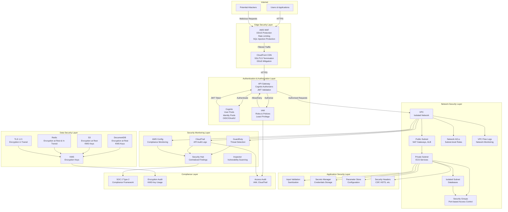

# Security Architecture Diagram

**Status**: Current State  
**Last Updated**: 2025-01-15

## Overview

The Security Architecture diagram shows the security layers and controls implemented in Leanda.io to protect data, applications, and infrastructure.

## Security Architecture Diagram

## Security Layers

### Edge Security Layer

#### AWS WAF
- **Purpose**: DDoS protection, web application firewall
- **Protections**:
  - SQL injection
  - Cross-site scripting (XSS)
  - Rate limiting
  - Geographic restrictions
- **Integration**: CloudFront, API Gateway

#### CloudFront CDN
- **Purpose**: SSL/TLS termination, DDoS mitigation
- **Features**:
  - TLS 1.2+ only
  - DDoS protection
  - Geographic distribution
  - Request signing

### Authentication & Authorization Layer

#### Amazon Cognito
- **Purpose**: User authentication and identity management
- **Features**:
  - User pools (authentication)
  - Identity pools (AWS resource access)
  - OIDC/OAuth2 support
  - MFA support
  - Password policies

#### API Gateway
- **Purpose**: API authentication and authorization
- **Features**:
  - Cognito authorizers
  - JWT token validation
  - API key authentication
  - Request signing

#### IAM
- **Purpose**: AWS resource access control
- **Features**:
  - IAM roles for services
  - Least privilege policies
  - Service-to-service authentication
  - Resource-based policies

### Network Security Layer

#### VPC
- **Purpose**: Network isolation
- **Structure**:
  - Public subnets (NAT, ALB)
  - Private subnets (ECS services)
  - Isolated subnets (databases)
- **Features**:
  - No direct internet access for services
  - VPC endpoints for AWS services
  - DNS resolution

#### Security Groups
- **Purpose**: Port-based access control
- **Rules**:
  - Inbound: Specific ports from specific sources
  - Outbound: HTTPS, HTTP, DNS only
- **Examples**:
  - ECS security group: Port 8080-8099 from ALB
  - DocumentDB security group: Port 27017 from ECS
  - Redis security group: Port 6379 from ECS

#### Network ACLs
- **Purpose**: Subnet-level access control
- **Features**:
  - Stateless rules
  - Allow/deny by IP, port, protocol
  - Additional layer of security

#### VPC Flow Logs
- **Purpose**: Network traffic monitoring
- **Features**:
  - All traffic logged
  - Security analysis
  - Troubleshooting
  - Integration with GuardDuty

### Data Security Layer

#### KMS (Key Management Service)
- **Purpose**: Encryption key management
- **Usage**:
  - DocumentDB encryption
  - S3 encryption
  - Redis encryption
  - Secrets Manager encryption
- **Features**:
  - Customer-managed keys
  - Key rotation
  - Access policies
  - Audit logging

#### Encryption at Rest
- **DocumentDB**: KMS encryption
- **S3**: KMS encryption, versioning
- **Redis**: Encryption at rest
- **EBS Volumes**: KMS encryption

#### Encryption in Transit
- **TLS 1.2+**: All communications
- **HTTPS**: API Gateway, CloudFront
- **Database**: TLS for DocumentDB, Redis
- **Service-to-Service**: TLS within VPC

### Application Security Layer

#### Input Validation
- **Purpose**: Prevent injection attacks
- **Measures**:
  - Input sanitization
  - Parameterized queries
  - File upload validation
  - Size limits

#### Secrets Management
- **Secrets Manager**: Credentials, API keys
- **Parameter Store**: Configuration (non-sensitive)
- **Features**:
  - Automatic rotation
  - Encryption
  - Access control
  - Audit logging

#### Security Headers
- **Content Security Policy (CSP)**: XSS protection
- **HSTS**: Force HTTPS
- **X-Frame-Options**: Clickjacking protection
- **X-Content-Type-Options**: MIME sniffing protection

### Security Monitoring Layer

#### GuardDuty
- **Purpose**: Threat detection
- **Data Sources**:
  - VPC Flow Logs
  - CloudTrail events
  - DNS logs
- **Threats Detected**:
  - Unauthorized access
  - Malware
  - Data exfiltration
  - Compromised instances

#### Security Hub
- **Purpose**: Centralized security findings
- **Sources**:
  - GuardDuty
  - CloudTrail
  - Config
  - Inspector
- **Features**:
  - Security score
  - Compliance checks
  - Automated remediation

#### CloudTrail
- **Purpose**: API audit logging
- **Features**:
  - All API calls logged
  - User attribution
  - Resource changes
  - Compliance auditing

#### AWS Config
- **Purpose**: Compliance monitoring
- **Features**:
  - Resource configuration tracking
  - Compliance rules
  - Change notifications
  - Remediation actions

#### Inspector
- **Purpose**: Vulnerability scanning
- **Features**:
  - EC2 instance scanning
  - Container image scanning
  - Vulnerability reports
  - Remediation guidance

### Compliance Layer

#### SOC 2 Type 2
- **Purpose**: Security and availability compliance
- **Controls**:
  - Access control
  - Encryption
  - Monitoring
  - Incident response
- **Audit**: Annual third-party audit

#### Encryption Audit
- **Purpose**: Verify encryption implementation
- **Checks**:
  - KMS key usage
  - Encryption at rest
  - Encryption in transit
  - Key rotation

#### Access Audit
- **Purpose**: Verify access controls
- **Checks**:
  - IAM policies
  - CloudTrail logs
  - Access patterns
  - Unusual activity

## Security Best Practices

### Defense in Depth
- Multiple security layers
- No single point of failure
- Redundant controls

### Least Privilege
- IAM roles with minimal permissions
- Security groups with specific ports
- Network ACLs as additional layer

### Encryption Everywhere
- Encryption at rest (KMS)
- Encryption in transit (TLS 1.2+)
- Secrets encrypted in Secrets Manager

### Monitoring and Alerting
- Continuous monitoring (GuardDuty)
- Centralized findings (Security Hub)
- Automated alerting
- Incident response procedures

### Regular Audits
- Security audits (GuardDuty, Inspector)
- Compliance audits (Config, SOC 2)
- Access reviews
- Penetration testing

## Security Incident Response

### Detection
- GuardDuty alerts
- Security Hub findings
- CloudWatch alarms
- User reports

### Response
1. **Contain**: Isolate affected resources
2. **Investigate**: Analyze logs, traces
3. **Remediate**: Fix vulnerabilities
4. **Recover**: Restore services
5. **Document**: Incident report

### Prevention
- Regular security updates
- Vulnerability scanning
- Penetration testing
- Security training

## Related Diagrams

- [Deployment Diagram](./deployment-diagram.md) - Infrastructure deployment
- [Integration Patterns](./integration-patterns.md) - Secure communication
- [Observability Architecture](./observability-architecture.md) - Security monitoring

---

**Document Version**: 1.0
