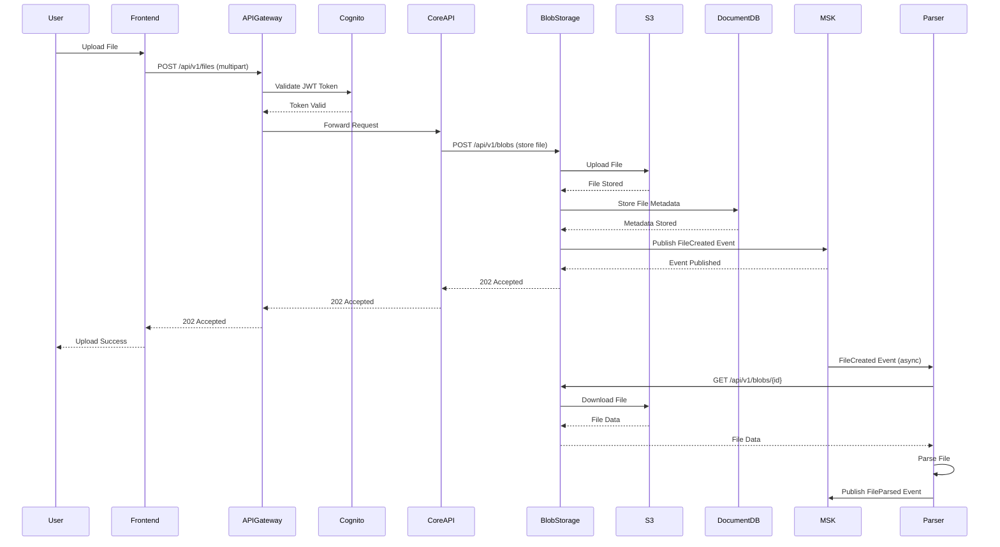
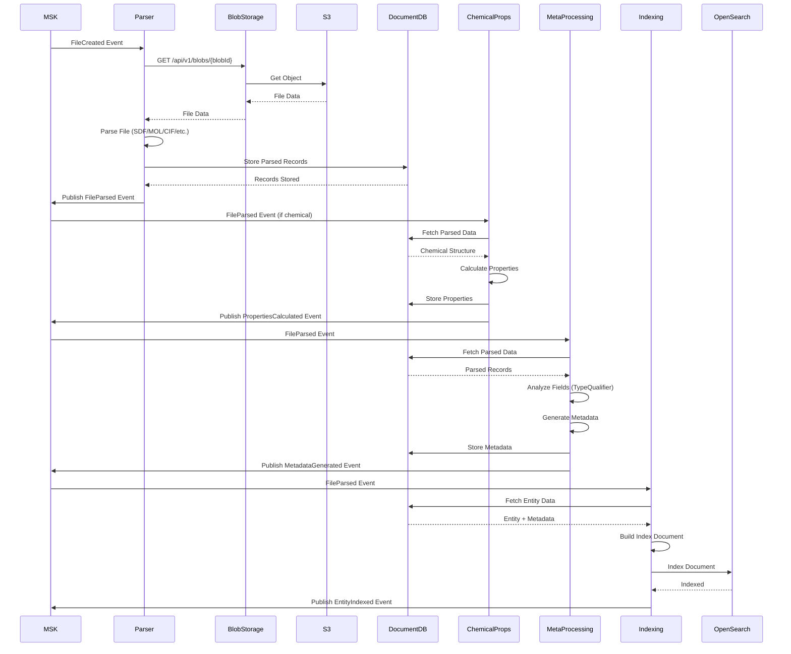
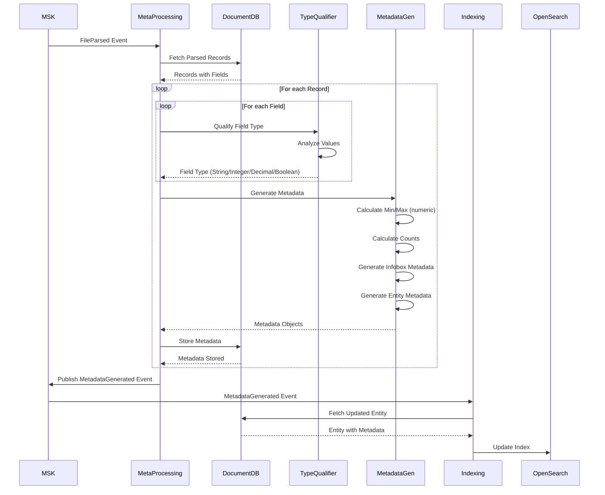
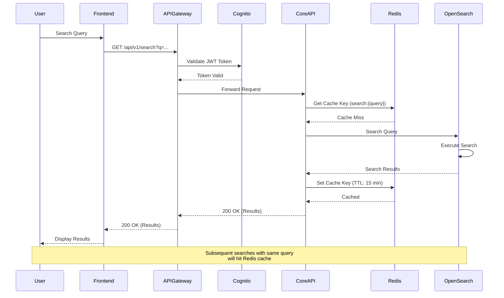
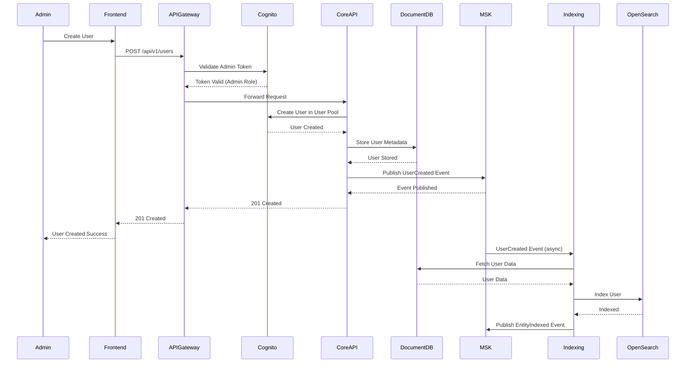
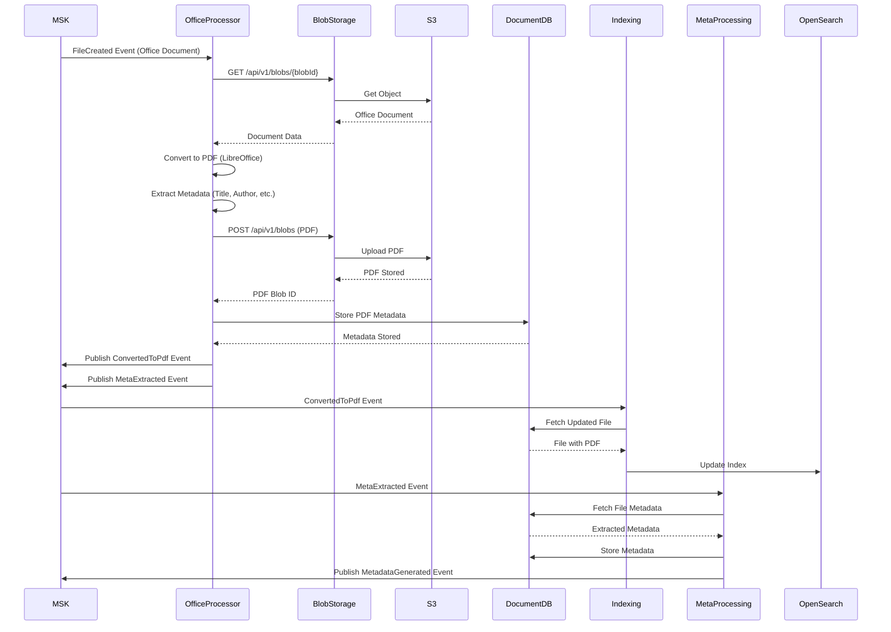
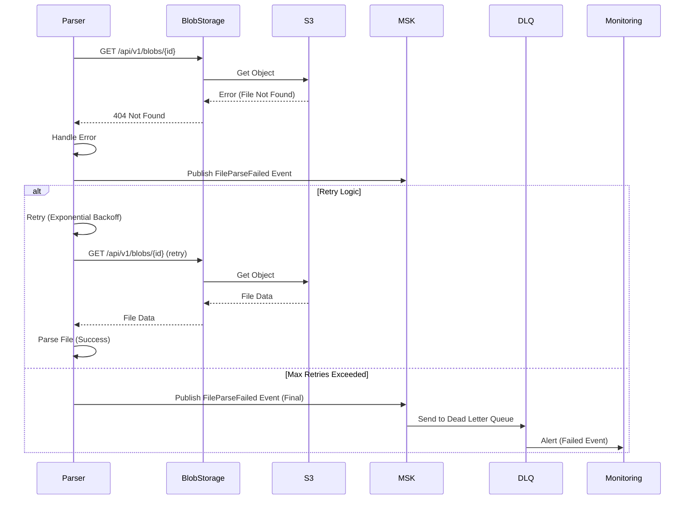

# Sequence Diagrams

**Status**: Current State  
**Last Updated**: 2025-01-15

## Overview

Sequence diagrams show the detailed interaction sequences between components for key system flows.

## File Upload Sequence

## File Parsing Sequence

## Metadata Generation Sequence

## Search Sequence

## User Management Sequence

## Office Document Conversion Sequence

## Error Handling Sequence

## Related Diagrams

- [Data Flow Diagrams](./data-flow-diagrams.md) - High-level data flows
- [Component Diagrams](./component-diagrams.md) - Component structure
- [Integration Patterns](./integration-patterns.md) - Communication patterns

---

**Document Version**: 1.0
