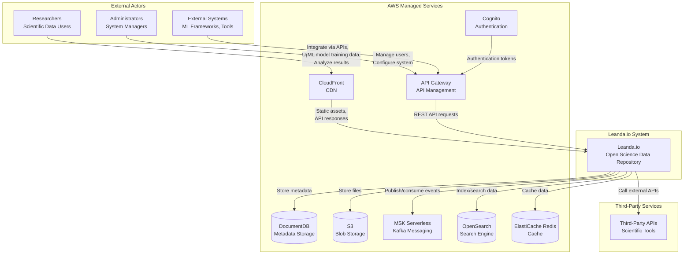

# System Context Diagram

**Status**: Current State  
**Last Updated**: 2025-01-15

## Overview

The System Context diagram shows Leanda.io in its environment, identifying the external actors and systems that interact with it.

## System Context Diagram

## External Actors

### Researchers
- **Role**: Primary users of the system
- **Interactions**:
  - Upload scientific data files
  - Search and browse data
  - View and analyze results
  - Manage their data collections
  - Export data in various formats

### Administrators
- **Role**: System administrators
- **Interactions**:
  - Manage user accounts and permissions
  - Configure system settings
  - Monitor system health
  - Manage data access policies

### External Systems
- **Role**: Third-party integrations
- **Interactions**:
  - ML frameworks for model training
  - Scientific tools for data analysis
  - External APIs for data enrichment
  - Integration via REST APIs

## External Dependencies

### AWS Managed Services

#### DocumentDB
- **Purpose**: Metadata storage (MongoDB-compatible)
- **Usage**: Store user data, file metadata, folder structures, records
- **Availability**: Multi-AZ deployment

#### S3
- **Purpose**: Blob storage for files
- **Usage**: Store uploaded files, processed data, artifacts
- **Features**: Versioning, lifecycle policies, encryption

#### MSK Serverless
- **Purpose**: Event-driven messaging
- **Usage**: Publish and consume domain events
- **Features**: Auto-scaling, managed Kafka

#### OpenSearch
- **Purpose**: Full-text search and indexing
- **Usage**: Index entities for search functionality
- **Features**: Vector search, analytics

#### ElastiCache Redis
- **Purpose**: Caching layer
- **Usage**: Cache API responses, session data
- **Features**: High-performance in-memory cache

#### CloudFront
- **Purpose**: Content delivery network
- **Usage**: Serve static assets, cache API responses
- **Features**: Global edge locations, DDoS protection

#### API Gateway
- **Purpose**: API management and routing
- **Usage**: Route requests to backend services
- **Features**: Authentication, rate limiting, throttling

#### Cognito
- **Purpose**: User authentication and authorization
- **Usage**: OIDC/OAuth2 authentication
- **Features**: User pools, identity pools

### Third-Party Services
- Scientific tools and frameworks
- ML model repositories
- External data sources
- Integration APIs

## System Boundaries

### In Scope
- Frontend application (Angular 21)
- Backend microservices (11 Java/Quarkus services)
- ML services (Python/FastAPI)
- Infrastructure services (managed by AWS)

### Out of Scope
- User's local systems
- External scientific tools (interact via APIs)
- Third-party ML frameworks (consume data via APIs)

## Interaction Patterns

### User Interactions
1. **File Upload**: Researcher → CloudFront → API Gateway → Leanda System → S3
2. **Search**: Researcher → CloudFront → API Gateway → Leanda System → OpenSearch
3. **Data Analysis**: Researcher → CloudFront → API Gateway → Leanda System → External Systems

### System Interactions
1. **Event Processing**: Leanda System → MSK → Event Consumers
2. **Data Storage**: Leanda System → DocumentDB (metadata), S3 (files)
3. **Caching**: Leanda System → Redis (frequently accessed data)

## Security Boundaries

- **Public Internet**: Researchers and Administrators access via HTTPS
- **AWS VPC**: Leanda.io system deployed in private subnets
- **API Gateway**: Entry point with authentication (Cognito)
- **CloudFront**: DDoS protection and SSL termination
- **Private Subnets**: Backend services isolated from public internet

## Related Diagrams

- [Container Diagram](./container-diagram.md) - Internal system structure
- [Deployment Diagram](./deployment-diagram.md) - Infrastructure deployment
- [Security Architecture](./security-architecture.md) - Security layers

---

**Document Version**: 1.0
