# Technology Stack Diagram

**Status**: Current State  
**Last Updated**: 2025-01-15

## Overview

The Technology Stack diagram shows the complete technology stack used in Leanda.io, organized by layers.

## Technology Stack Diagram

```mermaid
graph TD
    subgraph "Frontend Layer"
        Angular[Angular 21<br/>Framework]
        TypeScript[TypeScript<br/>Language]
        Signals[Signals<br/>Reactive State]
        Playwright[Playwright<br/>E2E Testing]
    end
    
    subgraph "API Gateway Layer"
        APIGateway[API Gateway<br/>AWS Service]
        Cognito[Cognito<br/>Authentication]
        WAF[WAF<br/>DDoS Protection]
    end
    
    subgraph "Backend Layer"
        Quarkus[Quarkus 3.17+<br/>Framework]
        Java[Java 21 LTS<br/>Language]
        SmallRye[SmallRye Reactive Messaging<br/>Kafka Integration]
        Panache[Quarkus Panache<br/>MongoDB ORM]
        JUnit[JUnit 5<br/>Testing]
        Testcontainers[Testcontainers<br/>Integration Testing]
    end
    
    subgraph "ML Services Layer"
        FastAPI[FastAPI<br/>Framework]
        Python[Python 3.12+<br/>Language]
        NumPy[NumPy<br/>Scientific Computing]
        Pandas[Pandas<br/>Data Analysis]
    end
    
    subgraph "Data Layer"
        DocumentDB[DocumentDB 5.0<br/>MongoDB-Compatible]
        S3[S3<br/>Object Storage]
        Redis[ElastiCache Redis 7.2<br/>Cache]
        OpenSearch[OpenSearch 2.11<br/>Search Engine]
    end
    
    subgraph "Messaging Layer"
        MSK[MSK Serverless<br/>Kafka]
        Kafka[Kafka Protocol<br/>Event Streaming]
    end
    
    subgraph "Infrastructure Layer"
        ECS[ECS Fargate<br/>Container Orchestration]
        VPC[VPC<br/>Network Isolation]
        CDK[AWS CDK<br/>Infrastructure as Code]
        TypeScriptInfra[TypeScript<br/>CDK Language]
    end
    
    subgraph "Observability Layer"
        CloudWatch[CloudWatch<br/>Logs, Metrics, Alarms]
        XRay[X-Ray<br/>Distributed Tracing]
        Prometheus[Prometheus<br/>Metrics Collection]
        Grafana[Grafana<br/>Dashboards]
        OpenTelemetry[OpenTelemetry<br/>Tracing Standard]
    end
    
    subgraph "Security Layer"
        KMS[KMS<br/>Encryption Keys]
        IAM[IAM<br/>Access Control]
        GuardDuty[GuardDuty<br/>Threat Detection]
        SecurityHub[Security Hub<br/>Security Findings]
        CloudTrail[CloudTrail<br/>Audit Logs]
    end
    
    Angular --> TypeScript
    Angular --> Signals
    Angular --> Playwright
    
    Angular --> APIGateway
    APIGateway --> Cognito
    APIGateway --> WAF
    APIGateway --> Quarkus
    
    Quarkus --> Java
    Quarkus --> SmallRye
    Quarkus --> Panache
    Quarkus --> JUnit
    Quarkus --> Testcontainers
    
    FastAPI --> Python
    FastAPI --> NumPy
    FastAPI --> Pandas
    
    Quarkus --> DocumentDB
    Quarkus --> S3
    Quarkus --> Redis
    Quarkus --> OpenSearch
    
    Quarkus --> MSK
    MSK --> Kafka
    
    ECS --> Quarkus
    ECS --> FastAPI
    VPC --> ECS
    CDK --> TypeScriptInfra
    CDK --> VPC
    CDK --> ECS
    CDK --> DocumentDB
    CDK --> S3
    CDK --> Redis
    CDK --> OpenSearch
    CDK --> MSK
    
    Quarkus --> CloudWatch
    Quarkus --> XRay
    Quarkus --> OpenTelemetry
    XRay --> OpenTelemetry
    Prometheus --> Grafana
    
    DocumentDB --> KMS
    S3 --> KMS
    Redis --> KMS
    ECS --> IAM
    Quarkus --> IAM
    VPC --> GuardDuty
    GuardDuty --> SecurityHub
    VPC --> CloudTrail
```

## Technology Stack by Layer

### Frontend Layer

| Technology | Version | Purpose |
|------------|---------|---------|
| Angular | 21 | Frontend framework |
| TypeScript | Latest | Programming language |
| Signals | Angular 21 | Reactive state management |
| Playwright | Latest | End-to-end testing |

**Key Features**:
- Zoneless architecture
- Signal Forms for reactive forms
- Component-based architecture
- Type-safe development

### API Gateway Layer

| Technology | Service | Purpose |
|------------|---------|---------|
| API Gateway | AWS | API management and routing |
| Cognito | AWS | User authentication |
| WAF | AWS | DDoS protection and security |

**Key Features**:
- OIDC/OAuth2 authentication
- Rate limiting and throttling
- Request/response transformation
- API versioning

### Backend Layer

| Technology | Version | Purpose |
|------------|---------|---------|
| Quarkus | 3.17+ | Java framework |
| Java | 21 LTS | Programming language |
| SmallRye Reactive Messaging | Latest | Kafka integration |
| Quarkus Panache | Latest | MongoDB ORM |
| JUnit | 5 | Unit testing |
| Testcontainers | Latest | Integration testing |

**Key Features**:
- Cloud-native framework
- Fast startup time
- Low memory footprint
- Reactive programming
- Native compilation support

### ML Services Layer

| Technology | Version | Purpose |
|------------|---------|---------|
| FastAPI | Latest | Python web framework |
| Python | 3.12+ | Programming language |
| NumPy | Latest | Scientific computing |
| Pandas | Latest | Data analysis |

**Key Features**:
- Async/await support
- Automatic API documentation
- Type hints
- High performance

### Data Layer

| Technology | Service | Purpose |
|------------|---------|---------|
| DocumentDB | 5.0 | Metadata storage |
| S3 | AWS | Object storage |
| ElastiCache Redis | 7.2 | Caching |
| OpenSearch | 2.11 | Search engine |

**Key Features**:
- MongoDB-compatible API
- S3 versioning and lifecycle policies
- Redis high-performance cache
- OpenSearch full-text and vector search

### Messaging Layer

| Technology | Service | Purpose |
|------------|---------|---------|
| MSK Serverless | AWS | Managed Kafka |
| Kafka Protocol | Latest | Event streaming |

**Key Features**:
- Auto-scaling
- Managed infrastructure
- High throughput
- Event streaming

### Infrastructure Layer

| Technology | Service | Purpose |
|------------|---------|---------|
| ECS Fargate | AWS | Container orchestration |
| VPC | AWS | Network isolation |
| AWS CDK | Latest | Infrastructure as Code |
| TypeScript | Latest | CDK language |

**Key Features**:
- Serverless containers
- Multi-AZ deployment
- Infrastructure as Code
- Type-safe infrastructure

### Observability Layer

| Technology | Service | Purpose |
|------------|---------|---------|
| CloudWatch | AWS | Logs, metrics, alarms |
| X-Ray | AWS | Distributed tracing |
| Prometheus | Latest | Metrics collection |
| Grafana | Latest | Dashboards |
| OpenTelemetry | Latest | Tracing standard |

**Key Features**:
- Structured logging
- Distributed tracing
- Custom metrics
- Alerting

### Security Layer

| Technology | Service | Purpose |
|------------|---------|---------|
| KMS | AWS | Encryption keys |
| IAM | AWS | Access control |
| GuardDuty | AWS | Threat detection |
| Security Hub | AWS | Security findings |
| CloudTrail | AWS | Audit logs |

**Key Features**:
- Encryption at rest and in transit
- Least privilege access
- Threat detection
- Compliance tracking

## Technology Decisions

### Why Quarkus?
- **Fast Startup**: Sub-second startup time
- **Low Memory**: Optimized for containers
- **Cloud-Native**: Built for Kubernetes/ECS
- **Developer Experience**: Hot reload, great tooling

### Why DocumentDB?
- **MongoDB Compatibility**: Familiar API
- **Managed Service**: Reduced operational overhead
- **Multi-AZ**: High availability
- **Encryption**: KMS encryption support

### Why MSK Serverless?
- **Auto-Scaling**: Scales automatically
- **Managed**: No infrastructure management
- **Cost-Effective**: Pay per use
- **Kafka Compatible**: Standard Kafka API

### Why OpenSearch?
- **Full-Text Search**: Advanced search capabilities
- **Vector Search**: ML/AI search support
- **Analytics**: Aggregations and analytics
- **Managed Service**: Reduced operational overhead

## Technology Roadmap

### Current (2025)
- Java 21 LTS
- Quarkus 3.17+
- Angular 21
- Python 3.12+

### Future Considerations
- **GraalVM Native**: Native compilation for faster startup
- **Kubernetes**: Migration from ECS (if needed)
- **Serverless**: Lambda for appropriate services
- **Data Lake**: Apache Iceberg integration

## Related Diagrams

- [Container Diagram](./container-diagram.md) - How technologies are used
- [Deployment Diagram](./deployment-diagram.md) - Infrastructure deployment
- [Integration Patterns](./integration-patterns.md) - Technology integration

---

**Document Version**: 1.0
