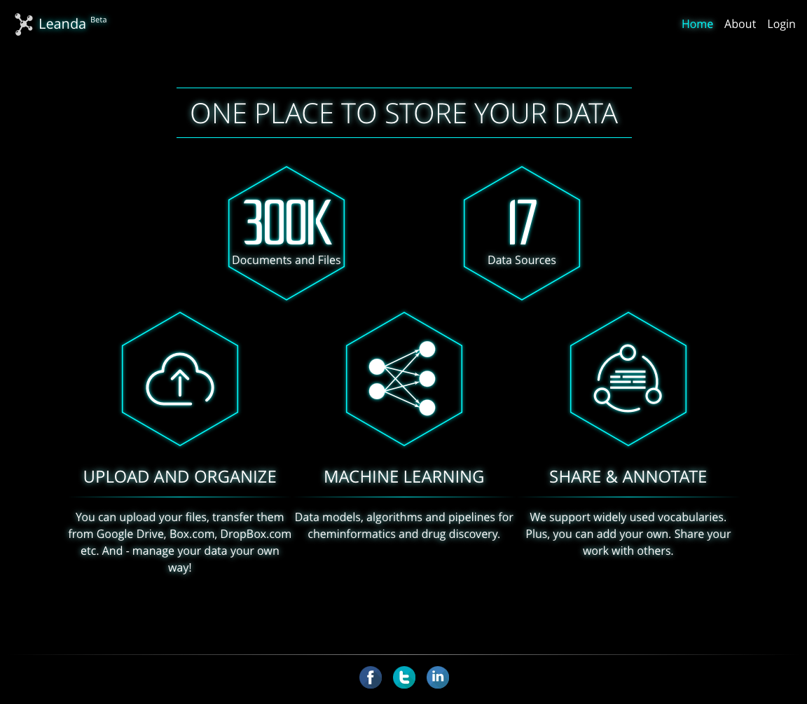
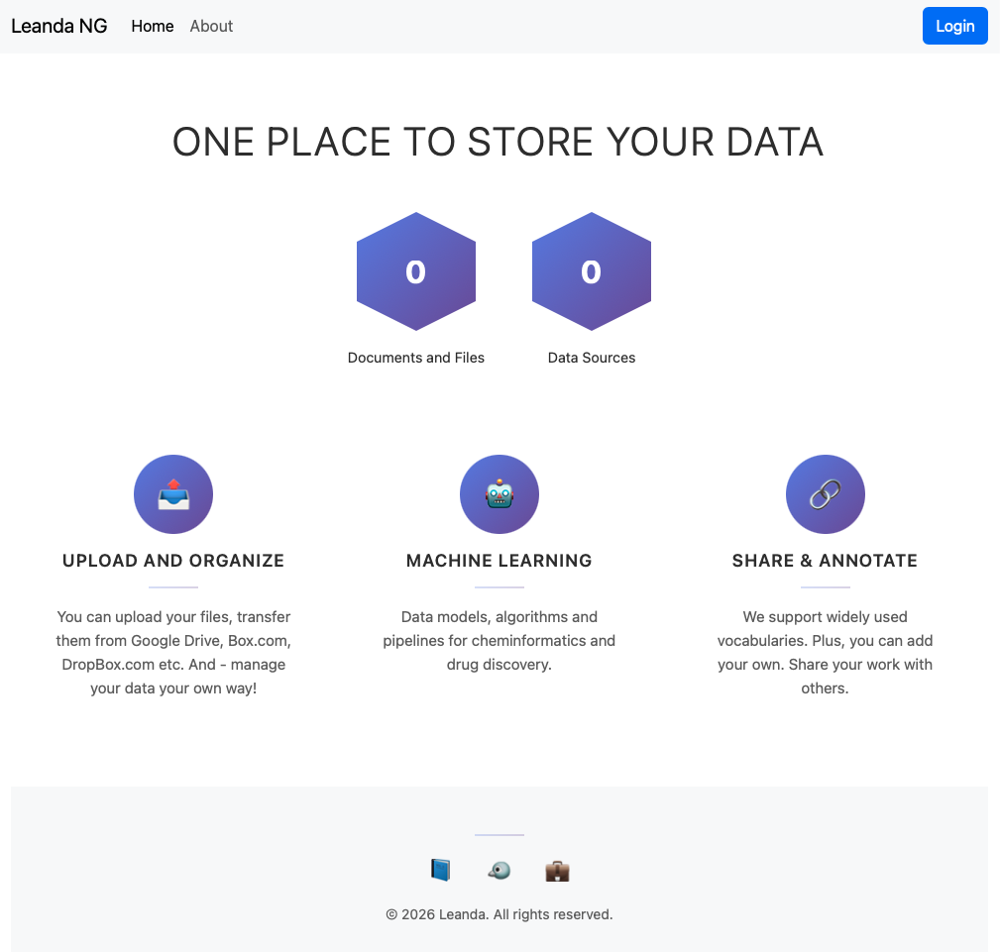

# Week 3: Front-end is finally up

*Holy macaroni. What are we looking at?*

## Started running tests

Our old home page:

And our new modernized home page:

Very interesting.

## OK so all the E2E tests?

... Are actually mock tests that just emulate the UI functionality and call the APIs directly, using, you know the actual UI

## Codex and Claude models are much more useful

They helped me actually migrate the visuals from legacy, where Cursor's Auto mode failed spectacularly.
