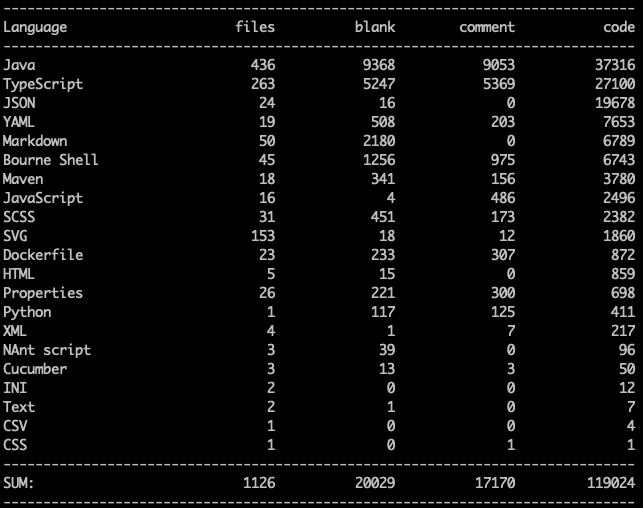

# Week 4

Fighting with Docker on my Mac.

Adding comprehensive E2E tests - it was future forward to have them in 2016!

Cursor is incredibly stubborn at ignoring the rules. Will the agent configs help?

## Adding authentication

First trying to implement mock auth for just the testing.

## Week 4 – Lines of code

