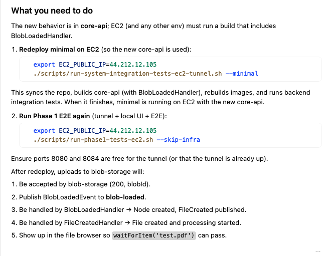

# Week 5 Integration Tests

## Cursor is being stubborn

After couple latest updates Cursor became increasingly useful.

It forgets the context from just two-three previous responses. It stops to instruct what you should do. Yes, the agent feels like a master now. Hey stop sitting around - go resolve this issue. Go run this script. Decide what to do.

Trivial tasks feel like they take twice longer than a month ago.

What's happening?

OK so the default Cursor's model, Composer, definitely got a lot dumber, sadly. If couple weeks ago it could independently complete most of the tasks, now it just reads the code, provides some light analysis, and asks you to do the work.

Take-away. The AI coding provider (Cursor, Anthropic etc) can change the behavior of their AI system at any time. You should not rely on that specific behavior for your work without proper guardrails. Meaning, any work - development, infrastructure engineering, security checks, QA workflows, you name it.

What would those guardrails look like? Do you run a comprehensive "smartness" check on for your team before you start your workday and not allow any automatic updates during the day? What if you're calling their APIs and they update something "transparently to the users"?

The obvious solution is to deploy all models inside your org infrastructure, but what if you're small and have no budget? Doesn't it defeat the whole AI SaaS promise to make it convenient, cost effective and secure?

Switching to Opus 4.5 worked perfectly. Now the question is - how do I know what model to use for my specific task/workflow? How do I make sure, if I'm getting charged for the usage, that I am using the best model for that specific activity?

## Oh BTW

Since we still used Mongo for everything, I decided we have enough contract, unit, integration and e2e tests to finally migrate to DynamoDB for metadata and S3/Minio for the blob storage.

That was relatively easy since the system know almost all of the specs.

## Week 5

