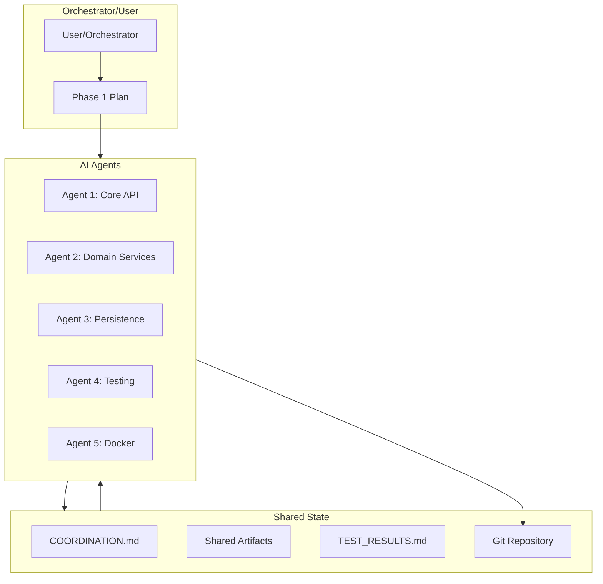

# Phase 1: AI Agent Execution Framework

## Overview

This document defines how to execute Phase 1 migration using **AI agents** (like Cursor's agent system or multiple AI instances) working in parallel. Each AI agent operates independently on assigned work packages while coordinating through shared artifacts and a coordination protocol.

## AI Agent Architecture



## Execution Models

### Model 1: Sequential AI Agent Sessions (Recommended for Cursor)

**How it works**:
- Run one agent at a time in separate Cursor sessions
- Each agent session focuses on their work package
- Agents coordinate through shared files (COORDINATION.md, shared artifacts)

**Workflow**:
```
Session 1: Agent 5 (Docker) - 2-3 hours
  → Creates docker-compose.yml
  → Updates COORDINATION.md: "Agent 5: Docker setup complete ✅"

Session 2: Agent 3 (Persistence) - 2-3 hours  
  → Reads COORDINATION.md (sees Docker ready)
  → Creates data models
  → Updates COORDINATION.md

Session 3: Agent 1 (Core API) - 3-4 hours
  → Reads COORDINATION.md (sees Docker + models ready)
  → Creates core-api service
  → Updates COORDINATION.md

Session 4: Agent 2 (Domain Services) - 3-4 hours
  → Reads COORDINATION.md
  → Creates event handlers
  → Updates COORDINATION.md

Session 5: Agent 4 (Testing) - 2-3 hours
  → Reads COORDINATION.md
  → Sets up Testcontainers
  → Updates COORDINATION.md
```

**Advantages**:
- Works with single Cursor instance
- Clear context per agent
- Easy to track progress
- No conflicts (sequential execution)

### Model 2: Parallel Agent Sessions (Multiple Cursor Instances)

**How it works**:
- Run multiple Cursor instances simultaneously
- Each instance runs a different agent
- Agents coordinate through file system (COORDINATION.md, Git)

**Coordination Mechanism**:
- File-based locking (`.agent-N.lock` files)
- Polling COORDINATION.md every 5-10 minutes
- Git branches for isolation
- Merge conflicts handled via coordination protocol

**Advantages**:
- True parallel execution
- Faster completion
- More realistic multi-agent scenario

## AI Agent Initialization

### Agent Prompt Template

Use the prompts in `leanda-ng-core-distro/AGENT_PROMPTS.md` to initialize each agent session in Cursor.

**Key Elements**:
1. Agent identity and role
2. Prerequisites check (read COORDINATION.md first)
3. Specific tasks from work package
4. Coordination protocol
5. Success criteria

### Example: Agent 5 Initialization

```
You are Agent 5: Docker & Infrastructure for Leanda NG Phase 1 migration.

**Your Critical Task**: Create Docker Compose setup for local development

**Coordination Protocol**:
1. Read `COORDINATION.md` first (should show all agents not started)
2. Update COORDINATION.md: "Agent 5: Starting Docker setup"
3. Complete your tasks
4. Update COORDINATION.md: "Agent 5: Docker setup complete ✅"
5. Commit to branch: `agent-5/docker-setup`

**Steps**:
1. Read `leanda-ng/docker/docker-compose.yml` as reference
2. Create `leanda-ng-core-distro/docker-compose.yml` with infrastructure services
3. Test all services start
4. Update COORDINATION.md with completion
5. Commit work

**Start by reading COORDINATION.md, then create the docker-compose.yml file.**
```

## Coordination Protocol

### Pre-Work Checklist

Each AI agent must:

1. **Read Coordination State**:
   ```bash
   cat leanda-ng-core-distro/COORDINATION.md
   grep -i "blocker\|urgent" COORDINATION.md
   ```

2. **Check Dependencies**:
   - Verify required agents completed their work
   - Check shared artifacts exist

3. **Update Status**:
   - Mark as "Starting work" in COORDINATION.md

### During Work

1. **Update COORDINATION.md every 30-60 minutes**:
   ```markdown
   ### Agent [N]
   - **Status**: In Progress
   - **Progress**: 60%
   - **Current**: Implementing UserRepository
   - **Blockers**: None
   ```

2. **Propose Changes to Shared Artifacts**:
   - Document in COORDINATION.md
   - Wait 4 hours (or get approval)
   - Implement change
   - Notify in COORDINATION.md

### Post-Work Checklist

1. **Run Tests**:
   ```bash
   mvn test  # or pytest, etc.
   ```

2. **Update TEST_RESULTS.md**:
   ```markdown
   Agent N: Unit tests 15/20 passing, Coverage 78%
   ```

3. **Update COORDINATION.md**:
   ```markdown
   Agent N: Completed [tasks], tests passing ✅
   ```

4. **Commit Work**:
   ```bash
   git checkout -b agent-N/feature-name
   git commit -m "Agent N: [description]"
   ```

## Helper Scripts

### Check Agent Status

```bash
cd leanda-ng-core-distro
./scripts/agent-status.sh
```

### Check Dependencies

```bash
./scripts/check-dependencies.sh <agent-number>
# Example: ./scripts/check-dependencies.sh 1
```

### Initialize Agent Session

```bash
./scripts/agent-init.sh <agent-number> <feature-name>
# Example: ./scripts/agent-init.sh 5 docker-setup
```

## Execution Schedule

### Week 1: Sequential Execution

**Day 1-2**: Agent 5 (Docker) - Critical Path
- Session: 2-3 hours
- Output: Docker infrastructure ready

**Day 3**: Agents 1, 2, 3 (Sequential)
- Agent 3: 2-3 hours (Data models)
- Agent 1: 2-3 hours (Core API scaffold)
- Agent 2: 2-3 hours (Event models)

**Day 4**: Continue Agents 1, 2, 3
- Continue implementation
- Coordinate through COORDINATION.md

**Day 5**: Agent 4 (Testing) + Integration
- Agent 4: 2-3 hours (Testcontainers)
- Integration: 1-2 hours (All agents integrate)

### Week 2+: Parallel Execution

Once dependencies are clear, agents can work in parallel sessions.

## Monitoring Progress

### Real-Time Monitoring

```bash
# Quick status check
./scripts/agent-status.sh

# Check for blockers
grep -i "blocker\|urgent" COORDINATION.md

# Check test results
cat TEST_RESULTS.md
```

### Progress Dashboard

The `agent-status.sh` script provides:
- All agent statuses
- Blockers
- Recent updates
- Test results

## Best Practices

### Do's

✅ **Read before writing**: Always read COORDINATION.md and shared artifacts first
✅ **Update frequently**: Update COORDINATION.md every 30-60 minutes
✅ **Test before committing**: Run tests before updating TEST_RESULTS.md
✅ **Use feature branches**: Each agent works in their own branch
✅ **Document changes**: Explain what you changed and why

### Don'ts

❌ **Don't modify shared artifacts without coordination**
❌ **Don't skip dependency checks**
❌ **Don't work in isolation** (always check coordination state)
❌ **Don't commit broken code** (tests must pass)
❌ **Don't ignore blockers** (document and coordinate)

## Troubleshooting

### Agent Can't Start (Dependencies Not Ready)

**Solution**:
- Agent checks COORDINATION.md
- Sees dependency not ready
- Waits and checks again in 30 minutes
- Or works on independent tasks

### Shared Artifact Conflict

**Solution**:
- Agent detects conflict in COORDINATION.md
- Reads other agent's proposal
- Proposes alternative or waits
- Documents resolution

### Test Failures

**Solution**:
- Agent runs tests, sees failures
- Fixes issues before committing
- Updates COORDINATION.md: "Agent N: Tests failing, investigating..."
- Once fixed: "Agent N: Tests passing ✅"

## Success Metrics

### Per Agent

- [ ] All assigned tasks completed
- [ ] Tests passing (>80% coverage)
- [ ] COORDINATION.md updated regularly
- [ ] Shared artifacts maintained
- [ ] No blocking conflicts

### Overall

- [ ] All integration checkpoints passed
- [ ] All services work together
- [ ] Documentation complete
- [ ] Ready for Phase 2

## Next Steps

1. **Start Agent 5**: First AI agent session (Docker setup)
2. **Continue Sequentially**: Agents 1-3 after Docker ready
3. **Add Agent 4**: Testing infrastructure
4. **Weekly Integration**: Integration checkpoints

See `leanda-ng-core-distro/AGENT_PROMPTS.md` for ready-to-use agent initialization prompts.

