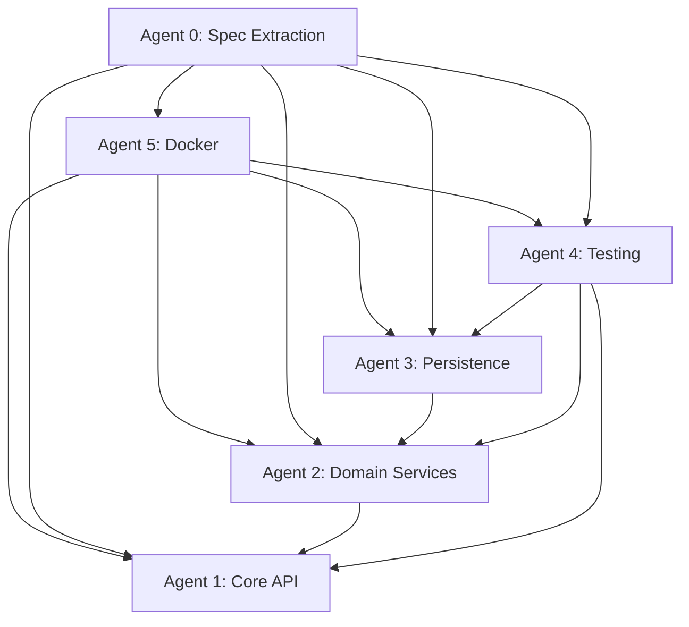

# Phase 1 Coordination Framework - Multi-Agent Parallel Execution

## Overview

This document defines the coordination mechanism for executing Phase 1 migration with multiple agents working in parallel. It establishes shared artifacts, communication protocols, and integration points.

## Phase 0: Spec Extraction (Before Phase 1)

### Prerequisites for All Agents

Before starting Phase 1 implementation, **Agent 0: Legacy Spec Extractor** must complete:

- [ ] API specs extracted from `Sds.Osdr.WebApi`
- [ ] Event specs extracted from `Domain.BackEnd`/`Domain.FrontEnd`
- [ ] Data model specs extracted from entities
- [ ] Implementation plans created
- [ ] Test specs defined

### Agent 0 Deliverables

Agent 0 produces specifications in `shared/specs/`:
- `shared/specs/api/core-api.yaml` - OpenAPI 3.1 specification
- `shared/specs/events/domain-events.yaml` - AsyncAPI specification
- `shared/specs/models/*.json` - JSON schemas for entities
- `shared/specs/implementation/core-services-plan.md` - Implementation plan
- `shared/specs/tests/*.md` - Test specifications

### Dependency Graph



### Critical Path

1. **Phase 0 (Weeks 1-2)**: Agent 0 completes spec extraction
2. **Week 1 Day 1-2**: Agent 5 (Docker) starts after specs are ready
3. **Week 1 Day 3-4**: Agents 1, 2, 3 can start in parallel (after Docker setup)
4. **Week 1 Day 5**: Agent 4 (Testing) can start after basic services exist

### Agent 0 Status Check

Before Phase 1 agents begin:
- Check `shared/specs/` directory exists and contains all required files
- Verify OpenAPI and AsyncAPI specs are valid
- Review implementation plan for completeness
- Confirm test specifications are available

See [Phase 0 Spec Extraction](./00-legacy-spec-extraction.md) for detailed methodology.

## Agent Work Streams

### Agent 0: Legacy Spec Extractor
**Focus**: Analyze legacy .NET services, generate specifications
**Deliverables**: OpenAPI specs, AsyncAPI specs, JSON schemas, implementation plans, test specs
**Timing**: Runs BEFORE Phase 1 (Weeks 1-2)

### Agent 1: Core API & REST Endpoints
**Focus**: REST API implementation, user management, authentication
**Deliverables**: REST endpoints, DTOs, API documentation
**Dependencies**: Agent 0 (specs), Agent 5 (Docker)

### Agent 2: Domain Services & Event Handlers
**Focus**: Domain logic, event handlers, CQRS implementation
**Deliverables**: Event handlers, domain models, saga orchestration
**Dependencies**: Agent 0 (specs), Agent 5 (Docker), Agent 3 (repositories)

### Agent 3: Persistence & Data Layer
**Focus**: Data persistence, repositories, event storage
**Deliverables**: Repository implementations, persistence service, data models
**Dependencies**: Agent 0 (specs), Agent 5 (Docker)

### Agent 4: Testing Infrastructure
**Focus**: Test setup, fixtures, test utilities, CI/CD (CI/CD postponed until full migration is complete)
**Deliverables**: Testcontainers setup, test utilities, test data, CI pipeline
**Dependencies**: Agent 0 (test specs), Agent 5 (Docker)

### Agent 5: Docker & Infrastructure
**Focus**: Docker Compose, Dockerfiles, environment configuration
**Deliverables**: Docker Compose files, Dockerfiles, Makefile, environment configs
**Dependencies**: Agent 0 (specs for service configuration)

## Coordination Mechanisms

### 1. Shared Artifacts Repository

All agents must use and update shared artifacts in `leanda-ng-core-distro/shared/`:

```
shared/
├── specs/                  # Specifications (from Agent 0)
│   ├── api/               # OpenAPI specs
│   │   └── core-api.yaml
│   ├── events/            # AsyncAPI specs
│   │   └── domain-events.yaml
│   ├── models/            # JSON schemas
│   │   ├── User.json
│   │   └── File.json
│   ├── implementation/    # Implementation plans
│   │   └── core-services-plan.md
│   └── tests/             # Test specifications
│       ├── api-tests.md
│       └── integration-tests.md
├── contracts/              # API contracts (OpenAPI specs)
│   ├── core-api.yaml      # Core API OpenAPI spec
│   └── events.yaml        # Event schemas (AsyncAPI)
├── models/                 # Shared data models
│   ├── User.java          # User entity (Java)
│   ├── File.java          # File entity
│   └── events/            # Event models
├── interfaces/             # Service interfaces
│   ├── UserService.java   # User service interface
│   └── FileService.java   # File service interface
└── config/                 # Shared configuration
    ├── application.properties
    └── kafka-topics.yml
```

**Rules**:
- Agents MUST read from shared artifacts before implementing
- Agents MUST update shared artifacts when creating new contracts
- Changes to shared artifacts require coordination (see Change Protocol)

### 2. Daily Coordination Points

**Morning Standup (Async)**:
- Update `COORDINATION.md` with:
  - What you completed yesterday
  - What you're working on today
  - Blockers or dependencies
  - Changes to shared artifacts

**Evening Sync (Async)**:
- Commit progress to feature branch
- Update test results in `TEST_RESULTS.md`
- Document any API/interface changes

**Integration Checkpoints**:
- **End of Week 1**: All agents integrate Docker setup
- **End of Week 2**: Core API + Domain Services integration
- **End of Week 3**: Full stack integration test
- **End of Week 4**: E2E validation

### 3. Dependency Management

#### Dependency Graph

See Phase 0 section above for complete dependency graph including Agent 0.

#### Critical Path

1. **Phase 0 (Weeks 1-2)**: Agent 0 (Spec Extraction) must complete first
2. **Week 1 Day 1-2**: Agent 5 (Docker) starts after specs are ready
3. **Week 1 Day 3-4**: Agents 1, 2, 3 can start in parallel (after Docker setup)
4. **Week 1 Day 5**: Agent 4 (Testing) can start after basic services exist
5. **Week 2+**: All agents work in parallel with daily syncs

### 4. Change Protocol

When an agent needs to change a shared artifact:

1. **Propose Change**: Update `COORDINATION.md` with proposed change
2. **Wait for Approval**: Other agents review (4-hour window)
3. **Implement**: If no objections, implement and update artifact
4. **Notify**: Update `COORDINATION.md` with change notification

**Emergency Changes**: For critical blockers, use `#urgent` tag in coordination doc

### 5. Integration Testing Protocol

**Daily Integration Tests**:
- Each agent runs their service's integration tests
- Results posted to `TEST_RESULTS.md`
- Failures block other agents if in critical path

**Weekly Integration Sprints**:
- All agents stop feature work
- Full stack integration test
- Fix integration issues
- Resume parallel work

## Communication Channels

### Primary: COORDINATION.md File

Location: `leanda-ng-core-distro/COORDINATION.md`

Format:
```markdown
## [Date] Coordination Log

### Agent 1: Core API
- **Status**: In Progress
- **Today**: Implementing user endpoints
- **Blockers**: None
- **Changes**: Added UserDTO to shared/models/
- **Tests**: 15/20 passing

### Agent 2: Domain Services
- **Status**: In Progress
- **Today**: Event handler implementation
- **Blockers**: Waiting for event schema from Agent 1
- **Changes**: None
- **Tests**: 8/12 passing
```

### Secondary: Git Branch Strategy

- **Main branch**: `main` (protected)
- **Feature branches**: `agent-1/core-api`, `agent-2/domain-services`, etc.
- **Integration branch**: `integration/week-1`, `integration/week-2`, etc.

**Merge Rules**:
- Agents merge to their feature branch daily
- Weekly integration merges to integration branch
- Integration branch tested before merging to main

## Shared Artifacts Specifications

### API Contracts (OpenAPI)

**Location**: `shared/contracts/core-api.yaml`

**Maintained By**: Agent 1 (Core API)

**Usage**:
- Agent 1: Implements the contract
- Agent 4: Uses for contract testing
- Agent 5: Uses for API Gateway setup (future)

**Update Process**:
1. Agent 1 proposes change
2. Agent 4 reviews for test impact
3. Change approved → update contract
4. All agents sync

### Event Schemas (AsyncAPI)

**Location**: `shared/contracts/events.yaml`

**Maintained By**: Agent 2 (Domain Services)

**Usage**:
- Agent 2: Publishes events per schema
- Agent 3: Consumes events per schema
- Agent 4: Uses for event testing

### Data Models

**Location**: `shared/models/`

**Maintained By**: Agent 3 (Persistence)

**Usage**:
- All agents use shared models
- Changes require coordination

### Service Interfaces

**Location**: `shared/interfaces/`

**Maintained By**: Service owner agent

**Usage**:
- Define contracts between services
- Enable parallel development
- Support testing with mocks

## Work Package Definitions

### Agent 1: Core API & REST Endpoints

**Week 1**:
- Day 1-2: Wait for Docker setup (Agent 5)
- Day 3-4: Create core-api service scaffold, health endpoints
- Day 5: OpenAPI contract definition

**Week 2**:
- Day 1-3: User management endpoints
- Day 4-5: Authentication/authorization

**Dependencies**:
- Needs: Docker setup (Agent 5), Data models (Agent 3)
- Provides: API contracts, REST endpoints

**Deliverables**:
- `services/core-api/` complete
- `shared/contracts/core-api.yaml`
- Unit tests (>80% coverage)
- Integration tests

### Agent 2: Domain Services & Event Handlers

**Week 1**:
- Day 1-2: Wait for Docker setup (Agent 5)
- Day 3-4: Analyze existing domain events, create event models
- Day 5: Event schema definition (AsyncAPI)

**Week 2**:
- Day 1-3: Event handler implementations
- Day 4-5: Saga orchestration setup

**Dependencies**:
- Needs: Docker setup (Agent 5), Event storage (Agent 3)
- Provides: Event schemas, Event handlers

**Deliverables**:
- Event handler implementations
- `shared/contracts/events.yaml`
- Event handler tests

### Agent 3: Persistence & Data Layer

**Week 1**:
- Day 1-2: Wait for Docker setup (Agent 5)
- Day 3-4: Analyze MongoDB schema, create data models
- Day 5: Repository interfaces

**Week 2**:
- Day 1-3: Repository implementations
- Day 4-5: Persistence service

**Dependencies**:
- Needs: Docker setup (Agent 5)
- Provides: Data models, Repositories, Persistence service

**Deliverables**:
- `shared/models/` complete
- Repository implementations
- `services/persistence-service/` complete
- Repository tests

### Agent 4: Testing Infrastructure

**Week 1**:
- Day 1-2: Wait for Docker setup (Agent 5)
- Day 3-4: Testcontainers setup, test utilities
- Day 5: First integration test

**Week 2+**:
- Continuous: Test utilities, fixtures, CI/CD setup (CI/CD postponed until full migration is complete)
- Support other agents with testing

**Dependencies**:
- Needs: Docker setup (Agent 5), Services from Agents 1-3
- Provides: Test infrastructure, Test utilities

**Deliverables**:
- Testcontainers configuration
- Test utilities and helpers
- Test data fixtures
- CI/CD pipeline (postponed until full migration)
- Integration test framework

### Agent 5: Docker & Infrastructure

**Week 1**:
- Day 1-2: **CRITICAL PATH** - Docker Compose setup
- Day 3-4: Dockerfiles for services
- Day 5: Environment configuration, Makefile

**Week 2+**:
- Support: Infrastructure updates as needed
- Maintenance: Keep Docker setup aligned with service changes

**Dependencies**:
- Needs: None (starts first)
- Provides: Docker infrastructure for all agents

**Deliverables**:
- `docker-compose.yml` complete
- Service Dockerfiles
- Environment configuration
- Makefile with commands
- Infrastructure documentation

## Integration Checkpoints

### Checkpoint 1: End of Week 1 (Day 5)

**Goal**: All services can start in Docker

**Agents Involved**: All

**Activities**:
1. Agent 5: Finalize Docker Compose
2. Agents 1-3: Verify services start
3. Agent 4: Run first integration test
4. All: Fix any integration issues

**Success Criteria**:
- All services start successfully
- Health checks pass
- First integration test passes

### Checkpoint 2: End of Week 2 (Day 10)

**Goal**: Core API + Domain Services integrated

**Agents Involved**: Agents 1, 2, 3, 4

**Activities**:
1. Agent 1: Core API endpoints working
2. Agent 2: Event handlers working
3. Agent 3: Data persistence working
4. Agent 4: Integration tests passing

**Success Criteria**:
- User management workflow works end-to-end
- Events flow correctly
- Data persists correctly
- Integration tests pass

### Checkpoint 3: End of Week 3 (Day 15)

**Goal**: Full domain functionality working

**Agents Involved**: All

**Activities**:
1. Complete remaining domain features
2. Full integration test suite
3. Performance baseline

**Success Criteria**:
- All core features working
- All integration tests pass
- Performance meets targets

### Checkpoint 4: End of Week 4 (Day 20)

**Goal**: File management integrated

**Agents Involved**: Agents 1, 3, 4

**Activities**:
1. File upload/download working
2. File metadata management
3. E2E tests

**Success Criteria**:
- File operations work end-to-end
- E2E tests pass
- Data migration validated

### Checkpoint 5: End of Week 5 (Day 25)

**Goal**: Production-ready core distribution

**Agents Involved**: All

**Activities**:
1. Final integration testing
2. Documentation complete
3. Performance validation
4. Security audit

**Success Criteria**:
- All tests pass
- Documentation complete
- Performance targets met
- Ready for Phase 2

## Conflict Resolution

### Scenario 1: API Contract Conflict

**Situation**: Agent 1 wants to change API contract, Agent 4 has tests using old contract

**Resolution**:
1. Agent 1 proposes change in COORDINATION.md
2. Agent 4 reviews impact (2-hour window)
3. If approved: Both agents update simultaneously
4. If rejected: Discuss alternative approach

### Scenario 2: Data Model Conflict

**Situation**: Agent 3 changes data model, Agent 1/2 using old model

**Resolution**:
1. Agent 3 proposes change
2. Agents 1, 2 review (4-hour window)
3. Coordinate migration: Update models → Update code → Update tests
4. All agents sync at next checkpoint

### Scenario 3: Infrastructure Dependency

**Situation**: Agent needs infrastructure change, Agent 5 unavailable

**Resolution**:
1. Document requirement in COORDINATION.md
2. Agent 5 reviews at next sync
3. If critical: Use `#urgent` tag
4. Temporary workaround if possible

## Quality Gates

### Daily Quality Gates

- [ ] All unit tests pass for agent's work
- [ ] Code compiles without errors
- [ ] No breaking changes to shared artifacts (without coordination)
- [ ] Progress documented in COORDINATION.md

### Weekly Quality Gates

- [ ] Integration tests pass
- [ ] Code coverage >80%
- [ ] No critical security vulnerabilities
- [ ] Documentation updated

### Phase Quality Gates

- [ ] All integration checkpoints passed
- [ ] E2E tests pass
- [ ] Performance targets met
- [ ] Documentation complete

## Tools & Templates

### COORDINATION.md Template

```markdown
# Coordination Log

## [Date]

### Agent [N]: [Name]
- **Status**: [In Progress / Blocked / Complete]
- **Today**: [What working on]
- **Blockers**: [Any blockers]
- **Changes**: [Changes to shared artifacts]
- **Tests**: [Test status]
- **Next**: [Tomorrow's plan]
```

### TEST_RESULTS.md Template

```markdown
# Test Results

## [Date]

### Agent [N]: [Name]
- **Unit Tests**: X/Y passing
- **Integration Tests**: X/Y passing
- **Coverage**: X%
- **Issues**: [Any test failures]
```

### Change Proposal Template

```markdown
## Change Proposal: [Title]

**Agent**: [Agent Name]
**Date**: [Date]
**Type**: [API Contract / Data Model / Interface / Other]

**Current State**: [Description]
**Proposed Change**: [Description]
**Impact**: [Who is affected]
**Migration Path**: [How to migrate]

**Review Required From**: [Agent names]
**Deadline**: [Time]
```

## Success Metrics

### Individual Agent Metrics

- Code commits per day
- Test coverage percentage
- Integration test pass rate
- Blocker resolution time

### Team Coordination Metrics

- Shared artifact update frequency
- Conflict resolution time
- Integration checkpoint success rate
- Communication latency (time to respond)

### Overall Phase Metrics

- On-time delivery rate
- Integration test pass rate
- Code quality metrics
- Documentation completeness

